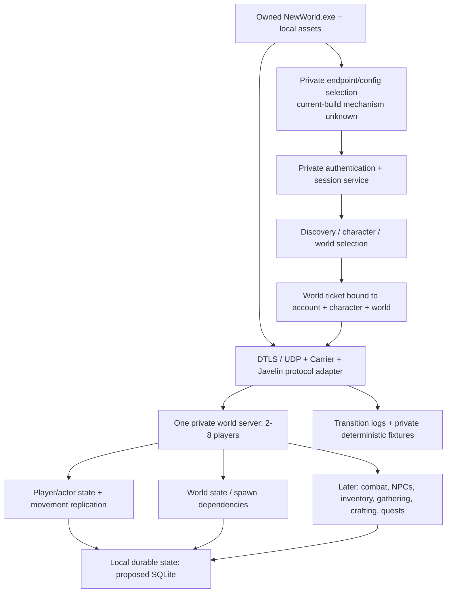

# Architecture

Status: **proposed boundaries, not an implemented private game server**. Evidence date: October 1, 2026 Arizona. See [evidence ledger](EVIDENCE_LEDGER.md) for pinned source/runtime identities and [First Light analysis](FIRST_LIGHT_ANALYSIS.md) for what actually exists.

## Objective and Milestone 1

Retain each player's legitimate New World PC executable, assets, map, animations, UI and combat presentation. Replace the external services it needs. Do not build another renderer/engine, distribute a client, or assume ownership of the client supplies server code.

Milestone 1 passes only when **two real legitimate clients**, using distinct private accounts/characters, enter the same Aeternum map, see each other, and observe each other's movement in both directions. Offline parser tests, replay acceptance, a character-selection screen, two sockets or a black loading screen do not pass it.

## Intended architecture

All solid paths above are target responsibilities, **not proof they currently work**. [Current bootstrap HTTPS](CURRENT_CLIENT_CONNECTIVITY.md) is now demonstrated with the stock client and local user-store CA/SAN controls. Private auth/session and REP/DTLS trust remain unresolved; HTTPS acceptance does not establish a game transport handshake. First Light's historical instrumentation is not current DTLS proof.

## Smallest deployment

- One host, one world, one process for the game loop; a separate HTTP/auth process is acceptable where existing code already separates it. No cloud orchestration, shards, queue infrastructure or MMO-scale design.
- Start loopback-only for controlled experiments. Later permit only the friends' private network/VPN and configured interface. Upstream defaults bind all interfaces; do not use those defaults as an operational deployment policy.
- Keep protocol parsing separate from authoritative state so one captured byte sequence cannot become a hardcoded world's authority.
- Use **Python 3.11/3.12, pytest and pyOpenSSL** first. This matches First Light's working components and CI. Retain those components rather than rewriting them in Rust/C++/another engine. Introduce another stack only when a measured, concrete compatibility limitation requires it.
- SQLite is a **later, provisional** persistence choice for the tiny group, not something to implement before client entry works. Tests and packet fixtures are private local files; assets never belong in this repository.

## Existing versus missing boundaries

| Boundary | Existing public implementation | Milestone 1 work |
|---|---|---|
| Client bootstrap and endpoint trust | Historical local hooks/config experiments; no current client verified here | Pin actual client build and prove a controlled private endpoint/trust mechanism; no Amazon keys or credentials |
| Authentication / discovery | First Light HTTP mock, synthetic token/entitlement responses, world/character/queue schemas | Distinct private accounts; per-request identity; exact schemas accepted by target client |
| Ticket -> world peer | V3 request identity extraction and stub response token | Bind a locally issued ticket to account/character/world; validate expiry/replay rules |
| Transport | Per-address DTLS memory BIO; Carrier parse/marshal; ACK helpers | Actual loopback handshake; reliability/resend, reassembly, compression and isolation checks as needed |
| Registration -> world entry | Optional timed captured replay; candidate SelfIdent/level codecs | Evidence-backed state progression and generated world/spawn messages |
| Shared actors/movement | No runtime owner/fan-out in inspected responder | Distinct actor identities; input/position contract; spawn/despawn and bilateral movement replication |
| Persistence/reconnect | Auth collections and replay cursors in memory; idle peer eviction | Initially rebuild one known world; later durable characters/spawn state and deterministic reconnect |

First Light's `rep_responder.py:1280-1328` owns separate peers, while `auth_mock.py:1408-1416,1554-1606` exposes one shared context. There is no implemented bridge that authoritatively binds those domains. `SessionState` is unused scaffolding, and inbound typed decoding is logging-only (`rep_responder.py:483-527`).

## Authority and lifetime decisions

These are **design constraints**, not discoveries about Amazon's server internals:

1. A private account owns its characters; the server owns the account/character/world association. Never use the auth mock's globally mutable persona as account storage.
2. A world owns actor identities and each actor's accepted position. A network peer owns only its connection/counters, not shared world authority.
3. A captured replay is a test oracle for covered byte shapes, not the source of all players' identity or live state.
4. Client-authoritative versus server-authoritative movement in the real protocol remains **unknown**. Do not choose an input packet, teleport acceptance rule or prediction reconciliation scheme from a class name. First establish the wire contract, then apply server-side identity, finite-value and world-bound validation consistent with it.
5. Disconnect must remove the old peer and notify remaining clients of actor departure; reconnect must not duplicate the actor. Neither contract is implemented yet. Persistence should live outside DTLS/Carrier objects.

## Observability contract

When connection work begins, log one structured event at each proven transition: `bootstrap.selected`, `auth.accepted/rejected`, `world.listed`, `character.selected`, `ticket.issued/consumed/rejected`, `dtls.started/ready/failed`, `carrier.connected`, `registration.accepted/retried`, `world.loading/ready`, `actor.spawned`, `replication.ready`, `peer.disconnected/expired`, `reconnect.started/completed`.

Include monotonic timestamp, private opaque account/peer/actor correlation IDs, old/new state, build/protocol profile, direction/type/channel/sequence and a reason. **Do not log bearer tokens, Steam tickets, private keys or complete bodies by default.** A datagram dump is not a substitute for state-transition logging. The current first-task harness logs only its own preflight/test states; it introduces no connection-state implementation.

## Deferred systems

Trading Post, wars, territory control, Outpost Rush, matchmaking, cash shop, transfers, seasons, achievements, leaderboards, global economy and thousands of users remain outside Milestone 1. Likewise, no broad recreation of NPC/combat/quests until one player and then two players can reliably enter and move.

## Reuse/provenance

First Light has no detected license in the inspected tree/API. Keep it as an external ignored reference and do not vendor its source here. Our setup/validation scripts are original integration code. Resolve licensing with a demonstrably authorized upstream before redistributing adapted components. Aeternum-World declares AGPL-3.0; review its terms before integration. No leaked/proprietary Amazon source is an acceptable shortcut.
