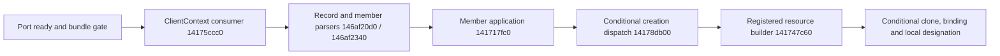

# Current asynchronous context and creation admission

October8, #213 / workItemId164. The pinned image now joins asynchronous map
continuation to port readiness, retained-message replay and the conditional
native creation path. The port's ready flag admits messages around a map change;
it does not establish that the new map has finished loading. Native player
construction and control remain unproved in the closed trial.

This is original static analysis at clean main
`cdefd4ef6834af070d5c1c5ac723203068eb6eec`, plus the explicitly identified
canonical candidate check below. [The receipt](../research/evidence/current-async-context-creation.json)
pins inputs, private source seals, review and validation. No game, hook, process
read, endpoint or system trial ran in this unit.

## Context publication and asynchronous map continuation — K445/K446

Game initialization allocates and constructs ClientContext at
`146440d75..146440d92`, then publishes its adjusted interface at
`146440d9f..146440db0`. Accessor `14100a290` returns the holder address;
`141025ee0` and the message handler dereference it and subtract `2c0` to recover
the same base. This global reachability exists before the loader
calls `Initialize14171b850` at `146448ee8`.

Initialize copies identity/settings, associates the SDK at context+340 and
resets retained state conditionally. It does not write the port-ready byte.
Global context availability, initialized contents and per-port admission have
separate state and lifetime owners.

| Static edge | Exact join and condition |
|---|---|
| Loader → console | `146448cd0` sets port activation+1a1, then issues its map command at `14644908c`. Console registration `146da6140` installs the `map` callback `146db5810→146db5840`. |
| Console → registered game interface | Game Init registers game+a8 in the same bus holder returned by `140caefb0`. Predicate thunk `140571484` selects virtual+10; dispatcher `143213190` invokes thunk `14057148c`, virtual+18=`146467f50`, with the map argument. Base and derived game tables agree on these slots. |
| Map request → unload work | `146467f50` owns target map+968 and phase+960. With a previous map, it starts asynchronous unloading and checks `146420cc0`: pending jobs, AssetBus queue entries or waiting references. An empty previous map permits ordinary handling without this deferred path. |
| Pending work → game update | Work remaining sets phase1 and defers the command. Update `14646c720` polls the same predicate, advances to phase2 after work drains, invokes primary virtual+1f8 and clears the phase to0. |
| Continuation → port admission | Primary virtual+1f8 reaches `14644b980`, directly or through derived wrapper `141038fe0`. It permits/reissues the map command and selects the first game wrapper's actor for `145a95160`. The no-pending-work path can publish readiness before ordinary map loading continues. |

The deferred operation is **map unloading before allowing a map change**.
Calling this a map-load-complete callback would overstate the source. The loader
also has immediate/editor alternatives that set readiness and drain messages.
Immediate readiness=false in the closed trial is compatible with a deferred
path; phase1 and the pending-work counters were not observed there.

## Port ownership and retained-message replay — K447

The actor embeds GameMessagePort at actor+b0. The port's self, activation and
ready bytes are +1a0/+1a1/+1a2; actor+252 aliases the ready byte.
`145a95160` writes readiness at **145a951a8**, then calls `146455e90`.
Instruction145a9518e adjusts the receiver by b0 before that store.

`14643e7b0` checks ready before obtaining ClientContext. With false readiness
or no context it can retain incoming shared objects in port+c8 and trigger
context setup for a matching bundle. The ensuing no-context log is not a
post-loader measurement that the singleton is still null.

When ready and a context are available, `146455e90` moves c8 into a local
collection and clears the original before replay through actual port virtual+8.
It then drains a separate ordered collection only while context and expected
sequence match. Retention, replay and ordered delivery are distinct operations.

The ready publisher selects the first wrapper, rather than receiving the
initiating port or a context-generation token. The default context0 candidate
fits that selection, but later wrapper selection and generation in the trial
were unread. No race or wrong-wrapper defect is established.

## Dedicated bundle gate and native creation route — K448/K450

On the dedicated null-cast type8 branch, handler R14 is GameMessagePort,
R12 is the incoming decoded bundle and R13 is the separate ClientContext
recipient. Bundle+8 selects a cursor policy. Calling these fields application
owner state was an incorrect first-pass attribution, retained and corrected
in the private evidence.

With bundle+8=false, `14643eb62..14643eb74` calls `14644b280` with queue
permission=false. Exact supplied byte and sequence equality with port+80/+70
advance the expected sequence and admit `14175ccc0`. A mismatch bypasses this
helper's insertion branches and skips the recipient. Draining other pending
entries does not establish retry of that rejected object. The bundle+8=true
branch has its own port+78/context checks; it is not interchangeable with this
candidate's selected branch.

The admitted continuation reuses the established conditional joins:

Descriptor/factory resolution, the member predicate, old-slot conditions and
active resource handler still govern this route. Builder entry is not completed
entity construction. Existing [member application](PLAYER_MEMBER_APPLICATION.md),
[entity binding](PLAYER_ENTITY_BINDING.md) and designation evidence retain their
class, resource, identity and lifetime limits.

Actor-wait `14644a070` case13→14 requires the actor's embedded-port readiness
and a live local player from Registry virtual+30. Getter `146800d10` requires
both the player pointer and its guard pointer, with a nonzero guard byte. A
reachable context, map command, ACK or creation-dispatch call does not satisfy
this local-player predicate.

## Canonical fields and conditional admission rejection — K449/K451

Fresh offline decoding verifies the original9-byte empty bundle and exact107-byte
closed-trial candidate SHA256
`6c02da121095bd0e5fa938db66a635ed25a3fbf4722063d2eb81bae6b9607310`.
Both omit the sequence, use byte fields30/31=0 and select bundle+8=false;
their payload lengths are0/98. Only these fields and hashes were exported.
This is a canonical-file/original-codec check, not captured wire bytes or native
decoding.

The native absent-sequence reader leaves its destination field unchanged; a
fresh factory seeds that field to UINT64_MAX. The controls below assume those
fresh-object defaults. They do not model reused native objects or partial decoder
mutation; omission alone is not a measurement of the runtime qword.

Current constructor `1463ff5f0` initializes port+70/+78 to UINT64_MAX and
context byte+80 to0. Reset `146463540` writes both cursors to1 and leaves the
context byte untouched. A qualifying LevelInfo context-switch branch calls
that reset and separately writes context+80 from LevelInfo+a1. This is a
conditional branch, including its incoming+a2 flag and prior port state;
the default LevelInfo or the closed trial does not prove it ran.

| Known state at the false08 gate | Fresh-default absent-sequence consequence |
|---|---|
| Fresh port, expected UINT64_MAX, matching context | One exact absent-sequence match can dispatch and advance expected sequence modulo2^64 to0. |
| Same port after that match, expected0 | A second absent-sequence bundle cannot match and is not queued by this call. |
| Reset port, expected1 | An absent-sequence bundle cannot match and is not queued by this call. |
| Context byte differs | The exact-match route rejects independently of matching sequence. |

These controls expose an admission gap in composing two default bundles.
They do not establish the trial's actual dispatch order or cursor state, or
exclude another writer/reset/allocation. Waiting longer does not change the
false08 exact-match contract. The next implementation needs context-scoped
sequence ownership supported by the actual initialization/order, rather than
treating an omitted sequence as universally admissible. This unit changes no
wire value, cursor, scheduler or observation site.

## Verification, limits and continuation

Five function-scoped Ghidra queries close the callback/ownership chain; material
joins are cross-checked against instructions and data. Fifteen retained private
sources match their original seals. Primary verification independently binds
actor construction, ready getter, wait predicate and Registry getter to the
current image. The wait function's14-entry switch table is classified as data;
two exact sealed leaf getters are verified byte-for-byte without guessed PDATA.
Failed and repaired queries remain private with their limits.

Fifteen original source-derived controls exercise pre-gate retention, known
cursor/context rejection, exact-match advancement and the actor/Registry/live
guard predicate. They execute an explicitly limited original model and local
codec, not native client code or a replay of the trial. Targeted review confirms
the corrected conditional joins and counter examples.

The closed trial observed readiness=false only at immediate context-load return.
It did not observe later async phases, port counters/reset, replay, parser,
resource creation or designation. Its missing-context marker precedes creation
and cannot show rejection of that candidate. The human spawn timeout identifies
no failed predicate. No delay change or retry follows from those observations.

Current source review, affected evidence/catalog checks, unchanged-runtime
validation reuse, publication hygiene and cleanup are recorded in the receipt.
The verified client archive remains reused. Raw instruction/decompiler output
and canonical private candidate remain ignored; no client artifacts are committed.
Next work is an evidence-supported bundle admission correction and subsequent
creation/resource/designation verification. A new native attempt would need a
separately prepared, specifically approved trial; no user action is pending here.
