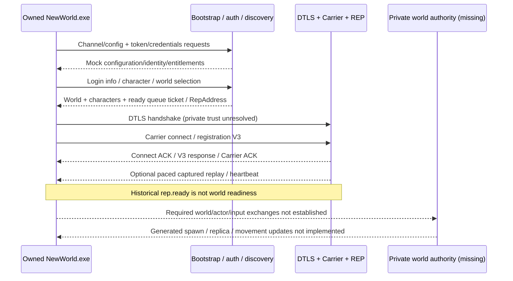

# Client connection flow

Evidence: clean First Light `63756a3`; newer research `820156d`. References below are external-checkout paths. This document is the **historical server-side flow**, not a current-client packet recipe. Current bootstrap -> token model acceptance -> credentials GET is verified in [TOKEN_SESSION_CONTRACT](TOKEN_SESSION_CONTRACT.md) and [CURRENT_CLIENT_CONNECTIVITY](CURRENT_CLIENT_CONNECTIVITY.md); later game auth/REP/world flow remains unknown. [SPAWN_SEQUENCE](SPAWN_SEQUENCE.md) records unresolved actor gates. See [ledger](EVIDENCE_LEDGER.md).

## Intended and historical flow

The diagram groups known server responsibilities. It does **not** assert every HTTP request's exact order, retry timing, or that a current client accepts these responses.

## Stage-by-stage source trace

| Stage | Source-backed path | Limits / required observation |
|---|---|---|
| Startup | Auth process constructs one `Ctx`, TLS HTTP server and route dispatcher (`auth_mock.py:1554-1606,1471-1495`). No actual client startup code exists here. | Steam/offline entitlement, launcher/EAC prerequisites, command-line/config endpoint selection and post-shutdown launch behavior unknown. No binary/install found in discovered Steam libraries. |
| Bootstrap/config | Channel JSON handler route (`auth_mock.py:1343`); reads `capture/channel_config.json`, otherwise source fallback (`197-233`). | Current build's endpoint/config schema unknown. Fallback mixes US-East auth and US-West gateway; not a verified working deployment configuration. |
| Authentication | `/credentials/omni` GET/POST (`1346-1347`); token-service/JWKS/OpenID routes (`1394-1399`); token handler reads `fallbackToken.sub` and updates global persona (`1183-1208`). | Synthetic credentials/entitlements, not Amazon authentication. A private account replacement needs its own verified identity contract; official credentials must never be required or reused. |
| Server/world discovery | `/prod/game/getlogininfo` GET/POST -> `handle_get_login_info` (`1359-1360,895-993`); returns context's world and characters. | Seeded Valhalla/development data are mock choices, not complete discovery/world metadata. Current wire/request schemas require comparison. |
| Character selection/creation | Validator and creation POST routes under `/prod/game/worlds/.../characters/...` (`1366-1371`); handlers (`996-1100`); seeded character (`458-493`). | No per-account filtering; changing persona rewrites all character owners (`450-456`). Selecting two accounts cannot be inferred safe from this source. |
| Login/session ticket | Queue prefixes `/prod/game/login/queue` and older `/prod/users/login_queue` (`1353-1356`); ready-ticket issue/store and configured `RepAddress` (`547-589,777-892`, schema `258-314`). | No durable/local-account authorization bridge to REP. Exact expiry, consumption, queue retries and reconnect meaning unknown for current client. |
| World connection | UDP listener default `0.0.0.0:23971`; sessions keyed by source tuple (`rep_responder.py:62,1280-1328`). `PeerSession` owns OpenSSL connection and counters (`179-312`), accepts DTLS input (`316-382`). | Only context/memory-BIO construction tested here, not handshake. A historical trust hook is mentioned in source; that is not evidence of stock-client private certificate acceptance. |
| Carrier/session establishment | Parses envelope/body, responds to channel3 connect request; treats first flags&0x40 record as V3 (`425-482`); request/response/ACK (`597-775`). | Recognition heuristic is not a complete application state machine. Strict registration layout is one old capture; retry semantics and reliability remain incomplete. |
| World selection/load | Queue selects/configures one REP address. After V3, optional `--replay-after-v3` drives replay; disabled by default and capped at sequence0x24 by default (`776-783,1213-1226`). | Replay sequence numbers are not client game-state numbers. No generated world-streaming implementation exists. |
| Player spawn | Candidate SelfIdent, level info and actor/replica creation discussed in static RE. Responder does not emit the SelfIdent/LevelInfo codecs. | No verified spawn sequence. Candidate body/header-only conflict and build-dependent indices remain open. |
| Movement/replication | Typed inbound decode goes to `_shadow_decode_record`, explicitly log-only (`483-527`). StateBundle codec retains opaque tails. | No accepted input/position application, actor mapping, state generation, interest management or cross-peer fan-out. Newer position diagrams are not an executable decoder. |
| Disconnect/reconnect | TLS close-notify makes `read_app()` return empty (`366-373`); idle dictionary eviction defaults to120s (`1206-1211,1287-1305`). `SM_DISCONNECT=3` exists in enum. | No actor despawn/game-disconnect handler in inspected runtime, durable reconstruction or address-rebinding contract. A new source tuple creates a new transport peer, not proven character reattachment. |

`/Javelin.RPC.*` is a preemptive HTTP/1.1 logger returning `{}` (`auth_mock.py:1311-1328,1377-1378`). Real HTTP/2/gRPC/protobuf framing is explicitly unconfirmed. Catch-all success at `1331-1337` cannot be counted as implemented service support.

## Client-state evidence and contradictions

Historical RE proposes a post-registration ladder **10 ->11 ->12 ->13 ->14**: SelfIdentification candidate; automatic next transition; level-information candidate; player/replica readiness candidate. Those numbers refer to analyzed client wrapper state, **not enum values implemented by this project**. See `analysis/state_machine_summary.md`, `self_ident.py:34-64`, `level_info_changed.py:31-38`.

- README's May11 report: V3 response accepted /`rep.ready` set, ~500ms retries and destruction around30s.
- Later `docs/next-session.md:286-294`: replay held connection but black screen remained at wrapper state10; earlier lines112-127 retain the older destruction report.
- Neither experiment was repeated here, and their configurations differ. Do not say the connection is stable, spawn is solved, or V3 retry necessarily means missing SelfIdent.
- Our offline test fixture contains an official-session sequence through historical state53. Replaying/preserving its bytes does not show our replacement reaches that state.

## What to observe next

First pin the actual legitimate client: Steam build ID, executable version/hash, launch mode, region/world, UTC timestamps and private fixture identity. No install is required for the completed offline prerequisite; it is required for real-client acceptance work.

Use normal own-account sessions to record screens/timings/log events for: cold launch -> character screen; existing character -> world; second consenting friend enters view; stationary/walk/turn/stop; logout -> relog; ordinary disconnect -> reconnect. Packet contents remain unknown unless obtainable through a permitted, consented observation method; encrypted traffic metadata alone cannot supply application schemas. See [Capture Before Shutdown](PROTOCOL_NOTES.md#capture-before-shutdown).

Future private-server checks must correlate authenticated private account, selected character/world, consumed ticket, DTLS peer, actor identity and transition events. No AWS/Amazon credentials, keys, official accounts or external calls should be necessary for the final private backend.
