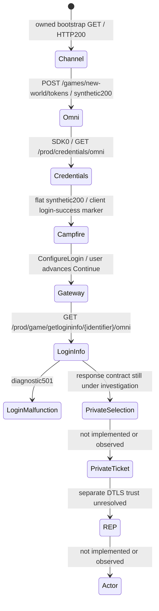

# Current credentials and private-session handoff

## Verified checkpoint: 2026-10-02

Stock Steam build **22469132**, version **1.400.6031.6004151**, installed executable SHA256 `8654f01d324636d9f74f1c793b0cc4a417c3c5fa9847d9913c358ca29e0fdc8e`.

The client accepted a **synthetic local credentials response**, logged Campfire login successful, configured the gateway, and reached the **character-selection frontend**. Its gateway login-info requests then received our deliberate501. **No private game-session ticket, REP connection, world entry, actor, or multiplayer is proven.**

[Evidence receipt](../research/evidence/current-credentials-contract.json) pins dirty exercised sources, ignored observations and static inspection. [Deterministic metadata fixture](../tests/fixtures/connectivity/current-credentials-contract-result.json) contains no request bodies/header values. The attached user screenshot confirms “Select Character” with “Login malfunction, please try again soon.”; its copyrighted pixels are not redistributed here.



## Credentials contract: evidence, not guessed AWS structure

Current request: GET `/prod/credentials/omni`, body0, Authorization present, Cookie absent, HTTP1.1 over TLS1.2; SNI/Host the **locally substituted regional alias** `d2c74t4zimux3r.cloudfront.net`. This is not a claim about the real regional API hostname or exact bearer/header contents.

| Field | Current static read | Locally tested value / limit |
|---|---|---|
| `accessKeyId` | String getter call at `0x145a958a2` | Original opaque synthetic string; not Amazon-issued |
| `secretAccessKey` | String getter at `0x145a95964` | Original synthetic string; never a collected credential |
| `sessionToken` | String getter at `0x145a95a04` | Original synthetic string; incoming headers never exported |
| `expiration` | Integer getter at `0x145a95aa2`; timestamp constructor `0x145a95af2` | Numeric1893456000000, fixed2030 diagnostic expiry; not a production session lifetime |

Parser bounds from PE exception metadata: `[0x145a955e0,0x145a95f93)`. The response gate compares HTTP status200 at `0x145a9580b`, then checks JSON parse state. String getter `[0x1474654e0,0x14746554c)` substitutes empty text for a null string result. Integer getter `[0x147465460,0x147465481)` truncates the numeric member to integer; no ISO-date parse is on this path. Timestamp constructor `0x147466b00` multiplies that integer by10000. Interpreting the input as **epoch milliseconds** is an inference supported by the matching integer [AWS DateTime constructor](https://docs.aws.amazon.com/sdk-for-cpp/latest/api/aws-cpp-sdk-core/html/class_aws_1_1_utils_1_1_date_time.html) and live acceptance; seconds/milliseconds boundary, expiry/error controls, missing/null/wrong-type fields and refresh are not exhaustively tested. No broad empty-object live control was attempted because unchecked missing numeric reads could be unsafe for the client.

The historical First Light mock at63756a3 returns these same **four flat names**, but generates an ISO UTC string for `expiration` (`auth_mock.py:236–255,766–774`). Its comments report a historical parser address; its earlier “gateway + persona wrappers” wording conflicts with its actual one-object implementation. The current disassembly establishes numeric consumption; do not reuse the mock's date-type guess. Historical character-creation/REP claims are not current-build evidence.

## Executed trial

Run `token-contract-credentials-14c4b19fcf6e47cfa958a266d95023cf`; clean starting HEAD0429e08, original probe/fixtures/log-whitelist edits dirty and SHA-pinned. Fresh normal Steam launch19:46:45.9441081Z; PID21700/start19:46:50.1106640Z, installed-file hash verified. Live image path unavailable, causeunknown: this is exclusive launch/start-time plus exact client-side TCP owner correlation, **not a live-image hash**. Per-user cache was not cleared.

1. Read back the **same retained CA** in CurrentUser Root (thumbprint1AEE2B69AD82A5C6F2CF52A80127D22A4487CECA), no import/remove/new approval. Same leaf/SAN profile; CA expires2026-10-09T18:58:22Z.
2. Bound owned IPv4/IPv6 HTTPS listeners on443. Prepared three temporary named-host mappings. Elevated watchdog verified program-only nonloopback outbound block in ActiveStore, then operator DNS loopback results19:46:30.175Z. This is configuration readback, not packet-enforcement/helper-process proof.
3. Token POST19:47:04.771Z,719request bytes discarded. Existing account-present synthetic461byte response SHA660b1029… preserved.
4. Credentials GET19:47:04.777Z received **188bytes** SHA `3464c15f02b7f5e795806eb7de5b53b6078674f0dd95274a82ecbd7d3d967213`, HTTP200 application/json. Current original candidate is [here](../tests/fixtures/connectivity/current-credentials-parser-candidate.json).
5. Fresh owned Game.log: SDK0 line355, Campfire login-success line359, ConfigureLogin line388. Export timestamps are extraction times, **not client event timestamps**. Final sourceSHA8b10adfb…; no raw lines/identities exported.
6. User advanced first-run setup with their own inputs. Attributed gateway GETs had sanitized path `/prod/game/getlogininfo/<redacted>/omni`, body0/Authorization present, local alias SNI/Host/TLS1.2. All rejected501. Repeated attempts are captured; no authorization signature values were retained or verified.
7. Owned client stopped19:49:09.770Z, then hosts/rule restoration completed19:49:10.894Z; listeners stopped19:49:11–12Z. CA remains intentionally installed. No game/EAC/config/memory/input changes.

## Reproduction, same retained trust

Use the current user's retained certificate directory from ignored `private/connectivity/retained-test-ca.json`; verify manifest SHA, trust-receipt ownership, expiry, leaf SAN and **exact Root count1 before launching**. Do not generate/import/remove a CA each trial. Incoming request bodies are bounded-discarded and header values never logged.

Service invocation (two instances, `--bind 127.0.0.1` and `--bind ::1`, using private paths):

```text
.venv\Scripts\python.exe scripts\credentials_contract_probe.py --certificates <retained-directory> --descriptor <private-copy-of-local-channel-token-hostnames.json> --log <new-private-jsonl> --bind 127.0.0.1 --port 443 --duration 600 --observe-local-socket-owner --case flat-numeric-expiration
```

Validate all PowerShell through `Invoke-CodexPowerShell.ps1`. This workspace's ignored, original `prepare-credentials-contract-run.ps1` checks retained trust and journals mappings; `start-credentials-listeners.ps1` records owned launcher IDs; `dispatch-channel-trial.ps1` uses tracked [Invoke-BootstrapTrialWindow](../scripts/Invoke-BootstrapTrialWindow.ps1) with `TokenServices` and300seconds. Wait for `BOOTSTRAP_TRIAL_READY` before normal Steam `-applaunch 1063730`; `record-channel-client.ps1` writes exact ownership before any cleanup. Advance Continue manually if shown. `extract-token-trial.ps1` exports fixed markers. `stop-channel-trial.ps1` requests client-first restore; `close-channel-listeners.ps1` stops only the matching Python children. Private preparation helpers are local-only; the tracked probe and containment scripts are the implementation. Preserve original owned logs privately, never commit them.

## Exact next blocker and capture before shutdown

Current gateway request builder `[0x1463e5e30,0x1463e617e)` explicitly passes `SignatureV4` at0x1463e5f38, sends through0x14747b0f0, and on success constructs login-info result at0x1463e5f8b. The result inspected from0x1474e01e0 conditionally reads **`LoginInfoList`**, then calls0x1474e42e0. That nested model has Characters/Worlds arrays, two integer limits, NameReservations/PendingWorldMerges arrays. Current compatible world/character values, runtime response acceptance, ticket signatures/expiry, queue state transitions and actual REP handoff still require verification. The 501 is ours, not evidence of Amazon rejecting local credentials.

Before shutdown, own normal sessions could establish fresh versus cached startup, credentials expiration units/refresh, region re-auth ordering, login-info schema/types and enum values, character metadata minimums, queue initial/refresh/cancel/ready envelopes, selected address/port and REP handshake ordering. Record schema/key/type/length and state metadata, never account IDs, credential values, ticket signatures, raw Steam tickets or another user's traffic. Local response omission/type controls can supplement, not replace, version-bound observed evidence.

Actor implementation remains gated on a verified private ticket/transport and spawn contract. No gameplay systems have been introduced.
