# Current-client connectivity

## October 3 default SSL configuration — static continuation

The unchanged Steam22469132/client1.400.6031.6004151 image contains an ordinary `OPENSSL_CONF` filename-to-parser/`ssl_conf` module path. Its same-context `system_default` helper enables file/client/server commands but omits certificate permission0x20. The compiled `VerifyCAFile`/`VerifyCAPath` records require that bit and are rejected before their loaders. No certificate-enabled named configuration caller was established by the bounded direct graph. The adjacent settings object's sized extent also ends before the CA-pointer slot. [Findings and limits](REP_TRUST_POLICY.md#default-ssl-configuration-and-certificate-command-gate--october-3-continuation), [receipt](../research/evidence/current-rep-default-config-boundary.json).

No game was launched and no client/config/environment/trust/routing state changed in this continuation. It provides no new live acceptance result: the furthest verified state remains Play → private queue829-byte200 →127.0.0.1:64003 →fatal `unknown_ca`, eight alerts across four stock runs. A supported unchanged-client private-CA input is still missing; actual DTLS completion and unrelated-root rejection must precede genuine Carrier/V3. Actor/spawn work remains gated. The prior367-case code checkpoint is preserved by exact source/test/fixture/lock hash checks; tests were not rerun for these recording-only changes.

## October 3 elevated read-only access observation

**Administrator access improved live process identity readback, not REP trust.** At preparation commit `f9f9de0`, the original launcher started stock Steam22469132 / client1.400.6031.6004151, SHA8654f01d…, signatureValid. Fresh game PID41260/start `16:57:24.4188974Z` had the recorded launcher as direct parent. The normal tool shell was non-admin; a normal elevated helper under the same user/root ran the original [bounded observer](../scripts/windows_rep_readonly_probe.py).

| UTC / state | Observed result | Limit |
|---|---|---|
|16:58:01.286 / QUERY_LIMITED handle | Opened, Win32error0 | Not a VM_READ handle or debug attachment |
|16:58:01.287 / creation FILETIME | Exact owned-start match, error0 | PID-reuse guard, not a call stack |
|16:58:01.288 / image-path query | Exact installed stock executable path, error0 | Live image path now verified; module contents not read |
|16:58:01.288 / module lookup | Not observed, Win32error5 `ERROR_ACCESS_DENIED` | Snapshot/first/next substage not separately recorded. Cause unknown; do not claim EAC causality |
|16:58:01.289 / observer stopped | Fail-closed, no later read step | **No VM_READ request, no ReadProcessMemory call, zero game memory read**, no writes/privilege adjustment/bypass |

The service recorded five HTTPS request/response chains, including channel, token, credentials and login-info fixtures. All five exact TCP-owner observations recorded PID41260, matching the owned game; the probe's separate generic `client_identity` label remained **unattributed**. No UI/input/screenshot observation was performed. No queue or DTLS datagram event was recorded; the observer's purpose was process access, not another trust comparison. Services were controller-terminated, so these are recorded-event counts, not graceful final counters. The furthest *previously verified* client state remains selectable synthetic character → private queue829-byte200 → loopback REP handshake → certificate rejection. No new world/Carrier/actor state is claimed.

Exact run/source/manifest/error/cleanup bindings: [access receipt](../research/evidence/current-rep-readonly-access.json). [Preparation receipt](../research/evidence/current-rep-readonly-preparation.json) records25 new fake-API/admission tests and the executed310-pass regression, plus an actual Windows ABI check on the helper's own known buffer—not game memory. Parallel untracked repository work was explicitly recorded and never executed by this trial; relevant tracked sources were clean/pinned.

### Final offline regression

The validated default `scripts/Test-Offline.ps1` **workspace** profile ran at HEAD `437aacf` from `17:31:55.192Z` through `17:33:03.269Z`: **345 Python cases passed**, including the25 new read-only observer cases; all three synthetic PowerShell suites and the owned loopback HTTPS200/exit0/listener-close check passed. No selected input changed during the run. This supersedes the310-case *test-count checkpoint*, not its live/static evidence. Parallel tooling accounts for the additional cases. The profile did not rerun upstream tests or operate a New World client, routing, trust stores or game memory. [Hash-bound validation receipt](../research/evidence/current-rep-readonly-validation.json) preserves the exact tested checkout, parallel documentation state, runtime and private JUnit/log bindings.

### Reproducible procedure and remaining blocker

1. Execute strict stock/resource readback through the PowerShell validator: pinned stock SHA/signature, no game/listeners/rules, original hosts, retained Root1.
2. Prepare a fresh existing queue/DTLS profile with the **same retained** CA/full chain. Do not reimport the certificate or apply the retired on-disk candidate.
3. Bind current committed observer/hash, proven unchanged-stock owner/source and fresh manifest. If unrelated untracked work exists, record it explicitly; refuse tracked source drift and never execute those files. The ignored `readonly-rep-observe-20261003/attach-stock-run.ps1` reproduces this run's preparation; its commit/hash gates deliberately require review for a later checkpoint.
4. Start owned loopback HTTPS/DTLS listeners and dispatch the existing unchanged-stock original-launcher containment owner. Require its fresh `owned-client.json` before observation.
5. Validate then run `.scratch/readonly-rep-observe-20261003/dispatch.ps1`, which starts the ordinary elevated helper with the committed source hash. It invokes `scripts/windows_rep_readonly_probe.py --run-directory <fresh private run>` once. No game input is needed. An unavailable/incorrect path or module result ends the probe; do not relax checks or bypass protection. Logs are CreateNew, timestamped structured JSON.
6. Request client-first stop; verify client absence before hosts/firewall release, then terminate only owned listeners. Execute strict cleanup readback. This run's final `17:00:58.887Z` queries all succeeded: stockValid/originalhosts, zero game+launcher/443/64003/projectrules, retained Root1. Snapshot is sequential, not atomic.

**Next technical blocker remains a supported unchanged-client private-CA loading boundary, then actual game DTLS acceptance.** Elevated metadata queries do not supply trust anchors. The [later static continuation](REP_TRUST_POLICY.md#descriptor-consumption-and-provider-population--october-3-continuation) now maps provider ownership/typed lookup and a conditional file-reader/value/merge path. Its extension to mode0/client.json was falsified; neither effective runtime input nor influence on the separate UDP CA argument is established. Carrier/V3 and actor/spawn work remain gated.

## October 3 live comparison — EAC refusal and stock DTLS rejection

**HTTPS trust is solved for the tested endpoints; private game DTLS trust is not.** A fresh trial at clean HEAD `bd1be58` substituted only the mapped certificate-data interval. The user supplied an EAC screenshot: “Unrecognized game client. Cannot continue.” and “Unknown file version (NewWorld.exe)”. No HTTP request or UDP datagram was logged in that candidate trial. This is a demonstrated launch refusal, **not** a test of the candidate's runtime verifier. The executable was restored byte-exact with a valid signature before routing was released. That substitution route is retired; EAC is not bypassed.

The elevated **unchanged-stock/original-launcher control** subsequently completed five private HTTP requests. Queue-v2 returned the existing synthetic829-byte200 at `08:20:08.566Z`, selecting127.0.0.1:64003. Two159-byte ClientHello-header datagrams received two2516-byte server flights; the client returned two15-byte fatal `unknown_ca` alerts. No completed DTLS, application data, Carrier/V3, world loading or actor. TCP tuples belong to fresh PID28024; UDP evidence is bound-endpoint ownership, not exact-flow or loaded-image proof. No screen report was obtained for this control; do not invent its popup.

Final strict `08:40:41.996Z` readback: successful process/TCP/UDP/ActiveStore/Root enumerations with Stop error policy; stock SHA/signatureValid, original hosts, zero game/launcher/443/64003/project rules, retained approved Root count1. This strengthens the earlier08:27 check that suppressed enumeration errors. No process-memory access/write or CA-store mutation; own-window observations failed safely without input or generated screenshot. [Hash-pinned live comparison](../research/evidence/private-rep-anchor-eac-control.json), [procedure and limits](PRIVATE_REP_ANCHOR_TRIAL.md).

**Exact next gate:** an unchanged-client private REP trust/configuration route compatible with intact launcher/EAC. Then require actual current-game DTLS and genuine application input before Carrier/V3. Actors remain gated. Static settings-manager/provider tracing is not yet a demonstrated private-CA control.

## Historical October 3 instrumentation/elevation update

[Private REP anchor attempts](PRIVATE_REP_ANCHOR_TRIAL.md) do **not** advance the furthest client state. The first certificate-data-only disk substitution was read back, then restored with valid stock signature after a PowerShell metadata exception; zero HTTP requests/DTLS datagrams and no verified game identity. Its precise failing property is unknown, not an EAC verdict. Hardened retry stopped at two canceled elevation dispatches, with no routing/client mutation. Nine current synthetic lifecycle checks pass; no game inputs or process-memory accesses occurred. [Receipt](../research/evidence/private-rep-anchor-attempts.json).

At that historical checkpoint the immediate gate was Windows elevation. The later comparison above supersedes that gate, not the earlier failed-attempt evidence. HTTPS trust remains solved; private game DTLS is unproven.

## Result — October 2, 2026 UTC

**The legitimate, unchanged current client reached our private HTTPS endpoint and sent its bootstrap request.** Correct local CA/SAN succeeds; removing CA trust or serving a wrong-name certificate prevents HTTP. No executable patch, process-memory inspection or Easy Anti-Cheat change was needed.

**Latest furthest live state:** accepted synthetic selection/queue200 reaches127.0.0.1:64003. Our original responder answers the current game's attempts with its configured full-chain server flight; the game returns **incoming fatal unknown_ca** and shows secure-connection error(2), six attempts across three runs. No completed handshake, Carrier/V3, world loading, actor or Milestone1. CurrentUserRoot trust that works for HTTPS is insufficient for this tested path. **New static evidence:** [REP_TRUST_POLICY](REP_TRUST_POLICY.md) maps embedded-certificate loading, the standard-verifier path and parameter-gated identity checks, including same-object factory→connection→driver linkage. Live context attribution/private-root configuration and whole-program pinning exclusion remain unproven. No cursor/keyboard control.

Latest receipt: [current DTLS rejection](../research/evidence/current-dtls-trust-rejection.json). [PRIVATE_GAME_HANDOFF](PRIVATE_GAME_HANDOFF.md) preserves the prior receive-only handoff, not today's responder outcome. Earlier credentials/token/login-info/queue stops remain historical. Same CA reused/retained; no new certificate approval. Secure private account/ticket validation remains unresolved.273 explicit workspace tests pass, including7 responder controls and5 new fixed-error/privacy tests; upstream455/skip1 unchanged historical.

| Identity | Verified value / limit |
|---|---|
| Steam | App `1063730`, installed build `22469132` |
| Executable | `C:\Program Files (x86)\Steam\steamapps\common\New World\Bin64\NewWorld.exe` |
| File/product and own-log version | `1.400.6031.6004151` |
| Installed executable | 179,204,176 bytes; SHA-256 `8654f01d324636d9f74f1c793b0cc4a417c3c5fa9847d9913c358ca29e0fdc8e` |
| Live identity | Ordinary Steam launch, name/PID/exact start time, own-log build, exact OS socket owner. Windows returned no live executable path. **Installed-file hash is not a live-image hash.** Cause of path restriction is unknown. |
| Source identity | Started at clean local `main` `2206da7`; original instrumentation was uncommitted during experiments. Exact exercised source hashes/private-source hashes: [live receipt](../research/evidence/current-client-connectivity.json). First Light remains unchanged at `63756a3`. |
| Probe | Workspace Python 3.11.9, builtin SSL/OpenSSL 3.0.13; different from First Light's pyOpenSSL provider. Loopback only; no forwarding/authentication/game transport. |

The prior no-install/discovery and Steam-install handoff were historical results, superseded by the user-supplied installation and live tests. Initial ecosystem investigation was not repeated.

## Observed endpoint flow

```mermaid
flowchart TD
    Steam[Ordinary Steam launch] --> Client[NewWorld.exe: current build]
    Client --> Bootstrap[Channel URL: d2c74t4zimux3r.cloudfront.net]
    Bootstrap --> Hosts[Guarded temporary hosts mapping: 127.0.0.1 and ::1]
    Hosts --> Probe[Owned loopback TCP 443: actual game used ::1]
    Probe --> TLS[TLS 1.2: matching SNI and CA/SAN controls]
    TLS --> GET[GET /STEAM_APP_ID.1063730.json HTTP/1.1]
    GET --> Regions[HTTP200 local descriptor: five region markers parsed]
    Regions --> Token[Token hostname redirected to owned ::1:443]
    Token --> TokenTLS[TLS1.3: SNI tokenservice.amazongames.com]
    TokenTLS --> Post[POST /games/new-world/tokens: HTTP1.1]
    Post --> TokenAccepted[Current synthetic token200: SDK0]
    TokenAccepted --> Credentials[Local credentials GET: compatible synthetic200]
    Credentials --> Preview[Login-info200: selectable Preservation /frontend preview]
    Preview --> Queue[User Play: queue-v2 POST /synthetic200]
    Queue --> UDP[Owned127.0.0.1:64003: DTLS ClientHello-header observations]
    UDP --> Flight[Owned responder: full-chain DTLS server flight]
    Flight --> Stop[Stock client: fatal unknown_ca /no completed handshake]
    Stop -. still gated .-> REP[Private trust /Carrier V3 /world actor]
```



| Stage | Actual evidence and boundary |
|---|---|
| Startup | Launched through existing Steam, first `steam://rungameid/1063730`, subsequent `-applaunch 1063730`. Installed hash checked before each launch. Own `Game.log` reports the same numeric build. |
| Channel selection | Baseline owned log line 298 references `https://d2c74t4zimux3r.cloudfront.net/STEAM_APP_ID.1063730.json`; later captured **actual** GET matches. This is not merely an executable string. |
| Configuration | Baseline log lines 305–348 reference five regional sets of CloudFront/execute-api hostnames; western hosts include `q8hqllbg6k.execute-api.us-east-1.amazonaws.com`, `v7irlu1nrl.execute-api.us-west-2.amazonaws.com`, `d3bj4csovi1fe8.cloudfront.net`. Listing a host does not prove it was contacted. Full safe hostname/line list is in the receipt. |
| Auth lead | Baseline line 380 mentions `https://d3bj4csovi1fe8.cloudfront.net/prod/credentials/omni`; line 424 contains `ConfigureLogin`. These are **log references**, not captured requests or successful authentication. Method/schema/order remain unknown. |
| DNS/redirection | Guarded hosts readback plus operator `.NET` resolver returned `::1` and `127.0.0.1`. Exact game-owned sockets reached `::1:443`. Supports current redirection compatibility; **not a client DNS-query trace** or proof of resolver/cache/fallback implementation. |
| TLS / HTTP | Actual attributed connections: SNI bootstrap hostname; TLS1.2; `ECDHE-RSA-AES256-GCM-SHA384`; selected ALPN `null`; HTTP/1.1 GET, zero declared body, no Authorization/Cookie headers. Offered TLS/ALPN extensions were not captured. |
| Other sockets | Baseline game TCP table had ports 443 and 80 on public IPs. No hostname/SNI/payload attribution for these; port80 alone is not proof of HTTP. Unrelated process traffic was not captured. |
| Current token/session request | Fresh owned PID31396/start17:35:29.4344206Z; exact socket owner for bootstrap and all three token connections. FirstPOST17:35:43.026Z: SNI/Host `tokenservice.amazongames.com`, TLS1.3/`TLS_AES_256_GCM_SHA384`, selectedALPNnull, HTTP1.1, declared body2941bytes, no Authorization/Cookie. Bodies discarded, not inspected or saved. Length is not a fixed protocol size. |
| Current descriptor / endpoint selection | Original local shape plus original token URL hostnames; only three explicitly allowed hostnames mapped to loopback. Five unique local names parsed again. No request to `prod.newworld.com` observed. Original token hostname could come from metadata or a matching hardcoded default: not distinguished. Collapsed origin previously produced204/no tokenHTTP, but that does not establish204's cause. |
| Character/world/session / spawn | Latest compatible synthetic token/credentials/login-info/queue200 advances through character preview/Play to the selected owned UDP endpoint. Earlier501/SDK201 observations remain historical; not official authorization, secure private accounts or actor spawning. |
| Game transport / reconnect | Historical receive-only run: ten159byte ClientHello-header datagrams/spinner/error. Four later stock responder runs: eight fatal unknown_ca alerts after configured full-chain flights, no completed handshake/application/world load. Latest control has no screen report. In-world reconnect untested; fresh launches are startup controls. |

Baseline log read SHA-256: `11c17fd275b648ca0a55a0407a59b43ca7dee87927a3eeb83f4ac1083ce92de3`, 44,996 bytes. Source log is not copied into this repository. Whitelist metadata stays ignored; public receipt retains only approved hostname/version/provenance fields. Extractor timestamps are extraction times, **not source-event times**; growing-log reads are explicitly marked unstable.

## Certificate / TLS observations

All times UTC. Each phase used a fresh ordinary client launch. Within each experiment CA, correct leaf, endpoint, routing and executable stayed fixed; the hostname control used another leaf signed by the **same CA**, with the same server public key but a different DNS SAN and serial.

| Phase | First TCP accept | Accepts / HTTP requests | Result |
|---|---|---|---|
| A: local CA absent | 15:35:42.823 | 3 / **0** | Server TLS1.2 handshake finished; peer closed before parsed HTTP. No CA-alert diagnosis is invented. |
| A: same CA in CurrentUser Root | 15:40:00.621 | 3 / **3** | Bootstrap GET received, HTTP501 returned. |
| A: same CA removed | 15:42:29.544 | 3 / **0** | Reversal restored no-HTTP behavior. |
| B: new local CA, correct name | 15:50:29.803 | 3 / **3** | Exact socket owner PID **38624**, start `15:50:22.1571585Z`, matched launch. |
| B: same CA, wrong-name leaf | 15:53:21.044 | 3 / **0** | Exact owner **42316**, start `15:53:13.3230843Z`; unchanged requested SNI. Wrong SAN `hostname-mismatch.invalid`; no HTTP. |
| B: original correct leaf restored | 15:56:00.585 | 3 / **3** | Exact owner **40672**, start `15:55:53.1931704Z`; restored successful HTTP. |

Exact timestamps/fingerprints/source hashes are authoritative in the receipt. Three connections per launch were observed; retry-policy internals are unknown.

**Solved for this bootstrap:** temporary one-host routing + short-lived local CA in `CurrentUser\Root` + correct hostname leaf works with the stock client. A mandatory hardcoded Amazon certificate pin does **not** block this endpoint on this build. Unknown: active TLS/trust API, Windows-vs-application root loading, and other-service pins. **Current REP/DTLS separately rejects our full-chain response with unknown_ca.** A CA-signed local leaf was tested, not a standalone self-signed leaf.

Server `TLS_ESTABLISHED` alone is not client trust proof: even the untrusted/wrong-name game controls emitted it. The certificate conclusions rely on differential HTTP behavior, matching socket ownership, and restoration. Do not classify a reset or absent request as pinning. No TLS validation was disabled in the game.

**Later token-origin positive control:** exact local CA trusted **before launch**, matching tokenservice.amazongames.com SAN; stock client sends three POSTs over TLS1.3. This endpoint permits compatible local trust; token-specific absent-CA/wrong-SAN controls were not run. Credentials/login-info/queue HTTPS works through the regional bootstrap alias, not proof for every original hostname. prod.newworld.com remains untested. Game DTLS is now separately tested/rejected as above. No memory inspection, binary/EAC change or validation bypass.

## Redirection options, failures and limits

| Option | Current outcome |
|---|---|
| Single-host hosts mapping, both address families | **Works**. No broad historical list, proxy, global DNS setting or DNS-cache flush. Hosts was restored byte-for-byte after both windows. Requires Windows elevation; a validated timed helper requested UAC normally. |
| Local user-store CA | **Works for bootstrap**, exact-fingerprint import/readback/removal. No machine-wide CA import. CA private key is never written; leaf key/certs stay ignored. |
| Local config / CLI server override | No supported control found in bounded root/config/package-index/ASCII-flag inspection. Do not invent flags. Not proof none exists anywhere. |
| `bootstrap.cfg` remote_ip / remote_port | Commented/disabled asset-processor controls, not an evidenced game endpoint override. Static adjacency to `AssetProcessorConnection` corroborates this. Not used. |
| Local DNS server / HTTP proxy / SSL_CERT_FILE | Not tested. Compiled OpenSSL environment strings do not establish runtime support. Proxying would not prove certificate trust. |
| Binary patch / hooks / memory inspection | Not performed. User permitted narrowly scoped memory inspection, but supported trust/routing already solved this gate. EAC remains untouched. |

Instrumentation failures retained: original observer silently skipped path-inaccessible game processes; corrected to log the limitation and offer explicit PID/start-time correlation. Initial elevated helper had a malformed prefix-array expression and exited **before mutation**; corrected. Initial CA loader expected a private key; corrected to parse certificate-only PEM **before import**. A launch watcher misinterpreted PowerShell's automatic JSON date conversion; fixed, later exact owner controls succeeded. These failures are not game pinning evidence.

## Smallest service and structured transitions

The initial transport probe accepts TLS and returns501 except health. Later original handlers add compatible synthetic descriptor/token/credentials/login-info/queue responses; [current service and procedure](PRIVATE_GAME_HANDOFF.md) reaches our owned UDP observer. Earlier collapsed-token204 and501 stops remain historical. Secure private account/ticket validation and field requiredness remain unknown. Services do not forward or save auth values/bodies; synthetic compatibility is not official authorization. Do not reuse First Light's fallback verbatim.

All server/mutation/observer events have UTC timestamps. Server events carry run/connection UUIDs and ordered sequence numbers; logs flush per transition. Important states:

- `CLIENT_START` / `CLIENT_IDENTITY_UNAVAILABLE`: exact-path or explicitly labelled launch-correlated observer; target-file hash is context only.
- `ENDPOINT_RESOLUTION`: operator resolver evidence, **not fabricated client DNS telemetry**.
- `CONNECTION_ATTEMPT` → `CONNECTION_OWNER_OBSERVED`: accept-time exact client-side tuple lookup through Windows IP Helper, not 500ms polling alone. Only that tuple's PID is returned; unrelated table rows are discarded.
- `TLS_CLIENT_HELLO` → `TLS_ESTABLISHED` / `TLS_FAILED`: SNI callback, negotiated values, bounded error mnemonic. No full ClientHello/session-key capture.
- `HTTP_REQUEST` → `HTTP_RESPONSE`: route/method/version/body-length/header-presence metadata only.
- `AUTHENTICATION_REQUEST` / `AUTHENTICATION_RESPONSE`: initial historical route classifications; latest original handlers log current compatible token/credentials response delivery, not secure authentication.
- `TOKEN_SESSION_REQUEST` / `TOKEN_SESSION_RESPONSE`: current token route observed; earlier501 and later synthetic200 phases separately identified; request values are discarded.
- Current selection/queue/UDP events and their ownership/state limits are specified in [PRIVATE_GAME_HANDOFF](PRIVATE_GAME_HANDOFF.md). No successful game DTLS/session/world state is emitted.
- `CONNECTION_CLOSED`, CA/hosts mutation/readback/restoration events and bounded listener stop/ownership checks.

Probe events deliberately remain `client_identity:unattributed`; the evidence receipt performs the PID/start-time/socket correlation. Socket ownership is not live-image verification. API layout references: [GetExtendedTcpTable](https://learn.microsoft.com/windows/win32/api/iphlpapi/nf-iphlpapi-getextendedtcptable), [IPv4 owner row](https://learn.microsoft.com/windows/win32/api/tcpmib/ns-tcpmib-mib_tcprow_owner_pid), [IPv6 owner row](https://learn.microsoft.com/windows/win32/api/tcpmib/ns-tcpmib-mib_tcp6row_owner_pid). These are OS metadata, not invented New World packet layouts.

## Reproducible procedure

### Offline validation — no game/hosts/trust mutation

From `C:\Code\NewWorldPreservation`:

```powershell
& 'C:\Users\Austin\.codex\tools\Invoke-CodexPowerShell.ps1' -Path .\scripts\Test-ConnectivityProbe.ps1 -Execute
& 'C:\Users\Austin\.codex\tools\Invoke-CodexPowerShell.ps1' -Path .\scripts\Test-FirstLight.ps1 -Execute
```

First script: original19 loopback controls, CLI health/start/automatic-stop control,29 instrumentation/fixture tests, mocked observer scenarios. Hosts tests use only isolated `.scratch/` fixtures; native owner tests hold owned ephemeral sockets. No real trust-store edit. Additional58 focused descriptor/bootstrap/safe-log/token-flow tests are listed in [BOOTSTRAP_CHANNEL](BOOTSTRAP_CHANNEL.md). See [control receipt](../research/evidence/connectivity-validation.json), [instrumentation receipt](../research/evidence/instrumentation-validation.json), [CLI receipt](../research/evidence/connectivity-cli-control.json).

### Historical bootstrap CA/SAN controls — explicitly live, not offline tests

For the **latest DTLS trial** use [DTLS_REGISTRATION's procedure](DTLS_REGISTRATION.md#exact-current-workspace-reproduction). [BOOTSTRAP_CHANNEL's procedure](BOOTSTRAP_CHANNEL.md#reproduce-the-latest-token-stopping-point) preserves the older descriptor/token gate. The following sequence documents historical bootstrap-only trust controls, not current REP testing.

1. Pin the actual installed executable with validated `Inspect-CurrentClient.ps1 -ClientExecutable 'C:\Program Files (x86)\Steam\steamapps\common\New World\Bin64\NewWorld.exe'`. Verify Steam build/version/hash. Preserve any already-running client unless its launch ownership is recorded.
2. Choose a **fresh** `private/connectivity/<run>/` directory. Generate a CA and two same-key/same-CA leaves:

```powershell
& .\.venv\Scripts\python.exe @('scripts/connectivity_probe.py','certificates','--directory','private/connectivity/<run>/certificates','--hostname','d2c74t4zimux3r.cloudfront.net','--hostname-negative-control')
```

3. In separate hidden processes/terminals start both binds; never stop an unrelated 443 listener. Record launched process IDs and Windows venv-shim child ownership:

```powershell
& .\.venv\Scripts\python.exe @('scripts/connectivity_probe.py','serve','--certificates','private/connectivity/<run>/certificates','--log','private/connectivity/<run>/correct-v4.jsonl','--bind','127.0.0.1','--port','443','--duration','600','--observe-local-socket-owner')
```

For IPv6 substitute `::1` and a distinct `correct-v6.jsonl`. Both must actually be listening before routing changes. `Start-Process` may return the venv launcher PID rather than the real socket-owner child PID; verify the parent-child relationship, do not guess.

4. Use the validator with `Set-ConnectivityHosts.ps1 -Action Prepare -JournalDirectory 'C:\Code\NewWorldPreservation\private\connectivity\<run>\hosts-journal'`. This snapshots existing bytes and refuses an existing active mapping for this host. Then run validated `Invoke-ConnectivityRedirectWindow.ps1` **elevated**, supplying that journal and actual `-IPv4ListenerProcessId` / `-IPv6ListenerProcessId`; `-Seconds 480`. It checks both listeners, applies one mapping, logs operator resolution, and restores in `finally` or at timeout. **Do not launch if resolution/readback is not confirmed.** End early by creating its `stop.request` file. It does not launch the client or change CA trust.
5. With CA absent, launch the owned game normally via Steam. Record launch time, unique new PID and exact UTC start time. Run validated `Observe-CurrentClient.ps1` with both `-ProcessId` and `-ExpectedStartTimeUtc` if its executable path is inaccessible. Match probe `CONNECTION_OWNER_OBSERVED` PID against this record. Capture only the game log whitelist via `game_log_metadata.py --source 'C:\Users\Austin\AppData\Local\AGS\New World\Game.log' --output private/connectivity/<run>/untrusted-log.json`.
6. Exit **only the recorded owned test client** before each next ordinary launch. Import exactly this CA through validated `Use-ConnectivityTrust.ps1 -Action Import -CertificateDirectory 'C:\Code\NewWorldPreservation\private\connectivity\<run>\certificates'`. Require exact CurrentUserRoot readback, then relaunch unchanged client and require attributed bootstrap GET. Remove with `-Action Remove`, relaunch under unchanged routing/cert and require no HTTP. A new run/directory is required for another import because ownership receipts are not overwritten.
7. For the hostname experiment use a fresh run/CA, import once, first confirm the correct leaf, then stop **only our verified listener child processes** and restart on both binds with the same certificate directory and additional `--hostname-negative-control`, fresh logs. Relaunch client: same requested SNI, no HTTP. Restart listeners without that flag and confirm restored HTTP from a fresh launch. Keep trust/routing/build fixed. No client verification bypass.
8. Stop only recorded owned client/probe processes; remove each exact CA; create `stop.request` for the elevated window; require its restoration event and original hosts SHA. Verify no probe listener remains. Keep raw/local logs, generated leaf keys, backups and journals ignored. Export only the normalized metadata/provenance fixture. Do not publish anything.

Guard scripts are rerunnable/reconcile partial apply/removal, refuse conflicts or ambiguous restoration, and preserve unrelated hosts/certificates/processes. Procedure placeholders are paths/recorded PID values, **not executable game flags**. It reproduces the measured 501 stopping point, not private authentication or world entry.

## Current-client differences from First Light / reuse

The historical bootstrap hostname/path still applies to this current build; source route: external `server/auth_mock.py:1343`, historical flow dated2025-12-27 in `docs/connection-flow.md`. Current western credential URL is logged, but First Light's full old routes/response schema/Steam JWT assumptions remain unverified on this build. Its manually maintained broad host list is unnecessary for this isolated test.

Reusable: channel loader/route scaffolding as a reference, HTTP/TLS concepts, separate transport/codecs/replay scaffolding. **Not used:** upstream raw request logging, success-synthesizing auth responses, shared persona/account state, all-interface listener, DTLS memory patch. No licensed source was vendored; our service/guard/observer/tests are original. Historical black-screen/replay results do not become current actor proof.

**Exact next blocker:** an **unchanged-client private REP trust/configuration input compatible with intact EAC**, then an actual game handshake. The known UDP factory/store/verifier path is mapped. The data-only disk substitution hit an EAC launch refusal and was restored; no memory write or EAC/launcher bypass occurred. [REP_TRUST_POLICY](REP_TRUST_POLICY.md#descriptor-consumption-and-provider-population--october-3-continuation) maps concrete provider ownership and conditional file-reader/insertion/merge, with mode0 loading and universal-key assumptions withdrawn. Effective file/alias input, current values, remote endpoint/schema and a normal path to the separate UDP CA argument remain unknown. Do not invent a config key/location or label unknown_ca as pinning. Carrier/V3 and current spawn/private-identity evidence still gate actor work; [SPAWN_SEQUENCE](SPAWN_SEQUENCE.md) is not an actor recipe. No gameplay implemented.

Subsequent non-destructive controls: original launcher/default and launcher-scoped SSL_CERT_FILE=retainedCA both yield two fatal unknown_ca/no app. Game parent matches launcher, runtime environment consumption unknown. Initial default-path/embedded-certificate inspection did not join the trust implementation; the newer positive source map above supersedes that initial gap without proving live context contents. [Control/inspection evidence](DTLS_REGISTRATION.md#non-destructive-trust-controls-after-the-first-rejection). User reported VPN disabled, but timing/state/causality were not independently captured. All runs cleaned client-first; same CA retained. Carrier/V3 cannot be exercised until this trust gate passes.

The later [CA-source ownership/callback review](REP_TRUST_POLICY.md#ca-source-ownership-and-callbacks--october-3-follow-up) finds no normal private-CA input in the demonstrated global initialization, direct constructors, primary/secondary APIs or direct ex-data registrations. The pump does consume CA bytes for an expiration metric; callback unreachability and whole-program immutability are not claimed. Indirect initialization/aliases and live state remain unknown. No new game trial or trust/client mutation occurred; the queue200 → fatal unknown_ca checkpoint is unchanged.

## Capture Before Shutdown

Only our own legitimate normal sessions. Prioritize:

- Account-independent channel descriptor **field names/types/required values**, regional/fallback selection, version compatibility and safe response metadata; do not retain tokens or account IDs.
- Own-process DNS/cache/IPv4–IPv6 decisions and public certificate-chain identity; offered TLS/ALPN extensions remain unknown despite selectedTLS1.2/HTTP1.1 proof.
- Actual file/remote configuration layer selection, load/failure status, virtual-asset alias resolution and effective REP transport/remoteCfg flags, **where normal own-client logs expose them**. Static defaulttrue/path construction is not an observation; record build and metadata only, not proprietary configuration contents or secrets.
- Normal remote configuration endpoint/path templates, redacted response field names/types, cache/version/ETag/refresh and unavailable-service behavior if encountered in our own legitimate sessions. The current S3-key interface call does not establish an endpoint/schema; do not probe guessed Amazon APIs or save signed URLs/credentials.
- Normal auth route order, methods/status/content types and **redacted schemas**, refresh/failure/retry states; do not scrape credentials, tickets, cookies or tokens.
- Character/world selection fields and permitted empty/error responses; queue state changes and REP address handoff stripped of session secrets.
- First normal REP handshake, channel/registration/state transitions and disconnection behavior, captured in a secret-minimizing way; encrypted lengths/timing alone cannot establish payload semantics.
- First self/actor creation, initial transform, owned-vs-remote replica identity, level visibility and reconnect cleanup from authorized own sessions; preserve deterministic sanitized fixtures and build identity.

These are outstanding captures, not invented observations. The current preserved fixture is **metadata only**, not a complete wire transcript or server-response schema.
