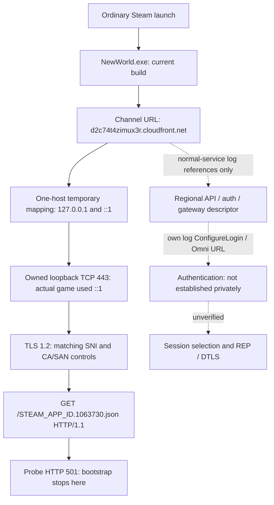

# Current-client connectivity

## Result — October 2, 2026 UTC

**The legitimate, unchanged current client reached our private HTTPS endpoint and sent its bootstrap request.** Correct local CA/SAN succeeds; removing CA trust or serving a wrong-name certificate prevents HTTP. No executable patch, process-memory inspection or Easy Anti-Cheat change was needed.

**Furthest verified protocol state:** HTTP/1.1 channel-bootstrap GET received and diagnostic HTTP **501** returned. Not authenticated, not world-loading, not spawned, not game-transport-connected, and not Milestone 1. Native game-window inspection was unavailable; a generic level-loader log marker is not evidence of loading Aeternum.

| Identity | Verified value / limit |
|---|---|
| Steam | App `1063730`, installed build `22469132` |
| Executable | `C:\Program Files (x86)\Steam\steamapps\common\New World\Bin64\NewWorld.exe` |
| File/product and own-log version | `1.400.6031.6004151` |
| Installed executable | 179,204,176 bytes; SHA-256 `8654f01d324636d9f74f1c793b0cc4a417c3c5fa9847d9913c358ca29e0fdc8e` |
| Live identity | Ordinary Steam launch, name/PID/exact start time, own-log build, exact OS socket owner. Windows returned no live executable path. **Installed-file hash is not a live-image hash.** Cause of path restriction is unknown. |
| Source identity | Started at clean local `main` `2206da7`; original instrumentation was uncommitted during experiments. Exact exercised source hashes/private-source hashes: [live receipt](../research/evidence/current-client-connectivity.json). First Light remains unchanged at `63756a3`. |
| Probe | Workspace Python 3.11.9, builtin SSL/OpenSSL 3.0.13; different from First Light's pyOpenSSL provider. Loopback only; no forwarding/authentication/game transport. |

The prior no-install/discovery and Steam-install handoff were historical results, superseded by the user-supplied installation and live tests. Initial ecosystem investigation was not repeated.

## Observed endpoint flow



| Stage | Actual evidence and boundary |
|---|---|
| Startup | Launched through existing Steam, first `steam://rungameid/1063730`, subsequent `-applaunch 1063730`. Installed hash checked before each launch. Own `Game.log` reports the same numeric build. |
| Channel selection | Baseline owned log line 298 references `https://d2c74t4zimux3r.cloudfront.net/STEAM_APP_ID.1063730.json`; later captured **actual** GET matches. This is not merely an executable string. |
| Configuration | Baseline log lines 305–348 reference five regional sets of CloudFront/execute-api hostnames; western hosts include `q8hqllbg6k.execute-api.us-east-1.amazonaws.com`, `v7irlu1nrl.execute-api.us-west-2.amazonaws.com`, `d3bj4csovi1fe8.cloudfront.net`. Listing a host does not prove it was contacted. Full safe hostname/line list is in the receipt. |
| Auth lead | Baseline line 380 mentions `https://d3bj4csovi1fe8.cloudfront.net/prod/credentials/omni`; line 424 contains `ConfigureLogin`. These are **log references**, not captured requests or successful authentication. Method/schema/order remain unknown. |
| DNS/redirection | Guarded hosts readback plus operator `.NET` resolver returned `::1` and `127.0.0.1`. Exact game-owned sockets reached `::1:443`. Supports current redirection compatibility; **not a client DNS-query trace** or proof of resolver/cache/fallback implementation. |
| TLS / HTTP | Actual attributed connections: SNI bootstrap hostname; TLS1.2; `ECDHE-RSA-AES256-GCM-SHA384`; selected ALPN `null`; HTTP/1.1 GET, zero declared body, no Authorization/Cookie headers. Offered TLS/ALPN extensions were not captured. |
| Other sockets | Baseline game TCP table had ports 443 and 80 on public IPs. No hostname/SNI/payload attribution for these; port80 alone is not proof of HTTP. Unrelated process traffic was not captured. |
| Character/world/session / spawn | No private observation; HTTP501 never supplies the needed descriptor. |
| Game transport / reconnect | No UDP/DTLS connection, actor or in-world reconnect tested. Fresh launches are startup controls, not game reconnect semantics. |

Baseline log read SHA-256: `11c17fd275b648ca0a55a0407a59b43ca7dee87927a3eeb83f4ac1083ce92de3`, 44,996 bytes. Source log is not copied into this repository. Whitelist metadata stays ignored; public receipt retains only approved hostname/version/provenance fields. Extractor timestamps are extraction times, **not source-event times**; growing-log reads are explicitly marked unstable.

## Certificate / TLS observations

All times UTC. Each phase used a fresh ordinary client launch. Within each experiment CA, correct leaf, endpoint, routing and executable stayed fixed; the hostname control used another leaf signed by the **same CA**, with the same server public key but a different DNS SAN and serial.

| Phase | First TCP accept | Accepts / HTTP requests | Result |
|---|---|---|---|
| A: local CA absent | 15:35:42.823 | 3 / **0** | Server TLS1.2 handshake finished; peer closed before parsed HTTP. No CA-alert diagnosis is invented. |
| A: same CA in CurrentUser Root | 15:40:00.621 | 3 / **3** | Bootstrap GET received, HTTP501 returned. |
| A: same CA removed | 15:42:29.544 | 3 / **0** | Reversal restored no-HTTP behavior. |
| B: new local CA, correct name | 15:50:29.803 | 3 / **3** | Exact socket owner PID **38624**, start `15:50:22.1571585Z`, matched launch. |
| B: same CA, wrong-name leaf | 15:53:21.044 | 3 / **0** | Exact owner **42316**, start `15:53:13.3230843Z`; unchanged requested SNI. Wrong SAN `hostname-mismatch.invalid`; no HTTP. |
| B: original correct leaf restored | 15:56:00.585 | 3 / **3** | Exact owner **40672**, start `15:55:53.1931704Z`; restored successful HTTP. |

Exact timestamps/fingerprints/source hashes are authoritative in the receipt. Three connections per launch were observed; retry-policy internals are unknown.

**Solved for this bootstrap:** temporary one-host routing + short-lived local CA in `CurrentUser\Root` + correct hostname leaf works with the stock client. A mandatory hardcoded Amazon certificate pin does **not** block this endpoint on this build. Unknown: active TLS/trust API, whether roots are loaded through Windows directly or application/library code, and any pinning/trust on other services. **REP/DTLS trust remains separate and untested.** A CA-signed local leaf was tested, not a standalone self-signed leaf.

Server `TLS_ESTABLISHED` alone is not client trust proof: even the untrusted/wrong-name game controls emitted it. The certificate conclusions rely on differential HTTP behavior, matching socket ownership, and restoration. Do not classify a reset or absent request as pinning. No TLS validation was disabled in the game.

## Redirection options, failures and limits

| Option | Current outcome |
|---|---|
| Single-host hosts mapping, both address families | **Works**. No broad historical list, proxy, global DNS setting or DNS-cache flush. Hosts was restored byte-for-byte after both windows. Requires Windows elevation; a validated timed helper requested UAC normally. |
| Local user-store CA | **Works for bootstrap**, exact-fingerprint import/readback/removal. No machine-wide CA import. CA private key is never written; leaf key/certs stay ignored. |
| Local config / CLI server override | No supported control found in bounded root/config/package-index/ASCII-flag inspection. Do not invent flags. Not proof none exists anywhere. |
| `bootstrap.cfg` remote_ip / remote_port | Commented/disabled asset-processor controls, not an evidenced game endpoint override. Static adjacency to `AssetProcessorConnection` corroborates this. Not used. |
| Local DNS server / HTTP proxy / SSL_CERT_FILE | Not tested. Compiled OpenSSL environment strings do not establish runtime support. Proxying would not prove certificate trust. |
| Binary patch / hooks / memory inspection | Not performed. User permitted narrowly scoped memory inspection, but supported trust/routing already solved this gate. EAC remains untouched. |

Instrumentation failures retained: original observer silently skipped path-inaccessible game processes; corrected to log the limitation and offer explicit PID/start-time correlation. Initial elevated helper had a malformed prefix-array expression and exited **before mutation**; corrected. Initial CA loader expected a private key; corrected to parse certificate-only PEM **before import**. A launch watcher misinterpreted PowerShell's automatic JSON date conversion; fixed, later exact owner controls succeeded. These failures are not game pinning evidence.

## Smallest service and structured transitions

The original transport probe accepts TLS and returns501 except health. A later [bootstrap checkpoint](BOOTSTRAP_CHANNEL.md) adds a strict local HTTP200 descriptor: current client parsed all five local region names and initialized its frontend, then failed Omni CreateSession with result204. No subsequent HTTP reached our listener; field requiredness and session routing remain unknown. Neither service forwards, invents auth success or saves headers/bodies. Do not reuse First Light's synthetic fallback verbatim.

All server/mutation/observer events have UTC timestamps. Server events carry run/connection UUIDs and ordered sequence numbers; logs flush per transition. Important states:

- `CLIENT_START` / `CLIENT_IDENTITY_UNAVAILABLE`: exact-path or explicitly labelled launch-correlated observer; target-file hash is context only.
- `ENDPOINT_RESOLUTION`: operator resolver evidence, **not fabricated client DNS telemetry**.
- `CONNECTION_ATTEMPT` → `CONNECTION_OWNER_OBSERVED`: accept-time exact client-side tuple lookup through Windows IP Helper, not 500ms polling alone. Only that tuple's PID is returned; unrelated table rows are discarded.
- `TLS_CLIENT_HELLO` → `TLS_ESTABLISHED` / `TLS_FAILED`: SNI callback, negotiated values, bounded error mnemonic. No full ClientHello/session-key capture.
- `HTTP_REQUEST` → `HTTP_RESPONSE`: route/method/version/body-length/header-presence metadata only.
- `AUTHENTICATION_REQUEST` / rejected `AUTHENTICATION_RESPONSE` and `GAME_SESSION_SELECTION_REQUEST`: already instrumented historical-route classifications; **not reached in these private tests**. No successful selection/transport state emitted.
- `CONNECTION_CLOSED`, CA/hosts mutation/readback/restoration events and bounded listener stop/ownership checks.

Probe events deliberately remain `client_identity:unattributed`; the evidence receipt performs the PID/start-time/socket correlation. Socket ownership is not live-image verification. API layout references: [GetExtendedTcpTable](https://learn.microsoft.com/windows/win32/api/iphlpapi/nf-iphlpapi-getextendedtcptable), [IPv4 owner row](https://learn.microsoft.com/windows/win32/api/tcpmib/ns-tcpmib-mib_tcprow_owner_pid), [IPv6 owner row](https://learn.microsoft.com/windows/win32/api/tcpmib/ns-tcpmib-mib_tcp6row_owner_pid). These are OS metadata, not invented New World packet layouts.

## Reproducible procedure

### Offline validation — no game/hosts/trust mutation

From `C:\Code\NewWorldPreservation`:

```powershell
& 'C:\Users\Austin\.codex\tools\Invoke-CodexPowerShell.ps1' -Path .\scripts\Test-ConnectivityProbe.ps1 -Execute
& 'C:\Users\Austin\.codex\tools\Invoke-CodexPowerShell.ps1' -Path .\scripts\Test-FirstLight.ps1 -Execute
```

First script: original19 loopback controls, CLI health/start/automatic-stop control,26 instrumentation/fixture tests, mocked observer scenarios. Hosts tests use only isolated `.scratch/` fixtures; native owner tests hold owned ephemeral sockets. No real trust-store edit. See [control receipt](../research/evidence/connectivity-validation.json), [instrumentation receipt](../research/evidence/instrumentation-validation.json), [CLI receipt](../research/evidence/connectivity-cli-control.json).

### Owned-client trial — explicitly live, not part of offline tests

1. Pin the actual installed executable with validated `Inspect-CurrentClient.ps1 -ClientExecutable 'C:\Program Files (x86)\Steam\steamapps\common\New World\Bin64\NewWorld.exe'`. Verify Steam build/version/hash. Preserve any already-running client unless its launch ownership is recorded.
2. Choose a **fresh** `private/connectivity/<run>/` directory. Generate a CA and two same-key/same-CA leaves:

```powershell
& .\.venv\Scripts\python.exe @('scripts/connectivity_probe.py','certificates','--directory','private/connectivity/<run>/certificates','--hostname','d2c74t4zimux3r.cloudfront.net','--hostname-negative-control')
```

3. In separate hidden processes/terminals start both binds; never stop an unrelated 443 listener. Record launched process IDs and Windows venv-shim child ownership:

```powershell
& .\.venv\Scripts\python.exe @('scripts/connectivity_probe.py','serve','--certificates','private/connectivity/<run>/certificates','--log','private/connectivity/<run>/correct-v4.jsonl','--bind','127.0.0.1','--port','443','--duration','600','--observe-local-socket-owner')
```

For IPv6 substitute `::1` and a distinct `correct-v6.jsonl`. Both must actually be listening before routing changes. `Start-Process` may return the venv launcher PID rather than the real socket-owner child PID; verify the parent-child relationship, do not guess.

4. Use the validator with `Set-ConnectivityHosts.ps1 -Action Prepare -JournalDirectory 'C:\Code\NewWorldPreservation\private\connectivity\<run>\hosts-journal'`. This snapshots existing bytes and refuses an existing active mapping for this host. Then run validated `Invoke-ConnectivityRedirectWindow.ps1` **elevated**, supplying that journal and actual `-IPv4ListenerProcessId` / `-IPv6ListenerProcessId`; `-Seconds 480`. It checks both listeners, applies one mapping, logs operator resolution, and restores in `finally` or at timeout. **Do not launch if resolution/readback is not confirmed.** End early by creating its `stop.request` file. It does not launch the client or change CA trust.
5. With CA absent, launch the owned game normally via Steam. Record launch time, unique new PID and exact UTC start time. Run validated `Observe-CurrentClient.ps1` with both `-ProcessId` and `-ExpectedStartTimeUtc` if its executable path is inaccessible. Match probe `CONNECTION_OWNER_OBSERVED` PID against this record. Capture only the game log whitelist via `game_log_metadata.py --source 'C:\Users\Austin\AppData\Local\AGS\New World\Game.log' --output private/connectivity/<run>/untrusted-log.json`.
6. Exit **only the recorded owned test client** before each next ordinary launch. Import exactly this CA through validated `Use-ConnectivityTrust.ps1 -Action Import -CertificateDirectory 'C:\Code\NewWorldPreservation\private\connectivity\<run>\certificates'`. Require exact CurrentUserRoot readback, then relaunch unchanged client and require attributed bootstrap GET. Remove with `-Action Remove`, relaunch under unchanged routing/cert and require no HTTP. A new run/directory is required for another import because ownership receipts are not overwritten.
7. For the hostname experiment use a fresh run/CA, import once, first confirm the correct leaf, then stop **only our verified listener child processes** and restart on both binds with the same certificate directory and additional `--hostname-negative-control`, fresh logs. Relaunch client: same requested SNI, no HTTP. Restart listeners without that flag and confirm restored HTTP from a fresh launch. Keep trust/routing/build fixed. No client verification bypass.
8. Stop only recorded owned client/probe processes; remove each exact CA; create `stop.request` for the elevated window; require its restoration event and original hosts SHA. Verify no probe listener remains. Keep raw/local logs, generated leaf keys, backups and journals ignored. Export only the normalized metadata/provenance fixture. Do not publish anything.

Guard scripts are rerunnable/reconcile partial apply/removal, refuse conflicts or ambiguous restoration, and preserve unrelated hosts/certificates/processes. Procedure placeholders are paths/recorded PID values, **not executable game flags**. It reproduces the measured 501 stopping point, not private authentication or world entry.

## Current-client differences from First Light / reuse

The historical bootstrap hostname/path still applies to this current build; source route: external `server/auth_mock.py:1343`, historical flow dated2025-12-27 in `docs/connection-flow.md`. Current western credential URL is logged, but First Light's full old routes/response schema/Steam JWT assumptions remain unverified on this build. Its manually maintained broad host list is unnecessary for this isolated test.

Reusable: channel loader/route scaffolding as a reference, HTTP/TLS concepts, separate transport/codecs/replay scaffolding. **Not used:** upstream raw request logging, success-synthesizing auth responses, shared persona/account state, all-interface listener, DTLS memory patch. No licensed source was vendored; our service/guard/observer/tests are original. Historical black-screen/replay results do not become current actor proof.

**Exact next blocker (supersedes501 checkpoint):** current channel JSON/HTTP200 parsing is observed; now route/observe Omni CreateSession on private infrastructure and explain result204 before implementing its response. [Latest evidence/procedure](BOOTSTRAP_CHANNEL.md). Private auth/session selection and separate REP/DTLS then precede live actor work. [SPAWN_SEQUENCE](SPAWN_SEQUENCE.md) remains a historical source map, not a current actor recipe. No gameplay implemented.

## Capture Before Shutdown

Only our own legitimate normal sessions. Prioritize:

- Account-independent channel descriptor **field names/types/required values**, regional/fallback selection, version compatibility and safe response metadata; do not retain tokens or account IDs.
- Own-process DNS/cache/IPv4–IPv6 decisions and public certificate-chain identity; offered TLS/ALPN extensions remain unknown despite selectedTLS1.2/HTTP1.1 proof.
- Normal auth route order, methods/status/content types and **redacted schemas**, refresh/failure/retry states; do not scrape credentials, tickets, cookies or tokens.
- Character/world selection fields and permitted empty/error responses; queue state changes and REP address handoff stripped of session secrets.
- First normal REP handshake, channel/registration/state transitions and disconnection behavior, captured in a secret-minimizing way; encrypted lengths/timing alone cannot establish payload semantics.
- First self/actor creation, initial transform, owned-vs-remote replica identity, level visibility and reconnect cleanup from authorized own sessions; preserve deterministic sanitized fixtures and build identity.

These are outstanding captures, not invented observations. The current preserved fixture is **metadata only**, not a complete wire transcript or server-response schema.
