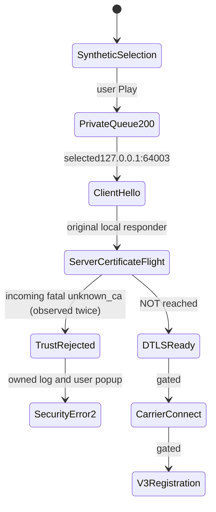

# Current REP DTLS trust and Carrier/V3 registration

## Scope and current evidence boundary

Continuation of [private queue handoff](PRIVATE_GAME_HANDOFF.md), clean parent HEAD `4bf6511468fa66d3935fca5859b2657c3ca3183b`. Target unchanged stock Steam22469132 / version1.400.6031.6004151 / installed SHA256 `8654f01d324636d9f74f1c793b0cc4a417c3c5fa9847d9913c358ca29e0fdc8e`. Prior own client reached selected127.0.0.1:64003 and sent ClientHello-header observations; prior observer sent no replies. This alone did not test certificate trust.

Work in this slice: verified local DTLS peers, owned current-client handshake/trust, then current Carrier/V3 **only if transport succeeds**. No actor/gameplay implementation, memory writes, executable/EAC change, other-user traffic, official-system authentication bypass, remote publication or mouse/keyboard control.

## Evidence ledger for this slice

| ID | Claim | Classification / limit | Evidence |
|---|---|---|---|
| D36 | Two isolated local DTLS clients verify the retained CA and exchange distinct payloads | Executed with normal and reversed completion order; presented-leaf-as-anchor control raises certificate verify failed and sends no application data. Not New World trust or hostname verification | Ignored `.scratch/dtls-local-exchange/probe.py`, results.json, experiment-report.md and validated run.ps1; fresh ephemeral127.0.0.1 sockets all closed |
| D37 | Existing Python DTLS BIO setup is a reusable integration boundary | Source-supported, clean First Light63756a3: per-source-tuple SSL.Connection/accept/feed/handshake/drain; server VERIFY_NONE means no client-certificate authentication, **not** a client trust bypass | `server/rep_responder.py:167–177,275–283,316–364,1308–1334`; no source vendored |
| D38 | Historical responder does not explicitly drive DTLS timers and emits unsafe raw logs for this task | Source-supported: no DTLSv1_handle_timeout call; record/parse-error/V3 payload dumps and identity/token logging. Do not run this responder unchanged | `rep_responder.py:433,451,601–613,631,673,768,771,1138`; old dtls_bridge one-client/WIP |
| D39 | Current-client REP trust differs from the successful private HTTPS result | **Observed rejection:** full configured leaf+retained-root flight followed by incoming fatal unknown_ca on both current-game attempts. CurrentUserRoot trust alone is insufficient for this tested path; exact active roots/pinning still unknown | [Current trust receipt](../research/evidence/current-dtls-trust-rejection.json); no trust/binary/memory changes |
| D40 | Original responder and portable controls preserve workspace regression | Executed268 pass/no failures/errors/skips;7 new actual-local/mock-error tests. Independent retained-CA experiment remains separate; no game acceptance | [Validation receipt](../research/evidence/dtls-local-validation.json),23explicit modules/36source hashes |
| D41 | Current game and owned responder exchange DTLS handshake/alert traffic | Observed two159byte ClientHello-header datagrams, two2516byte server flights and two15byte incoming fatal-unknown_ca records; both SNI callbacks report present=false; no completed handshake/application data | [Sanitized metadata fixture](../tests/fixtures/connectivity/current-dtls-trust-rejection.json), responder SHA13e73462791543f65bd0b328dc5f8d2d52c729e629df65f7d0cd244f204b8611 |
| D42 | `(2)` popup correlates with the incoming alerts | User report plus owned Game.log fixed mm_csdkerr_transport_security_error(2) at lines464,465,474,476. Log extraction timestamps are not source event times | Game.log SHA0742fcc46d9c5334d22be9d4d268eb7f46d24997e4ca110ce9e37135c376cd6d; receipt/parser tests |

The original local experiment uses Python3.11.9 / pyOpenSSL26.4.0 / cryptography50.0.2, the same installed dependency lock as the workspace. Both clients negotiated First Light's `ECDHE-RSA-AES256-GCM-SHA384` with separate server states. Test CA/leaf PEM-file hashes differ from DER fingerprints; compare like formats. No certificate/private key was copied into the test scratch folder. Its negative trust source was the presented leaf itself, not an unrelated CA; failure is scoped to those verification flags. The separate portable responder tests use temporary certificates, not game sessions or installed trust.

## Owned responder design and observability

Use existing pyOpenSSL memory-BIO boundaries in an original loopback-only diagnostic, not First Light's raw-logging responder or an OpenSSL subprocess bridge. Each source tuple owns an independent connection/state and outbound encrypted BIO route. OpenSSL, not a speculative New World codec, implements the handshake and encryption. Explicit public timeout handling covers timer-driven handshake retransmission; actual loss behavior must be tested separately.

Reuse `private/connectivity/retained-test-ca.json` certificate_directory, `server.pem`, `server.key`, `ca.pem`; never print key/PEM bytes. Startup leaf/root DER fingerprints describe **configured** material, not a wire capture or proof of certificate transmission. Record whether the root chain is supplied separately from actual output/peer evidence. Same CurrentUserRoot thumbprint `1AEE2B69AD82A5C6F2CF52A80127D22A4487CECA`, expiry2026-10-09T18:58:22Z; no import/removal/new approval. Configurations differ only where explicitly documented.

Required timestamped evidence: fresh Steam/PID/start identity; queue HTTP200/hash; received UDP bind-owner readback (not exact flow); handshake state changes; outgoing encrypted byte counts; optional SNI presence/class with unknown values discarded; SSL alert direction/level/description; negotiated version/cipher on server completion; decrypted application **length only**; timeout/close and client-first cleanup. Server completion alone must not be promoted to gameplay/authentication or a final client trust decision. A no-response timeout is not pinning proof.

Protocol/library references: [RFC6347](https://www.rfc-editor.org/rfc/rfc6347.html) for DTLS framing/handshake flights, and [pyOpenSSL SSL API](https://www.pyopenssl.org/en/stable/api/ssl.html) for BIO, info callbacks and DTLS timeout methods. These describe standard DTLS/library behavior, not New World packet schemas.

## Current-game outcome: full-chain trial

Clean exercised HEAD880662a829eb3f941426e322882d32d9e4a4c29b; no source edits during live execution. Same legitimate installed build/hash and retained CA as above. Fresh normal Steam launch21:44:35.558Z, owned PID34940/start21:44:39.910Z. IPv6 HTTPS443 receives queue-v2/omni, returns the unchanged synthetic829byte200 at21:45:12.584Z. Selected game destination remains127.0.0.1:64003.

First DTLS input21:45:12.758Z; OpenSSL writes server_hello/certificate/key_exchange states and emits2516bytes. At21:45:12.759Z, an incoming epoch0 alert record (15byte datagram,2byte record body) is decoded by OpenSSL as **read/fatal/unknown_ca**. Peer closes without establishment. A second ClientHello at21:45:12.778Z gets the same flight and explicit alert. IPv4 bound-port owner is the fresh game PID; this is not an exact-flow trace or live executable hash. No SNI is present in either callback. DTLS1.2 record version is a header observation, **not a negotiated session version**. Leaf/root fingerprints identify configured material; no separate DER-on-wire comparison was performed.

User-visible result: **“A secure connection could not be made. Please restart or update the game and try again. (2)”**. Our extractor exports only the matching fixed SDK code/value and line numbers, never raw error text or account/session values. No application/Carrier/V3 record was received. This differs from the old receive-only timeout: our server answered; the game rejected the presented chain. It does **not** alone prove leaf pinning, a particular embedded CA, hostname validation behavior, or that Windows roots are globally ignored.

Cleanup verified: client stopped21:46:13.420Z **before** hosts/firewall restoration21:46:14.520Z; HTTPS absent21:46:26.341Z; DTLS64003 absent21:46:32.653Z. Final readback21:46:39.750Z: original hosts SHA7c0d9bdf4d52255a757f4e1fa235c39a65701b26ec7b2c5aae8975539a4cc708, owned rule absent, no game/443, same CA Root count1. CA intentionally retained. No attachment, memory access, cursor/keyboard control, executable/EAC modification or raw capture export.

## Exact current-workspace reproduction

1. Require no running NewWorld and no443/64003 listeners. Verify pinned installed SHA/build, clean checkout and unchanged candidate file/canonical response hashes in the prior handoff document. Retained CA must have the exact Root entry and be unexpired; do not reimport it.
2. Validate/run `.scratch/prepare-dtls-run.ps1 -Chain full` through `Invoke-CodexPowerShell.ps1`. It creates a **fresh ignored run**, not reuse of this immutable receipt. `active-channel-trial.json` records source identities and journal paths.
3. Validate/run `start-queue-listeners.ps1`, then `start-dtls-responder.ps1`. Verify child-parent/PID/start ownership and loopback443/127.0.0.1:64003. Neither service forwards traffic.
4. Validate/run `dispatch-channel-trial.ps1`. User approves elevation with their own inputs if prompted. Require BOOTSTRAP_TRIAL_READY, exact three-name loopback resolutions and game-only nonloopback firewall ActiveStore readback **before** launch. Helpers/Steam/EAC are not filtered; this is configuration evidence, not packet-enforcement proof.
5. Validate/run `start-owned-baseline.ps1`, then immediately `record-channel-client.ps1`. Normal Steam launch, no attach/inject. User manually advances Continue, selects Preservation and clicks Play once.
6. Inspect structured `bootstrap-v4/v6.jsonl` and `dtls-transport.jsonl`. Require queue200/candidatehash, actual outgoing flight and the **incoming** fatal alert before concluding rejection. Server completion alone is not client trust acceptance. Record user screen independently. Default responder discards application bytes and cannot register/load a world.
7. Validate/run `stop-channel-trial.ps1`; require client stopped/trial closed before `close-channel-listeners.ps1`, `close-dtls-responder.ps1`, then `verify-credentials-cleanup.ps1`. Record separate UDP absence. Retain same CA; restore hosts/rule state. Never overwrite earlier run/receipt/fixture outputs.

Helpers are ignored local operator tooling, not portable deployment services. Wrapper: `C:\Users\Austin\.codex\tools\Invoke-CodexPowerShell.ps1 -Path <full-script-path> -Execute`. Tracked responder, extractor and immutable metadata fixture are the reviewable artifacts. This fixture is **sanitized metadata, not a raw handshake replay**. Local control tests exercise real DTLS without game/OS trust changes. Current explicit regression:273 pass, no failures/errors/skips; five new fixed-code/privacy tests were added after live capture, with an expected failing pre-change test followed by14 passing focused checks. [Current validation receipt](../research/evidence/current-dtls-trust-rejection-validation.json) pins39 source/fixture hashes; unaffected268-test source hashes remain unchanged.

## Historical Carrier/V3 map — not yet current-client proof

| Boundary | Existing reference implementation | Current limitation |
|---|---|---|
| DTLS → Carrier | `parse_envelope` then `parse_datagram`; envelope plaintext0x80/proto0x01/BE16sequence | Only apply to actual decrypted current data; lengths/flags may differ |
| Connect request | Channel3, system-msg trailing ID1 | Current request not yet observed |
| Connect ACK | Historical default reliable ch3 flag0x21, body00 00 00 05 02 plus inline ACK | Envelope-sequence echo is a historical hypothesis; ack-variant CLI is ignored by sender |
| V3 request | Historical flags0xe0/0xf0 and no-length framing; strict old832bytes plus lenient identity extraction | Responder's generic flags&0x40 heuristic is too broad for a current semantic claim; real auth blob/identities must not be logged |
| V3 response | Existing 88byte codec, VLQ-length framing, default reliable ch0, optional piggyback ACK | Help says mirror request but implementation defaults ch0; success/current dependencies untested |

Sources: clean ignored First Light `server/javelin/frame.py:40–94,142–225`, `v3_request.py:111–169,295–347`, `v3_response.py:149–175`, `rep_responder.py:425–480,639–765,1069–1140`. No payloads, proprietary client code or upstream source are copied here. Parser round-trips and field names do not prove registration acceptance.

## Reproduction and gates

Offline responder checks completed:7 focused tests and full268-test regression, with temporary unrelated-CA rejection/read-fatal-unknown_ca, separate local peers, timer retransmission and socket-error controls. Corrected startup fingerprint labels and historical negative-anchor identity after targeted review. Live outcomes will be recorded separately with exact exercised source hashes. Live routing uses the prior TokenServices profile, owned HTTPS443 and selected UDP64003; only our game executable is blocked from nonloopback destinations. ActiveStore readback is configuration evidence, not whole-machine/helper packet enforcement proof.

Responder CLI: `.venv\Scripts\python.exe scripts/dtls_transport_probe.py --certificates <same-retained-directory> --log <fresh-private-jsonl> --port 64003 --duration 600 --chain full`. Bind is fixed127.0.0.1. `--chain leaf` changes the presented chain only; it does not regenerate certificates or alter trust. Default decrypted application handling records length then discards bytes, with no Carrier response. The optional callback is for later evidence-constrained integration, not enabled by this CLI.

No already-running client/listener is replaced. All helper scripts require full PowerShell validation, fresh ignored run journals and explicit process/start/parent/script ownership. Normal Steam launch; user advances Continue/Preservation/Play manually. Stop owned game before restoring hosts/firewall; stop owned responder/listeners and verify original hosts bytes/hash, rule absence and same retained CA.

Next decisions must follow evidence: local configuration/root/chain behavior first; if current private trust rejects, preserve the exact error and narrowly inspect the **current** transport trust path. Never apply an old memory hook, manufacture a certificate/signature, modify the running game's memory, or mislabel a generic popup as pinning. Actor work waits for transport/registration/private identity and current spawn evidence. Milestone1 remains unachieved.

Targeted independent review checked receipt-pinned hashes,273-test JUnit and same-peer output/read-alert ordering. The rejection/privacy claims survived. Corrected “absent callback” to “both callbacks report no SNI value.” No SNI does **not** prove endpoint-name verification is disabled. The reviewer did not rerun the game or recheck live OS state; cleanup remains the primary's executed readback.
