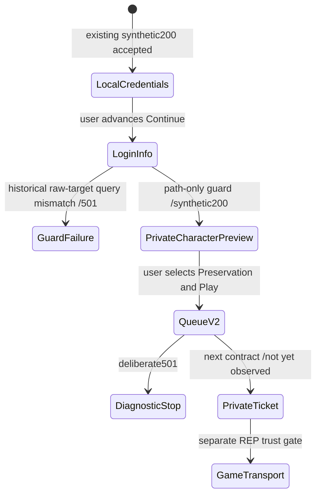

# Current private character-selection checkpoint

**Historical stopping point below:** later [PRIVATE_GAME_HANDOFF](PRIVATE_GAME_HANDOFF.md) serves queue200 and observes the current client's owned-loopback DTLS attempt. No completed handshake or world actor. This document retains the selection experiment and its earlier deliberate queue501.

## Observed result

Steam build **22469132**, file version **1.400.6031.6004151**, installed SHA256 `8654f01d324636d9f74f1c793b0cc4a417c3c5fa9847d9913c358ca29e0fdc8e`. With the same retained CA and unchanged stock client, an original synthetic login-info response rendered **Preservation**, its **Preservation Local** world label and a frontend avatar preview. The user selected it and pressed Play; an attributed queue-v2 POST followed and received our deliberate501. **No world entry, REP connection or player actor is proven.**

[Observed metadata fixture](../tests/fixtures/connectivity/current-login-info-result.json) and [receipt](../research/evidence/current-login-info.json) distinguish failed guards from the actual response experiment and pin dirty exercised source/private evidence. User screenshots are not redistributed. The final popup reads “Cannot log in due to too many players in queue. Please try again later.” This is the client's display after our501, **not a measurement of queue population**.

## Failed guard and correction

The first candidate trial (`57a477…`) never sent login-info data: the raw-target regex rejected every request. A separate diagnostic (`6ae55d…`, owned PID7532/start20:18:18.4014455Z) observed GET/body0/auth-present/correct-host, origin-form, five path segments, path-pattern match, **query present**, raw-target-pattern mismatch, no fragment/trailing slash/double separator. URI values were discarded. These flags isolate the guard failure; neither failed trial tested the model.

The original handler now matches the parsed path and discards query values; it still rejects absolute-form/fragment targets, unexpected hosts/methods/bodies and unknown routes. Synthetic TLS tests reproduced the query501 before the fix and pass afterward. This diagnostic does not validate SigV4 signatures or interpret query semantics.

## Successful trial

Run `token-contract-credentials-6f7ee271dea5474cbb568e6df8d0facc`; starting clean HEAD5250f79, new probe/fixture/test dirty, exercised probe SHA `dc8b758e156485f8c606886ae4176ef420284538040e034133408f104bb16611`. Normal Steam launch20:22:27.3585815Z; fresh PID2196/start20:22:31.6038291Z. Installed-file hash + exclusive fresh launch + exact accepted client TCP tuple ownership, **not live-image hashing**; per-user cache was not cleared.

| Transition | Timestamp/evidence | Limit |
|---|---|---|
| Temporary contained routing ready |20:22:04.723Z, operator resolver loopback + program-only ActiveStore rule|Configuration, not full packet/helper-process enforcement proof|
| Existing token response |20:22:46.290Z, synthetic461bytes|No official/private-account authentication claim|
| Existing credentials response |20:22:46.297Z, synthetic188bytes|Same accepted numeric contract, no collected credentials|
| Login-info GET |20:22:57.880Z, body0/auth-present, local regional alias TLS1.2|Sanitized `/prod/game/getlogininfo/<redacted>/omni`; query values discarded|
| Synthetic login-info200 |965bytes, SHA `8b9019b4a1133be82ce3532592d3298faccb8a234129d93b1e41ba9a7b3b03b5`|Original controlled candidate, not captured official response|
| Character preview and Play |User report/screenshots|Frontend avatar is not an in-world actor|
| Queue-v2 POST |First20:23:19.989Z; sixth retry20:23:20.758Z;644bytes/auth-present, same owned PID/TLS1.2;501|Body discarded, no queue response/ticket issued in this historical trial|
| Cleanup |Client stopped20:24:27.299Z before hosts/rule restore20:24:28.401Z; listeners absent20:24:44.416Z; OS readback20:24:46.619Z|Original hostsSHA, rule/client/listeners absent; same CA Root1 intentionally retained|

## Current static model evidence

PE exception bounds and field reads, pinned to the executable above; derived annotations remain ignored/private. Presence-checked fields are not proven mandatory.

- Result inspected from0x1474e01e0 reads `LoginInfoList` and calls0x1474e42e0.
- Nested model `[0x1474e42e0,0x1474e4f1d)`: arrays `Characters`, `Worlds`, `NameReservations`, `PendingWorldMerges`; integer `MaxChannelCharacters`, `CrossRegionTransferCooldownMins`.
- Character parser `[0x1474e1f60,0x1474e3c2a)`: identity/world/name/date strings and published-data/ownership/trial/FTUE metadata. Empty `PublishedData` sufficed for this frontend preview; valid gameplay appearance/state remains unknown.
- World parser `[0x1474e8e90,0x1474ea126)`: PascalCase world identifiers/status/type/version/name and integer capacities/counts, booleans and `WorldMetrics` object.
- Metrics `[0x1474ea130,0x1474ea671)`: integers `QueueSize`, `QueueWaitTimeSec`, `WorldAgeDays`; **string** `WorldPopulationStatus` (omitted in candidate, enum unknown). Do not blindly reuse the historical mock's lowercase/integer metric guesses.

Historical First Light63756a3 supplies useful schema candidates, including ACTIVE/OpenWorld strings, but its hardcoded1.0.0 version/extra lowercase world list, shared seed persona and fake tickets are not current proof. This experiment used original synthetic data with the current parsed nested model, not copied mock code or assets.

Static caller1464154e0 selects `/prod` plus `/game/getlogininfo/jwt/omni`, `/game/getlogininfo/jwt` or `/game/getlogininfo`, calling1463e5e30. Builder passes `SignatureV4` at1463e5f38. Function1474ea680 uses candidate query keys `channelId` and `includeNames`; the bounded trace does not conclusively connect that parameter builder to this particular URL object. Live diagnostics establish origin-form/query presence, **not actual query names/values or signature validity**.

## State machine

## Exact reproduction

1. Verify the installed build/hash, no existing game/443 owners, and the **same** retained CA manifest/trust receipt/expiry and exact CurrentUser Root count1. No trust import/removal is part of this trial.
2. Validate PowerShell using `Invoke-CodexPowerShell.ps1`. Prepare TokenServices named-host mappings with tracked `Set-ConnectivityHosts.ps1`; use a new private descriptor/log/journal directory.
3. Run two instances of `scripts/session_handoff_probe.py --certificates <retained-directory> --descriptor <private-local-channel> --log <new-private-jsonl> --bind <127.0.0.1-or-::1> --port 443 --duration 600 --observe-local-socket-owner --case seed-character`.
4. Use tracked `Invoke-BootstrapTrialWindow.ps1`, TokenServices,300seconds, actual owned listener PIDs. Wait for READY before normal Steam `-applaunch 1063730`; record fresh PID/exact start time in owned-client.json before cleanup. Never disable EAC, patch client trust or take user inputs.
5. User advances Continue, selects Preservation, presses Play once. Match response hash and exact owner-correlated login-info/queue requests. Do not treat server200 alone as client acceptance.
6. Request watchdog stop; verify owned client stops **before** original hosts/firewall restoration. Stop only owned listeners and read back original hosts hash/rule absence/no game/no443/same Root1. Export only fixed whitelist markers from the user's own log.

Existing ignored local orchestration: prepare-session-handoff-run, start-session-listeners, dispatch-channel-trial, start-owned-baseline, record-channel-client, stop-channel-trial, extract-token-trial, close-channel-listeners, verify-credentials-cleanup. These helpers are local conveniences; tracked scripts above are the implementation.

## Next blocker / capture before shutdown

The current queue-v2 response, readiness/refresh/cancel behavior, private ticket/REP selection and game-transport trust remain unverified. Static queue result chain1474e1370 ->1474e89d0 (`LoginQueueResponse`) ->1474e4f20 (`Token`) ->1474e5990 establishes candidate JSON names/types, not a ready-state or gameplay contract. Do not manufacture JWT/signature semantics from names.

Especially valuable own-session observations before shutdown: query-key/type relationships (no values), cold versus cached character-list ordering, published-data schema/minimums, queue-v2 request/response key/type/length, ready/refresh/cancel/expiry transitions and selected REP address family/port, followed by DTLS/registration/spawn boundaries. Never export real account identifiers, credentials or signature/ticket values. Actor implementation remains gated.
