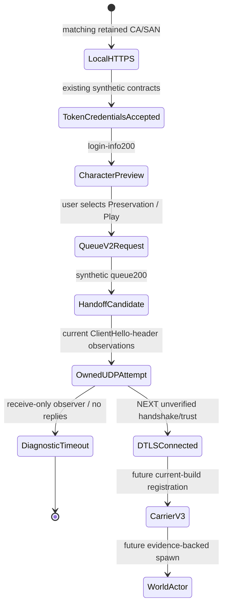

# Current private queue-to-game handoff

## Observed result — October 2, 2026 UTC

**The stock client consumed our original synthetic queue response and attempted DTLS at our selected loopback game endpoint.** This resolves the response/address handoff for this build, not secure private authentication or the game handshake.

Steam build **22469132**, version **1.400.6031.6004151**, installed executable SHA256 `8654f01d324636d9f74f1c793b0cc4a417c3c5fa9847d9913c358ca29e0fdc8e`. Starting clean workspace HEAD `71cbca2d5c39e6cb5db65e9f9bcbd3ca78aa7e84`; original queue/UDP additions were dirty during the trial. [Evidence receipt](../research/evidence/current-queue-handoff.json) pins exercised sources, private observations and cleanup; [observed fixture](../tests/fixtures/connectivity/current-queue-handoff-result.json) contains metadata, **not packet replay**. First Light remains unchanged at `63756a3`.

Run `token-contract-credentials-24ec4c1dc1b445eeb94b6d9947822caf`, normal Steam launch `20:44:28.7533440Z`, fresh PID24748/start `20:44:33.2930389Z`. Installed-file hash, exclusive fresh launch/start and exact HTTP-side socket owners identify the trial. Windows did not expose the live image path; **this is not a live-image hash**. Per-user cache was not cleared.

| Transition | Observed evidence | Limit |
|---|---|---|
| Bootstrap/token/credentials | Existing accepted local synthetic responses over owned HTTPS | Compatible envelopes, not official authorization or secure private accounts |
| Character/world selection | Same login-info200; user saw/selects Preservation and clicks Play | Frontend preview, not a world actor |
| Queue request | `20:45:07.369Z`, POST `/prod/game/login/queue/v2/<redacted>/omni`,644bytes discarded, Authorization present/Cookie absent, TLS1.2 and exact TCP owner24748 | Request schema/signature values not inspected or validated |
| Queue response | HTTP200,829bytes, canonical SHA256 `628bca819e5995a8e0eec41405f2d3750ea75691ab1fac98f924357f45b9aeca` | Original synthetic candidate, not a captured Amazon ticket |
| Game transport attempt | First datagram `20:45:07.530Z`,161ms after request event; ten159byte datagrams through `20:45:22.606Z` at127.0.0.1:64003 | Request-event interval is not measured response-to-datagram latency |
| Datagram identity | Source127.0.0.1:27000, native IPv4 UDP bind-owner24748 for all ten observations | Bound-endpoint owner, not exact UDP flow ownership or live-image proof |
| Header classification | Epoch0 handshake record, DTLS1.2 record-version,146byte record body, ClientHello fragment/header flags | ClientHello body not validated/saved; no negotiated-version proof |
| Visible outcome | User reports Play-button spinner briefly, then “Unable to connect to the server” popup | **Not a world-loading screen.** Observer sends no replies; popup does not demonstrate certificate rejection or Internet failure |

No DTLS response or certificate was sent. No completed handshake, Carrier/V3 registration, world loading, world entry, actor or mutual movement. **Milestone1 remains unachieved.** No inputs controlled, memory accessed, executable/EAC changes, official-system testing or credential collection.

## Current response model and evidence boundary

Bounded, installed-file-hash-pinned static inspection traces result constructor `0x1474e1370` → reader `0x1474e89d0` (`LoginQueueResponse`) → `0x1474e4f20` (queue object) → `0x1474e5990` (`Token`). The two inspected request wrappers select SignatureV4 and invoke the result/callback after HTTP success. Private annotation hashes are in the receipt; no proprietary disassembly is tracked. Parser success alone did not prove handoff; the subsequent owned-UDP observation does.

| Object | Source-supported field names/types | What remains unknown |
|---|---|---|
| LoginQueueResponse | Bool `AllowQueueTransfer`; integers `EstimatedTime`, `Position`, `RefreshInterval`; strings `QueueName`, `RecommendedTransferWorldId`, `TicketId`; object `Token` | Requiredness, readiness conditions, refresh/cancel/transfer and error semantics |
| Token identity/routing | Strings `CharacterId`, `WorldId`, `PersonaId`, `TicketId`, `LocationId`, `LocationGroupId`, `RepAddress`, `ChannelId`, `ClientCapabilities`, `HostHash`, `SteamUserId`; integers `SteamAppId`, `TokenVersion`, `AccountAge`; booleans `AccountIsLocked`, `IsPermanentAppOwner`, `IsTrialOwner` | Ownership, capability/channel/version meanings and which fields actually influence the handoff |
| Token time/crypto | Numeric doubles `GenerateTime`, `IssueTime` via `0x147465440`; strings `Signature`, `JwtClaims` | Time units/expiry and downstream signature/JWT verification; no checks established by a parser storing these fields |

The [original candidate](../tests/fixtures/connectivity/current-queue-parser-candidate.json) uses matching synthetic character/world/persona IDs, `RepAddress:"127.0.0.1:64003"`, empty JwtClaims, an explicitly non-Amazon signature marker and diagnostic numeric times. **These are tested compatibility values, not valid production credentials or a secure ticket contract.** No real identifiers, signatures or tokens are replayed. Numeric types are source-supported; chosen clock values/units/lifetime are not verified.

No `Ready`, `QueueReady`, generic Status/Location or lowercase duplicate aliases appear in this bounded typed parser chain. Historical First Light's ready-shaped mock is therefore not reused blindly. Other readers are not ruled out. The `token-empty` comparison exists as an offline case; **it was not run against the live game**. No minimal-field/expiry/negative-signature study is claimed.

## State machine and structured instrumentation



Existing UTC/run/connection-correlated logs cover CLIENT_START, operator endpoint resolution, exact TCP connection owner, HTTPS TLS/SNI, token/credentials and selection requests/responses. New events: `PRIVATE_QUEUE_CONTRACT_REQUEST` → `HTTP_RESPONSE` → `PRIVATE_GAME_HANDOFF_CANDIDATE`; separate observer `UDP_HANDOFF_OBSERVER_LISTENING` → `GAME_TRANSPORT_DATAGRAM_OBSERVED` → observer stop/cleanup. The HTTP emitter explicitly does not claim client acceptance; that is established separately by UDP observations. No successful DTLS state is emitted.

Standard header classification follows [RFC6347 sections4.1.1 and4.2.2](https://www.rfc-editor.org/rfc/rfc6347.html), not an invented New World format. OS ownership uses [GetExtendedUdpTable](https://learn.microsoft.com/en-us/windows/win32/api/iphlpapi/nf-iphlpapi-getextendedudptable) and the [IPv4 owner-PID row](https://learn.microsoft.com/en-us/windows/win32/api/udpmib/ns-udpmib-mib_udprow_owner_pid). It cannot return a destination tuple. Raw HTTP bodies/headers/query values and UDP bytes are discarded, not retained as fixtures.

## TLS, failed approaches and minimum services

**HTTPS trust is solved for the tested bootstrap/token/regional-service alias** with the retained CurrentUser Root CA and matching leaf SANs. The regional requests used the bootstrap alias, not every original regional hostname. The earlier absent-root/wrong-SAN bootstrap controls remain separate evidence. **Game DTLS trust is not tested or solved:** receive-only UDP never supplies a server certificate. A ClientHello attempt cannot establish pinning, accepted trust, negotiated cipher or DTLS session success.

Minimum observed services to reach this point: dual-stack HTTPS443 for local channel → token → credentials → login-info → queue; selected IPv4 loopback UDP64003. Other endpoints remain fail-closed501. No forwarding, gameplay service or broad proxy. The earlier login-info raw-target guard failed because a query was present; path-only matching fixed it without retaining query values. Earlier deliberate queue501 produced a misleading “too many players” UI error; the200 trial instead reached our UDP endpoint. No queue200 rejection was observed in this trial.

## Exact reproducible procedure

1. Pin the installed build/hash above, ensure no pre-existing game or443/64003 listener, use a fresh ignored private run directory. Read `private/connectivity/retained-test-ca.json` **certificate_directory**, its ownership/expiry and exact CurrentUser Root readback. Current CA thumbprint `1AEE2B69AD82A5C6F2CF52A80127D22A4487CECA`, expiry2026-10-09T18:58:22Z. Reuse it; no reimport/deletion. After expiry, this procedure needs an explicitly recorded replacement trust setup.
2. Use the original local descriptor from the previous selection trial with token-routing `original-hostnames`. Prepare `Set-ConnectivityHosts.ps1 -Action Prepare -JournalDirectory <new-run>/hosts-journal -EndpointProfile TokenServices`. Validate all orchestration through `C:\Users\Austin\.codex\tools\Invoke-CodexPowerShell.ps1`; use native argument arrays and Hidden background windows.
3. Run two owned instances of `.venv\Scripts\python.exe scripts/queue_contract_probe.py --certificates <retained-directory> --descriptor <private-descriptor> --log <fresh-v4-or-v6-jsonl> --bind <127.0.0.1-or-::1> --port 443 --duration 600 --observe-local-socket-owner --case token-loopback`. Record actual child PIDs/start times; verify both listeners.
4. Start owned `.venv\Scripts\python.exe scripts/udp_handoff_probe.py --log <fresh-private-jsonl> --port 64003 --duration 600`. Record actual PID/start/parent/script and verify127.0.0.1 binding. This listener receives only; never sends a handshake/replay.
5. Run tracked `Invoke-BootstrapTrialWindow.ps1 -RunDirectory <new-run> -IPv4ListenerProcessId <actual-v4-PID> -IPv6ListenerProcessId <actual-v6-PID> -Seconds 300 -EndpointProfile TokenServices` through validated elevated orchestration. Wait for READY: three explicit hostname mappings, operator loopback resolver and game-only ActiveStore nonloopback block. This is configuration readback, not whole-machine/helper-process packet enforcement proof.
6. Launch normally through Steam `-applaunch 1063730`; record fresh PID/exact start and launch boundary in owned-client.json **before watchdog cleanup**. User advances Continue, selects Preservation and clicks Play once. No automated inputs. Join exact HTTP owner/200 candidate hash and received UDP bind-owner observations to this identity. Do not collect auth values or attach to memory.
7. Expect only a brief Play spinner and connection error with this receive-only service. Request stop via `<new-run>/stop.request`; stop the verified owned game **before** hosts/rule restoration. Stop only recorded owned HTTPS/UDP processes after start/parent/script guards. Read back original hosts bytes/hash, no owned rule/game/443/64003, exact same retained Root1. Do not stop Steam/EAC helpers or unrelated processes.

This run's cleanup: game20:47:29.733Z → hosts/rule20:47:30.867Z → HTTPS absent20:47:53.598Z → UDP absent20:47:55.255Z → final OS readback20:47:57.498Z. Same CA retained intentionally; original hosts SHA256 `7c0d9bdf4d52255a757f4e1fa235c39a65701b26ec7b2c5aae8975539a4cc708`. UDP cleanup was controlled process termination, not a graceful-stop event. Ignored `.scratch` helpers are conveniences; tracked service/guard scripts above provide the implementation.

## Tests and exact next blocker

**261 explicit workspace tests pass, no failures/errors/skips;48 new** (22 queue guards/envelope/privacy,10 UDP headers/no-reply/loopback,13 native UDP ownership/fail-closed,3 observed metadata/hash/order). [Validation receipt](../research/evidence/current-queue-handoff-validation.json). Native ownership tests exercised real isolated Windows binds. Synthetic RFC/header tests do not validate the game's full ClientHello body. Unchanged upstream455 pass/1 deliberate skip is historical and was not rerun; no codec edits.

Reproduce the48 new offline checks from the workspace without starting a game or changing hosts/trust:

```powershell
$pythonExecutable = 'C:\Code\NewWorldPreservation\.venv\Scripts\python.exe'
$testArguments = @('-m','pytest','-q','tests/test_queue_contract_probe.py','tests/test_udp_handoff_probe.py','tests/test_windows_udp_owner.py','tests/test_current_queue_handoff.py')
& $pythonExecutable @testArguments
```

The receipt lists the full22-module261-test regression scope and exact runner/JUnit/source hashes; no bare upstream test discovery is implied.

Next: attach an evidence-backed **owned DTLS responder** at the selected REP address, preferably using existing First Light/Python scaffolding, and log the current client's handshake/trust result. First exercise two controlled local DTLS peers; then current-client trust with local configuration/roots before considering narrowly scoped binary work. HTTPS trust must not be substituted for this evidence. If DTLS completes, establish current Carrier/V3 bytes/state and ticket-to-peer ownership. Only then collect the current actor/spawn contract. **Actor implementation cannot begin on this handoff evidence alone.**

## Capture Before Shutdown

- Own normal-session queue schema/key types and request/response ordering; waiting/ready/cancel/refresh/expiry/disconnect transitions, without real tickets/signatures/account identifiers.
- Selected REP address family/port relationship and endpoint metadata, with stable sanitized world/character correlations.
- Own ClientHello/ServerHello **safe metadata**: offered/selected versions, cipher names, public extension types, retries/cookie exchanges, certificate issuer/SAN/fingerprint/trust failure markers. No keys, random/session/ticket values or other-user traffic.
- Cold versus cached launch/selection behavior, SDK/log state/error codes and frontend versus actual level-loading boundaries.
- After permitted handshake/registration observation, build-bound direction/channel/type/length and sanitized self-identification/level/replica/initial-transform correlations. Encrypted size metadata alone is not a spawn schema.

Unresolved: request JSON fields, queue follow-ups, secure local account/ticket validation, clock units/expiry, downstream signature/JWT requirements, DTLS certificate/pinning/SNI/ciphers, Carrier/V3 current compatibility, and all in-world spawn/movement behavior. No conclusion requires attacking Amazon or modifying the running game.
