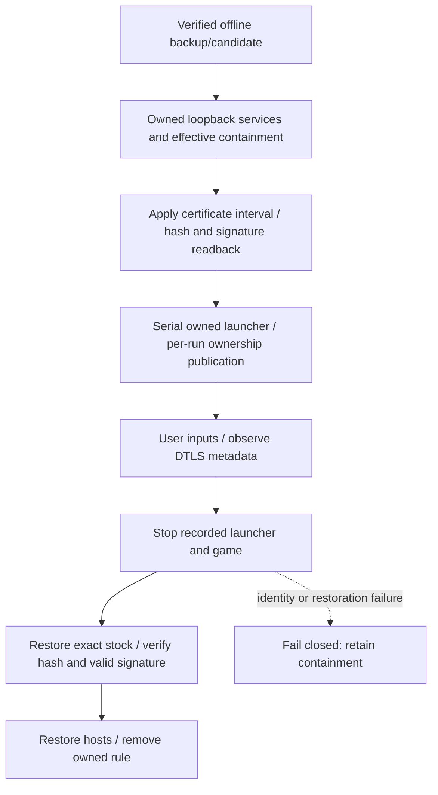

# Private REP anchor trial

## Offline checkpoint — not client acceptance

Stock Steam build22469132, client1.400.6031.6004151; installed EXE SHA256 `8654f01d324636d9f74f1c793b0cc4a417c3c5fa9847d9913c358ca29e0fdc8e`. The installed client remains unchanged at this checkpoint. [REP trust policy](REP_TRUST_POLICY.md) documents the preceding static initializer/verifier trace; [DTLS registration](DTLS_REGISTRATION.md) retains the six stock-client fatal `unknown_ca` attempts.

No supported private-CA setting was identified in the inspected REP path. The initialized certificate pointer is writable `.data` with a DIR64 loader relocation, pointing to read-only `.rdata`. Targeted scans found two validated factory reads, no direct RIP-relative writer/address-taking reference. Computed aliases, external writers and other configuration paths remain unexcluded; **this is not proof that all normal overrides are impossible**. The five observed transport-option keys are type, backoff-resends, disconnect delay, tick frequency and default port. Their underlying configuration source is still unknown. The alternate factory transport identifies LibUV, not another evidenced GridMate CA input.

The evidence-backed fallback is **certificate-data substitution for an isolated owned-client experiment**. It replaces the mapped embedded certificate with the already approved private CA, retaining the inspected verifier instructions. It deliberately changes accepted issuers; it does **not** preserve the original trust policy or establish a supported configuration mechanism.

## Candidate boundary

[rep_anchor_candidate.py](../scripts/rep_anchor_candidate.py) has only offline `plan` / `prepare` actions. It never edits the installed executable or launches processes.

- Exact full source-image size/hash, original certificate DER and NUL boundary are pinned.
- Exact approved single certificate-only PEM/DER, CA/key usage and validity interval are checked. Keys, multiple certificates, unrelated roots, expired/not-yet-valid roots and oversized inputs are refused.
- Candidate changes only the1,350-byte mapped certificate interval: approved1,192-byte PEM then zero padding. File size, pointers, instructions, layout and signature blob remain unchanged. Outside bytes are compared directly; candidate certificate DER is independently reparsed.
- A new ignored directory receives a verified stock backup, candidate `.bin` and metadata-only journal. Existing output is never overwritten. Source is rehashed before/after preparation.
- Prepared candidate SHA256: `dff94b76032fdd528c936e9f9313dea1736ad5432d32cb068933b8a3d5ed8096`. No proprietary image/certificate content is included in tracked fixtures or documentation.

The stock image has a valid Authenticode signature. Changing `.rdata` invalidates its signed image digest; retaining the signature blob does not retain signature validity. Do not strip/re-sign it or circumvent a vendor launcher/EAC refusal. [Microsoft PE image hashing](https://learn.microsoft.com/en-us/windows/win32/debug/pe-format#appendix-a-calculating-authenticode-pe-image-hash).

## Guarded application and recovery

[Set-RepAnchorTrialImage.ps1](../scripts/Set-RepAnchorTrialImage.ps1) is an explicit live-trial operation, never part of offline protocol validation. [RepAnchorImageTransaction.psm1](../scripts/RepAnchorImageTransaction.psm1) implements an exclusive target handle, durable write intent, interval-only write and full-image readback.

Before applying, the live wrapper requires no running game, exact verified backup/candidate, the same active retained CA, effective game-program-only non-loopback IPv4/IPv6 deny rule, owned routing and loopback responders. Apply requires exact stock bytes. Restore accepts stock, exact candidate, or an interrupted interval write only when outside bytes match and every interval byte matches stock or candidate. Unexpected Steam/user changes are not silently overwritten.

The private containment owner performs launch synchronously with the original vendor launcher and child-scoped environment; EAC remains unchanged. It retains the created launcher process object before fallible ownership publication. All intent/launcher/game records belong to the exact run. Fresh PID/start-time correlation is not a loaded-memory image hash or fully verified launcher ancestry. The candidate disk hash is checked after launch, after publishing cleanup identity.



Original launcher/EAC refusal is a useful terminal result, not permission to modify their protections. No process-memory writes, hooks, certificate-store edits or cursor/keyboard takeover are part of this trial. Reuse the retained CA; do not regenerate/import it.

## Reproduction

### Offline, no game or system routing mutation

```powershell
& .\.venv\Scripts\python.exe @('scripts/rep_anchor_candidate.py','plan')
& .\.venv\Scripts\python.exe @('scripts/rep_anchor_candidate.py','prepare','--output-dir','private/connectivity/<new-directory>')
& .\.venv\Scripts\python.exe @('-m','pytest','-q','-p','no:cacheprovider','tests/test_rep_anchor_candidate.py')
& 'C:\Users\Austin\.codex\tools\Invoke-CodexPowerShell.ps1' -Path tests/test_rep_anchor_transaction.ps1 -Execute
```

The prepared artifact predates addition of schema/timestamp fields to newly produced journals; it was retained unchanged and its full bytes independently rechecked. The new fields do not change the candidate bytes.

### Live trial gate (not yet executed at this checkpoint)

1. Use existing private queue/DTLS preparation and listener helpers, retaining the same approved CA and synthetic loopback handoff. Link the verified candidate journal to the fresh run manifest.
2. Validate the complete private `.scratch/rep-anchor-trial/Invoke-AnchorWindow.ps1` and dependencies using the required PowerShell wrapper. This integrated script is the **only launch path** for this experiment; the earlier separately generated launch/record helpers are unused historical drafts.
3. Run that containment owner elevated, with owned listener PID arguments and `TokenServices` routing. It verifies the stock image, configures containment, applies the interval, then launches serially. Elevation is an explicit runtime difference from the earlier launcher controls.
4. The user advances Continue/selects Preservation/Play using their own inputs. Record handshake completion and genuine decrypted application data separately. The responder discards plaintext; no credentials/raw application capture is implied.
5. If positive, repeat with the **same candidate client** and a suitable unrelated-root server certificate, without importing that root. Require actual client chain rejection before claiming trust-preserving private acceptance. Python/OpenSSL negative controls alone do not establish the modified game's rejection behavior.
6. Request stop; the owner stops recorded processes, restores stock hash/valid signature, then restores hosts/removes its rule. Stop owned responders and verify original hosts, zero project listeners/rules/game and retained CA count1. Failed ownership/restoration keeps containment.

## Verification and current limit

12 synthetic candidate tests and14 native transaction checks pass. The existing explicit preservation regression plus new candidate tests passes285 Python tests. Six AST-loaded synthetic launch fault checks cover expired/stopped admission, stop during mocked creation, manifest/identity publication failures and postlaunch disk hash drift. They are not a live Steam/EAC or concurrent cleanup experiment. Missing game identity correctly refuses cleanup; real containment release was not exercised by those mocks. The455 upstream passes/1 deliberate skip remain historical and unchanged. No current-game acceptance, Carrier/V3 registration, world loading, world actor or Milestone1 follows from these offline checks.

Receipt: [private-rep-anchor-offline.json](../research/evidence/private-rep-anchor-offline.json).

Pre-execution failures retained: copying the window into a different directory initially produced wrong relative paths; review caught and fixed it. Separate launch and timeout cleanup had a publication race; that draft is unused, replaced by serial ownership. These are engineering findings, not game trust/EAC results.

**Next:** execute the bounded actual-client candidate trial. On successful DTLS plus genuine application data and unrelated-root rejection, advance to current Carrier/V3 registration. Actor/spawn remains gated.
