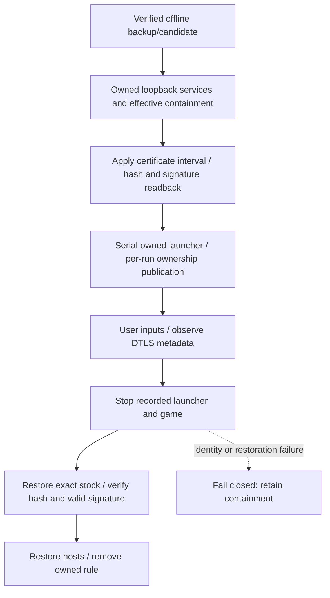

# Private REP anchor trial

## Latest outcome — October 3, 2026 UTC

**Private game DTLS acceptance remains unknown.** Two distinct outcomes follow the offline checkpoint:

1. The first bounded trial applied the 1,350-byte certificate interval, read back candidate SHA256 and Authenticode `HashMismatch`, and started the unchanged original launcher. At `00:19:51.692Z` the PowerShell owner failed with `PropertyNotFoundException`. The failing property/line was not retained. No owned-game identity was published, neither HTTPS listener logged a request, and the DTLS responder logged **zero received datagrams**. This is an instrumentation failure, **not demonstrated launcher/EAC refusal or certificate rejection**.
2. The metadata-hardened retry prepared the same CA and services, but both Windows elevation dispatches reported operation canceled. No trial window, routing change, interval write, launcher or game was admitted. Owned services were stopped; `04:54:29.310Z` readback verifies stock SHA/signature, original hosts, zero game/listeners/project rules and retained Root count1.

The first owner stopped its launcher and restored stock SHA at `00:20:24.240Z`, valid signature at `00:20:25.232Z`, **before** hosts/firewall release at `00:20:26.983Z`. Original-image recovery is observed; runtime private-anchor use is not. Both experiments began at clean HEAD `0c180367a29a2e75d940708d3325c39345051927`; the retry's ignored v2 runtime SHA is `92b900c7086835b330738d0cd3aafc181bffec0068dd29d9bece846c987dcf18`. No process-memory access, EAC/launcher change, credential collection, input action or CA-store mutation occurred in either attempt. User authorized game input control; the prepared own-window helper was only compiled, not exercised.

Receipt: [private-rep-anchor-attempts.json](../research/evidence/private-rep-anchor-attempts.json). The earlier offline receipt remains unchanged.

## Historical offline checkpoint — not client acceptance

Stock Steam build22469132, client1.400.6031.6004151; installed EXE SHA256 `8654f01d324636d9f74f1c793b0cc4a417c3c5fa9847d9913c358ca29e0fdc8e`. The installed client remains unchanged at this checkpoint. [REP trust policy](REP_TRUST_POLICY.md) documents the preceding static initializer/verifier trace; [DTLS registration](DTLS_REGISTRATION.md) retains the six stock-client fatal `unknown_ca` attempts.

No supported private-CA setting was identified in the inspected REP path. The initialized certificate pointer is writable `.data` with a DIR64 loader relocation, pointing to read-only `.rdata`. Targeted scans found two validated factory reads, no direct RIP-relative writer/address-taking reference. Computed aliases, external writers and other configuration paths remain unexcluded; **this is not proof that all normal overrides are impossible**. The five observed transport-option keys are type, backoff-resends, disconnect delay, tick frequency and default port. Their underlying configuration source is still unknown. The alternate factory transport identifies LibUV, not another evidenced GridMate CA input.

The evidence-backed fallback is **certificate-data substitution for an isolated owned-client experiment**. It replaces the mapped embedded certificate with the already approved private CA, retaining the inspected verifier instructions. It deliberately changes accepted issuers; it does **not** preserve the original trust policy or establish a supported configuration mechanism.

## Candidate boundary

[rep_anchor_candidate.py](../scripts/rep_anchor_candidate.py) has only offline `plan` / `prepare` actions. It never edits the installed executable or launches processes.

- Exact full source-image size/hash, original certificate DER and NUL boundary are pinned.
- Exact approved single certificate-only PEM/DER, CA/key usage and validity interval are checked. Keys, multiple certificates, unrelated roots, expired/not-yet-valid roots and oversized inputs are refused.
- Candidate changes only the1,350-byte mapped certificate interval: approved1,192-byte PEM then zero padding. File size, pointers, instructions, layout and signature blob remain unchanged. Outside bytes are compared directly; candidate certificate DER is independently reparsed.
- A new ignored directory receives a verified stock backup, candidate `.bin` and metadata-only journal. Existing output is never overwritten. Source is rehashed before/after preparation.
- Prepared candidate SHA256: `dff94b76032fdd528c936e9f9313dea1736ad5432d32cb068933b8a3d5ed8096`. No proprietary image/certificate content is included in tracked fixtures or documentation.

The stock image has a valid Authenticode signature. Changing `.rdata` invalidates its signed image digest; retaining the signature blob does not retain signature validity. Do not strip/re-sign it or circumvent a vendor launcher/EAC refusal. [Microsoft PE image hashing](https://learn.microsoft.com/en-us/windows/win32/debug/pe-format#appendix-a-calculating-authenticode-pe-image-hash).

## Guarded application and recovery

[Set-RepAnchorTrialImage.ps1](../scripts/Set-RepAnchorTrialImage.ps1) is an explicit live-trial operation, never part of offline protocol validation. [RepAnchorImageTransaction.psm1](../scripts/RepAnchorImageTransaction.psm1) implements an exclusive target handle, durable write intent, interval-only write and full-image readback.

Before applying, the live wrapper requires no running game, exact verified backup/candidate, the same active retained CA, effective game-program-only non-loopback IPv4/IPv6 deny rule, owned routing and loopback responders. Apply requires exact stock bytes. Restore accepts stock, exact candidate, or an interrupted interval write only when outside bytes match and every interval byte matches stock or candidate. Unexpected Steam/user changes are not silently overwritten.

The private containment owner performs launch synchronously with the original vendor launcher and child-scoped environment; EAC remains unchanged. It retains the created launcher process object before fallible ownership publication. All intent/launcher/game records belong to the exact run. Fresh PID/start-time correlation is not a loaded-memory image hash or fully verified launcher ancestry. The candidate disk hash is checked after launch, after publishing cleanup identity.



Original launcher/EAC refusal is a useful terminal result, not permission to modify their protections. No process-memory writes, hooks or certificate-store edits are part of this trial. User-authorized ordinary game inputs may be used on a verified owned window; none were sent in the recorded attempts. Reuse the retained CA; do not regenerate/import it.

## Reproduction

### Offline, no game or system routing mutation

```powershell
& .\.venv\Scripts\python.exe @('scripts/rep_anchor_candidate.py','plan')
& .\.venv\Scripts\python.exe @('scripts/rep_anchor_candidate.py','prepare','--output-dir','private/connectivity/<new-directory>')
& .\.venv\Scripts\python.exe @('-m','pytest','-q','-p','no:cacheprovider','tests/test_rep_anchor_candidate.py')
& 'C:\Users\Austin\.codex\tools\Invoke-CodexPowerShell.ps1' -Path tests/test_rep_anchor_transaction.ps1 -Execute
```

The prepared artifact predates addition of schema/timestamp fields to newly produced journals; it was retained unchanged and its full bytes independently rechecked. The new fields do not change the candidate bytes.

### Live trial gate (next admitted retry)

1. Use existing private queue/DTLS preparation and listener helpers, retaining the same approved CA and synthetic loopback handoff. Link the verified candidate journal to the fresh run manifest.
2. Validate the complete tracked [Invoke-RepAnchorTrialWindow.ps1](../scripts/Invoke-RepAnchorTrialWindow.ps1) and dependencies using the required PowerShell wrapper. This promoted v2 owner adds guarded path/CIM reads, nullable metadata, limitation events and safe failure line numbers. Private v1 is historical; the earlier separate launch/record helpers remain unused drafts.
3. Run that containment owner elevated, with owned listener PID arguments and `TokenServices` routing. It verifies the stock image, configures containment, applies the interval, then launches serially. Elevation is an explicit runtime difference from the earlier launcher controls.
4. Advance Continue/select Preservation/Play using ordinary authorized inputs. Record handshake completion and genuine decrypted application data separately. The responder discards plaintext; no credentials/raw application capture is implied. A blocked OS input call is not permission to circumvent Windows or EAC protections.
5. If positive, repeat with the **same candidate client** and a suitable unrelated-root server certificate, without importing that root. Require actual client chain rejection before claiming trust-preserving private acceptance. Python/OpenSSL negative controls alone do not establish the modified game's rejection behavior.
6. Request stop; the owner stops recorded processes, restores stock hash/valid signature, then restores hosts/removes its rule. Stop owned responders and verify original hosts, zero project listeners/rules/game and retained CA count1. Failed ownership/restoration keeps containment.

## Verification and current limit

12 synthetic candidate tests and14 native transaction checks pass. The existing explicit preservation regression plus new candidate tests passes285 Python tests. Six AST-loaded synthetic launch fault checks cover expired/stopped admission, stop during mocked creation, manifest/identity publication failures and postlaunch disk hash drift. They are not a live Steam/EAC or concurrent cleanup experiment. Missing game identity correctly refuses cleanup; real containment release was not exercised by those mocks. The455 upstream passes/1 deliberate skip remain historical and unchanged. No current-game acceptance, Carrier/V3 registration, world loading, world actor or Milestone1 follows from these offline checks.

Receipt: [private-rep-anchor-offline.json](../research/evidence/private-rep-anchor-offline.json).

Pre-execution failures retained: copying the window into a different directory initially produced wrong relative paths; review caught and fixed it. Separate launch and timeout cleanup had a publication race; that draft is unused, replaced by serial ownership. These are engineering findings, not game trust/EAC results.

## Metadata recovery verification

**Nine current AST-loaded synthetic lifecycle checks pass** against the promoted production functions: expired/stopped admission; stop during mocked creation; manifest/identity publication failures; postlaunch disk drift; throwing path accessor; empty CIM record; missing parent property. Each run gets a fresh ignored directory. Process/hash/CIM operations are inert controls, not real game/system operations. These are not live Steam/EAC or concurrent cleanup tests. The earlier285 Python/14 interval checks and455 upstream passes/1 deliberate skip remain historical and unchanged; no protocol codecs changed.

```powershell
& 'C:\Users\Austin\.codex\tools\Invoke-CodexPowerShell.ps1' -Path tests/test_rep_launch_lifecycle.ps1 -Execute
```

Unavailable `Path` or CIM metadata could fail the old code and is now safely represented, but the original failure's specific property remains unknown. A protected getter is not an EAC verdict. Cleanup still requires recorded fresh PID/name/start time and refuses a conflicting available path or unclaimed process.

**Next:** admit a fresh bounded trial through Windows elevation, then determine actual candidate-client full-chain DTLS acceptance. The canceled retry is closed; an old prompt cannot restart it. The private v2 attach helper pins the old HEAD and must not be reused after the new commit. Use the fresh-run procedure below. On actual DTLS plus genuine application data and **same-candidate unrelated-root rejection**, advance to current Carrier/V3 registration. Actor/spawn remains gated.

### Exact next-run procedure in this workspace

No running game/launcher, project rule,443 or64003 listener; require stock hash/valid signature, original hosts and the retained unexpired CA first. Every helper below is run with the required wrapper (`-Path <absolute path> -Execute`); never invoke a copied script without validating it. Do not execute these steps as offline validation.

1. `.scratch/prepare-dtls-run.ps1`: fresh private run with the same retained CA/full chain.
2. `.scratch/rep-anchor-trial-v3/attach-run.ps1`: require clean tracked tree; record current HEAD, candidate journal and tracked owner source hash. It does not pin the retired HEAD or alter the client.
3. `.scratch/start-queue-listeners.ps1`, then `.scratch/start-dtls-responder.ps1`: verify the two loopback HTTPS children and UDP child/parent/start identities.
4. `.scratch/rep-anchor-trial-v3/dispatch.ps1`: validates tracked owner; supply listener PIDs, `TokenServices`,300-second window. **Approve the fresh Windows UAC prompt.** This is OS admission, not a new certificate import. All game/file/hosts changes remain inside the serial owner after guard readback. Shorter window leaves time for recovery within the600-second responder lifetimes.
5. Require `REP_ANCHOR_TRIAL_READY` and fresh `owned-client.json` before using game inputs. Observe Continue/Preservation/Play and DTLS metadata, not raw tokens. Treat a launcher/EAC refusal as terminal; do not bypass it.
6. `.scratch/stop-channel-trial.ps1`: request serial cleanup; require `STOCK_CLIENT_RESTORED_BEFORE_ROUTING_RELEASE` then `BOOTSTRAP_TRIAL_CLOSED`. Next stop exact owned HTTPS/UDP responders using their ownership records. Verify final stock SHA/signature, original hosts, zero project rules/game/443/64003 and retained CA count1.

If elevation is canceled before a dispatch receipt, **no client trial has occurred**: do not write a fictitious dispatch record just to satisfy older cleanup tooling. Verify absence of window/file/routing admission; stop listeners only after current PID/start/parent/script/run-path readback (as in this checkpoint's `close-unadmitted.ps1`, whose fixed run ID must not be reused). Responders also expire after600seconds. Prepare a new run for another attempt, never reuse closed logs.

The ignored v3 attach/dispatch sources are pinned by the attempt receipt and intentionally refer to the tracked production owner. They are local operator tooling, not deployment/gameplay services. The authorized own-window helper remains ignored and unexercised; normal manual input is also sufficient. No extra trust-store operation is needed.

Targeted review matched all32 receipt-pinned files and both9-case result/source identities. Guarded unavailable metadata and fail-closed cleanup claims survived within scope. Corrected causal wording: exception plus zero traffic is observed; a sole explanation for the absence is not established. Review was read-only, did not run the whole owner/finally path or operate game/system resources. The primary's actual restoration/readback remains the live cleanup evidence.
