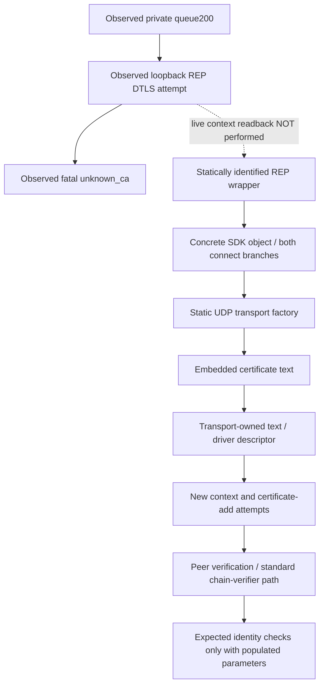

# Current REP trust policy — current-build evidence

> October 3 live follow-up: the mapped certificate-data candidate was refused at launch by intact EAC, then restored exactly. A matched unchanged-stock/original-launcher control reached queue200 and returned two further unknown_ca alerts. No private game DTLS acceptance; on-disk substitution is retired, not an EAC bypass. [Live comparison](PRIVATE_REP_ANCHOR_TRIAL.md), [receipt](../research/evidence/private-rep-anchor-eac-control.json). The static findings below are not a live readback of a candidate verifier.

## Result and identity

**The current REP wrapper→SDK→UDP secure-driver trust initializer and linked verifier are now statically identified. Private-root acceptance remains unproven.** The complete source/object chain is not a live readback of the selected enum, context or store contents.

The traced `gridmate-udp` / `gridmate-udp-bsd` transport passes embedded certificate text to a secure driver. That driver creates an OpenSSL context, parses the text, attempts to insert each certificate into its store, and enables peer verification. Within the inspected driver/connection lifecycle, the newly created context uses standard chain verification with no configured expected DNS/IP identity or separate certificate/key pin. This is **bounded static evidence**, not an application-wide absence claim or a demonstrated private-root override.

Analysis base: clean `d3841c476948595be9b430d66baa668516135f6d`, 2026-10-02. Stock Steam build **22469132**, client **1.400.6031.6004151**, installed EXE SHA256 `8654f01d324636d9f74f1c793b0cc4a417c3c5fa9847d9913c358ca29e0fdc8e`. All addresses are preferred-image virtual addresses for **this hash only**, not live ASLR addresses or hook instructions. Function/API labels below are semantic analysis labels, not a claim of recovered symbols or a specific shipped OpenSSL/source revision.

Receipt: [current-rep-trust-policy.json](../research/evidence/current-rep-trust-policy.json). Private disassembly, certificate bytes and proprietary files remain ignored and are not included in this repository. No process attachment/memory access, game launch, certificate/environment/hosts/firewall mutation, executable/EAC modification or mouse/keyboard control occurred during this analysis.

## Evidence ledger

| ID | Finding | Classification / limit |
|---|---|---|
| T47 | Transport factory `0x146b6a270` selects `gridmate-udp` or `gridmate-udp-bsd`; both pass global certificate pointer `0x149f80d90` to `0x146b34780` | Strongly source-supported; actual runtime selector and global-pointer immutability not established |
| T48 | Constructor copies the text into transport `+0x80`; client setup `0x146b36920` supplies its pointer in descriptor `+0x20`, copied to driver `+0x288` | Strongly source-supported; driver borrows the text pointer |
| T49 | Initializer `0x145dce750` parses the supplied text and calls a certificate-add routine for every parsed certificate | Strongly source-supported **insertion attempts**; add return is unchecked, so not proof of successful/live store contents |
| T50 | Client descriptor clears authenticate-client; initializer selects verification mode `1` with NULL per-certificate callback. Absent-CA branch instead installs a constant-1 callback | Strongly source-supported; absent-CA branch is not the non-null embedded-CA branch and is not a supported configuration recommendation |
| T51 | Full SSL-create and connect-success helpers contain no expected-host/IP/CN/fingerprint setup/check | Bounded negative static evidence; strengthened by T56–T58, never inferred from missing SNI |
| T52 | Initial construction and retries use the driver-created context retained by the connection | Strongly source-supported; borrowed pointer, not exclusive access or a new OS-root lookup |
| T53 | Queue handlers parse/copy typed `RepAddress`; exact queue-field-to-SDK argument provenance is not fully traced | Strongly source-supported up to response copy; distinct from the completed REP wrapper/interface join T61 |
| T54 | Own last Game.log has REP_CONNECTION marker at line461, no allowlisted transport/CA-key literal | Observed filtered metadata; marker presence/absence does not establish transport selection |
| T55 | Six preceding own-client attempts returned fatal unknown_ca after the configured server flight, with no completed DTLS/application data | Previously executed live evidence; not a live identification of the static context |
| T56 | Linked verifier dispatches a configured application verifier at context `+0x98`, otherwise standard chain verification | Strongly source-supported; distinct from ordinary verify callback `+0x188` |
| T57 | Context/default parameters begin zeroed; SSL inherits them; linked DNS/email/IP checks run only for populated expected-identity fields | Strongly source-supported; those fields are not populated by the inspected driver/connection functions |
| T58 | Context lifecycle and complete established-state handler show no extra identity/pin policy in the inspected scope | Bounded negative static evidence; aliases, callbacks and outside-cluster mutations remain unexcluded |
| T59 | Factory-created UDP transport creates the same client connection that calls the mapped secure setup, passing the copied endpoint-shaped value | Positive static object/vtable/data-flow proof; conditional on selection and construction, not runtime invocation |
| T60 | Context constructor creates a fresh store with initially empty object/lookup stacks; no explicit default-root loader found in that store constructor | Strongly source-supported scoped initialization; generic registered ex-data callback effects remain unexcluded |
| T61 | REP-labelled wrapper installs the concrete SDK primary object; both its direct and preparatory connect branches reach the mapped factory | Positive static reset/ownership/vtable/call proof; normal completion and UDP selection are conditions, not observed runtime branch values |

Two initial roles examined separate entry and verifier questions independently. Primary adjudication retained the missing bridge; targeted adversarial reviews verified the pinned artifacts and corrected insertion/ownership/verification scope. Agreement alone was not treated as proof.

## Trust-store initialization and ownership

1. **Selection:** caller `0x146b6d600` invokes factory `0x146b6a270` at `0x146b6d72f`, passing the value stored at object `+0x50`. That field is not established user-editable options storage. The factory independently reads `client-connection.transport-options.transport-type` at `0x146b6a44b`. Recognized UDP comparisons are at `0x146b6a4ba` / `0x146b6a561`. Both branches load the same embedded-text pointer and call constructor `0x146b34780` at `0x146b6a536` / `0x146b6a5e0`. This factory does not demonstrate the selected/default value for our run.
2. **Text ownership:** constructor copies the text at `0x146b34817` / `0x146b3481a` into transport `+0x80`. Client-style setup `0x146b36920` places its C-string pointer in descriptor `+0x20` at `0x146b369d8`. Own private-key/certificate slots are zero; authenticate-client is cleared at `0x146b369b1`. Driver constructor `0x145dbdd30` is called at `0x146b36ab5`; descriptor copying yields driver CA pointer `+0x288` and authenticate byte `+0x270`.
3. **Store construction:** `0x145dce750` creates the context through `0x1478ef900` at `0x145dce7e4`, saves it in driver `+0xd0`, and configures the existing cipher `ECDHE-RSA-AES256-GCM-SHA384`. Context construction calls store constructor `0x14777dac0` at `0x1478efabe`, storing it at context `+0x20` at `0x1478efac3`. That constructor zero-allocates the store, creates initially empty object/lookup stacks and fresh parameters, and initializes ex-data/locking/reference state. No explicit default-root loader is found there; globally registered ex-data callback effects remain unexcluded. For non-null CA text, driver initialization obtains the store through `0x1406ccf20` at `0x145dce8bb`, parses text through `0x145dc8de0` at `0x145dce8f2`, and attempts additions through `0x14777d770` at `0x145dce986`. The add return is not checked. No default-file/directory or Windows-root loader appears in this complete initializer.
4. **Verification mode:** `0x1478eff50` at `0x145dce9a5` writes mode and callback to context `+0x158` / `+0x188`. The traced client descriptor chooses `SSL_VERIFY_PEER` (`1`) with NULL callback. Only the alternate absent-CA branch installs `0x1402a1a70`, whose body returns `1`. Do not conflate NULL callback with disabled validation.
5. **Connection lifetime:** two driver-context reads at `0x145dcc30a` / `0x145dd9ee5` feed `0x145dce4c0`, which stores the borrowed context at connection `+0x2060`. Initial SSL creation and retry/reconstruction read that retained pointer. Driver destructor frees/clears its context. This establishes creation/destruction ownership, not exclusive access.

Embedded certificate region: VA `0x148590460`, pointer slot `0x149f80d90`, DER SHA256 `62880372376f5d9b4e63e453c7eaaf906a9b3d11bf8e3e9e2c8cbdd98c28ffe3`. Previous parsing established X.509v1, subject==issuer and absent BasicConstraints. That is self-issued metadata, not a verified self-signature. Missing BasicConstraints does not disprove an explicitly installed trust role. Subject strings/PEM are deliberately not exported; there is no demonstrated CN-string comparison in this path.

The public engine initializer is useful semantic corroboration for explicit descriptor certificates versus its alternate callback, **not evidence of the shipped source revision or actual REP execution**. [Public GridMate initializer](https://github.com/aws/lumberyard/blob/master/dev/Code/Framework/GridMate/GridMate/Carrier/SecureSocketDriver.cpp#L1398).

## Actual linked verifier and expected-peer inputs

- **Verifier dispatch:** current chain-verification analogue spans split unwind ranges `0x1478fd900–0x1478fdb98`. It selects certificate-specific store `cert+0x1d0` or context store `ctx+0x20`, applies client/server verification defaults, overlays SSL verification parameters, and uses the ordinary callback when present. At `0x1478fdadb` it separately tests the **application verifier** at `ctx+0x98`; non-null invokes it at `0x1478fdaee` with `ctx+0xa0`. Null calls the standard `X509_verify_cert` analogue `0x1477ae910` at `0x1478fdaf2`. Thus NULL ordinary callback alone was insufficient to settle policy.
- **Default state:** context constructor allocates zeroed state via `0x147781000`; app-verifier fields therefore initially null. A fresh verification parameter at context `+0x198` has null DNS/email/IP inputs. The complete secure initializer does not replace those fields.
- **Inheritance:** SSL creation copies mode/callback and inherits context verification parameters into SSL `+0xd0` (`0x1478f14cf–0x1478f14ee`). They are not automatically derived from the socket address or absent SNI by the inspected helper.
- **Expected identity:** linked identity checker `0x1477aff20` gates DNS checks on parameter `+0x30`, email on `+0x48`, and IP on `+0x58`. Those checks exist in the binary, but require populated inputs; the traced initialization does not supply them. This does not prove all callers lack expected-peer policy.
- **Success:** client handler `0x145dd2440` calls SSL-connect analogue at `0x145dd24a9`; result `1` immediately chooses state9. Its full registered `CS_ESTABLISHED` handler `0x145dd2630–0x145dd297b` performs transport/error work with no separate certificate/name/fingerprint decision found.

Interpretation: **ordinary embedded-certificate chain verification, with no expected hostname/IP or separate leaf/SPKI pin installed by the inspected lifecycle**. This is an embedded trust-source restriction, not proof of a custom leaf pin, global lack of hostname verification, or a bypass opportunity. Windows-root HTTPS success does not settle this separate context. OpenSSL's callback/parameter distinctions are corroborated by its [verify API](https://docs.openssl.org/1.1.1/man3/SSL_CTX_set_verify/) and [chain-verifier source](https://github.com/openssl/openssl/blob/OpenSSL_1_1_1w/ssl/ssl_cert.c#L326).

## REP source join and remaining live limits

**REP wrapper/interface join (T61):** initializer `0x146425cb0` resets the same wrapper through `0x14642d2d0`, then calls SDK allocator `0x146b6c490`. That allocator constructs `0x146b69ad0`; the returned **primary object base** is move-installed into wrapper `+0x1000` at `0x146425cf5–0x146425d02`. Its primary vtable is `0x148590ab8`, with slot `+0x18` targeting `0x146b6d600`. The separate small SDK wrapper at `+0x1048` is not confused with this field. Reset clears `+0x1000` at `0x14642d363` and releases the old object; it is not another install source in that inspected pair.

The current `REP connection` / `GameConnectionWrapper` format-string span begins at `0x1484fe8f0`. Reference `0x14644a651` is in `0x14644a070`, which calls `0x146425f20` at `0x14644a66a` with the same wrapper receiver. That routine loads its concrete SDK field and conditionally dispatches `+0x10` at `0x14642638e` or `+0x18` at `0x1464263d7`. Direct `+0x18` reaches the factory caller. Preparatory `+0x10` targets `0x146b6d580`, which copies a record into SDK `+0x3f0` then invokes the **same object's `+0x18`** at `0x146b6d5e4`; its copy helper does not mutate the primary vtable. **Both known implementations converge on `0x146b6d600` on normal completion.** UDP selection remains a separate condition.

Method correction: an exact NUL-terminated string search initially missed that longer format string. A bounded substring search found its start/code reference; the earlier absence claim is superseded. Matching slots alone were not accepted until constructor/store/receiver identity and the preparatory branch were checked independently.

Current HTTP paths `0x1463e6650` / `0x1463e6d30` use adapter `0x1474e1370` → parser `0x1474e89d0` → deserializer `0x1474e4f20` → reader `0x1474e5990`. `RepAddress` lands in result `+0x168`, with flag `+0x188`; response copying uses `0x146403790` → `0x146404a00`. Those handlers do not directly create transport. Exact decoded queue-field-to-SDK-argument provenance remains untraced; this no longer means the REP wrapper's concrete interface or factory-to-driver relationship is missing. Prior live evidence separately proves the synthetic response leads to the selected private endpoint.

**Positive factory-to-setup bridge (T59):** transport constructor installs vtable `0x14858d150`, whose `+0x8` slot is `0x146b393d0`. Factory `0x146b6a270` calls it at `0x146b6a769`; that method passes the **same transport pointer** into connection constructor `0x146b27180`, which stores it at connection `+0x2f8` (`0x146b27237`). Connection vtable `0x14858c358` has `+0x30` slot `0x146b27e10`. Factory retains the connection at `+0x60`, loads that slot at `0x146b6a7ec`, and invokes it at `0x146b6a8bb` with the address-shaped value copied from factory `+0x8`. The slot reloads the same transport and calls secure setup `0x146b36920`. Caller `0x146b6d600` also reads `client-connection.transport-options.rep-default-port`. Thus the transport/store relationship is no longer merely two neighboring code regions; the remaining provenance boundary is **upstream of `0x146b6d600`**, not factory-to-driver identity.

The positive static source/object join is complete for these known implementations. **Live enum/context/store/expected-parameter values remain unread**, and global pointer mutation, aliases or registered callbacks are not exhaustively excluded. Other factory branch `0x146b3de50` has not been classified here. Incoming `unknown_ca` identifies chain rejection for the tested flight, not the precise failing X.509 error/depth or live root set. Historical hooks, matching cipher choice or bidirectional DTLS alone would not have established this source join.

## Coverage, reproduction and preserved validation

1. Verify the installed EXE hash/build and inspect Git state before reading. Use `.scratch/rep-verify-policy/run.ps1` through the repository-required PowerShell wrapper; inspect exact current function addresses, not old First Light addresses. The original private analyzer refuses a different executable hash.
2. Reproduce the positive argument/copy/store/verify relationships using `.scratch/rep-verify-policy/ledger.md`, `ledger-second-pass.md`, `ledger-object-bridge.md`, `ledger-store-constructor.md`, `ledger-sdk-interface.md` and `ledger-sdk-branch.md`. The immutable `.scratch/rep-context-entry/entry-final-functions.txt` retains the wrapper initializer, REP helper/marker and reset functions; `ledger-entry-final.md` records the corrected search and receivers. Receipt hashes pin the final inputs. Proprietary output stays ignored. Never turn this into a hook/patch procedure.
3. For negative policy checks, enumerate **each** `.pdata` range independently and join split continuations only when control flow establishes the join. The secure-driver cluster `[0x145dbd000,0x145de1000)` scan covers435 records /37042 decoded instructions. It retains42 undecoded tail bytes at `0x145dd6210–0x145dd6238` and `0x145dd8596–0x145dd8598`. Direct-member matches are not alias-aware; gaps, outside-cluster code and generic ex-data registration callbacks remain unexcluded. A raw linear scan that stops early cannot prove absence.
4. Own-log helper `.scratch/rep-trust-review/inspect-owned-log.ps1` uses fixed allowlisted markers, drops secret-signal/userinfo lines and exports no raw lines. Stable source SHA256 `32b1f8a6eeaf1c4d776947a2c9e48771f9b61b6dbb4bb9f668ceabcfccbdef0b` matches the previous CA-file trial. Log extraction is not a live call stack.
5. `.scratch/rep-trust-review/verify-validation-identity.ps1` rechecked all39 source/fixture hashes and prior JUnit/runner identity from the273-pass receipt, plus installed EXE/launcher hashes. **No new tests were added or rerun** for this static/documentation-only change. Prior273 workspace pass and455 upstream pass/1 deliberate skip remain executed historical results, not new tests of these binary inferences.
6. Read-only runtime readback: no NewWorld process, TCP443/UDP64003 listener or project routing rule; hosts original byte hash; retained local root count1. No CA regeneration/removal/import. PowerShell helpers passed parser/automatic-variable checks before execution.

## Exact next blocker and gate

### Fresh three-turn required-input impasse — October 4

The [fresh blocked audit](../research/evidence/current-rep-fresh-blocked-audit.json) verifies that the required supported ordinary root-input/activation/actual REP store/timing join remained missing across three resumed root turns. Earlier blocked counts are historical. The finite source findings below remain usable; current image/build and all84 code inputs match. Unknown aliases/class callbacks do not supply a normal root-value edge, and no live experiment is pending. Blocked status is selected; the full objective remains incomplete. Resume upon a documented/source-backed normal root initializer/input for the pinned owned build or a relevant owned-build/input change, then prove actual REP ownership and pre-verification timing before any retained-CA trial. Preserve verification, intact launcher/EAC and denied-access boundaries.

### Fresh resumed audit: nested parser and retained transport — October 4

The user explicitly resumed the full preservation objective. The earlier blocked audit and stop instruction are historical; this is the first goal turn of a fresh audit. Analysis started at clean `d088ef9`. Fresh readback confirms Steam **22469132**, version **1.400.6031.6004151**, the stock image hash above and valid signature, the retained CA count of one, original hosts, and no game process, trial listeners or project routing rules. The full English private-backend objective and ten-minute/two-client/reconnect acceptance remain open.

Two distinct fresh-context roles traced finite questions explicitly left open by the earlier CA-source handoff. They did not repeat the closed CA-slot, default-configuration, gRPC, setter, literal-control, lookup-table or settings scans. [Source receipt](../research/evidence/current-rep-callback-alias-boundary.json) binds their reports, targeted challenge and primary adjudication; raw client-derived output stays ignored.

| Boundary | Adjudicated source finding | Limit |
|---|---|---|
| Retained transport | Constructor `0x146b27180` borrows the primary transport at connection `+0x2f8`. The two secondary receivers are primary `+8` and `+0x30`. Secondary1 writes at receiver `+0x2f8` address **primary `+0x300`, the connection identifier**, rather than replacing the transport | Local constructor/destructor establish no retain/release; outer lifetime and synchronization remain unknown |
| Finite consumers | The 34 installed virtual entries, constructor/destructor and eight immediate callees identify seven retained-pointer consumers: setup, pool output, payload/close queues and diagnostics. No supplied root value, CA-owner replacement or established SSL/store handle emerges from these bodies | Second-edge pool helpers, transport `+0x48` virtual `+0x78`, diagnostic `+0x38` and callbacks remain explicit boundaries; this is not transitive immutability or whole-program absence |
| Descriptor roles | Client setup `0x146b36920` passes existing transport `+0x80` bytes in descriptor `+0x20`, the previously mapped CA input. Listen-style `0x146b38c10` instead uses the same bytes at `+0x18`, transport `+0xa8` at `+0x10`, and clears `+0x20` | Local-certificate/key use does not establish a client private-root route. Ordinary selection, live use and construction timing remain unobserved |
| Nested helper | Complete `0x14776d040..0x14776d238` includes the formerly uninspected `0x14776d11c..0x14776d203`. It invokes the constructed stream method and may pass the **original CA-byte pointer** to callbacks at object `+8` or `+0x10`, including after a nonpositive method result | Callback targets/effects remain unknown. The source alias may be writable; no constness or callback innocence claim follows. Explicit arguments supply no private-root value or REP SSL/store handle |
| Stream copy correction | Table `0x149546500` slot `+0x30` resolves to `0x14776d960`; copy destination is obtained through the stream backing descriptor. Actual copy call is `0x14776da24`; the original report's `0x14776da20` is destination arithmetic | Different pointer expressions alone do not prove unconditional source/destination disjointness. Original report and challenge corrections remain preserved |
| Constructor initialization | Default allocation zeroes `0x78` bytes, initially clearing callback fields `+8`/`+0x10`. Constructor then calls generic ex-data initialization with class `0x0c`, object and `&object+0x68`. Its success tail invokes table slot `+0x48` → `0x14776ddc0` → `0x14776e000`, initializing the stream descriptor/flags | Registered class callbacks and allocator overrides remain unknown; initial zeros do not establish later callback state. The concrete stream initializer supplies no root input or REP context/store handle. Registry globals lie in a virtual-only data tail, so static bytes cannot establish runtime contents |

Targeted challenge independently checked the descriptor/receiver joins, 44 PE ranges and all eleven jump-table destinations. It preserved the finite consumer result, clarified callback result handling and weakened unconditional buffer-separation wording. These are static byte/range checks, not 44 client experiments or proof of a root input. Constructor success-path and class `0x0c` initialization are adjudicated separately in the bound source receipt; the earlier class1/class4 ex-data findings are not silently extended to this class.

Fresh validated `Test-Offline -Profile workspace` ran at clean `d088ef9`: **367 Python cases across 28 modules passed**, all three synthetic PowerShell suites passed, and the owned loopback HTTPS lifecycle returned200/child-exit0/listener-closed. No selected inputs changed. [Executed validation](../research/evidence/current-rep-fresh-audit-validation.json). This exercises offline/fake APIs and loopback resources, with no New World client or upstream rerun; it does not prove game DTLS or unrelated-root rejection by the game.

**Exact missing evidence:** a concrete supported ordinary root value/input, its activation into REP driver-owned context `+0xd0`, context store `+0x20` or preferred certificate store `+0x1d0`, and the relevant construction/verification timing. A writable byte alias or generic loader capacity cannot replace that join. No evidence-backed retained-CA client change is ready. Next, require a source-backed normal input/initializer carrying roots into that actual owner; do not continue arbitrary callback/library tours or guess configuration keys. Actual game DTLS completion and unrelated-root rejection still precede Carrier/V3, world loading and actors. The full goal is active and incomplete; the prior repeated-blocker count is not reused.

### Bounded read-only observation preparation

**Executed follow-up:** [access receipt](../research/evidence/current-rep-readonly-access.json) records the elevated stock-client query: exact creation time and executable path verified; module lookup returned Win32error5. Observer stopped before requesting VM_READ or reading memory. Exact API substage/cause is unknown, not an EAC verdict. No runtime trust-pointer/context/provider value was observed. [Procedure/results](CURRENT_CLIENT_CONNECTIVITY.md#october-3-elevated-read-only-access-observation). The preparation-only statements below remain scoped to their earlier checkpoint.

`scripts/windows_rep_readonly_probe.py` is an original, explicit opt-in observer for this pinned stock image only. Offline tests never construct its real Windows adapter. It does not establish a private-root override or change game behavior.

Admission requires an active ignored connectivity run, its three matching ownership/launch manifests, the pinned unchanged-stock containment-owner source identity, the installed stock hash, an exact process creation FILETIME (including its seventh fractional digit), successful `QueryFullProcessImageNameW` matching the installed client, and a unique exact-path `NewWorld.exe` module. Unavailable image-path queries fail closed. A matching *loaded module* alone is not main-image identity proof. The creation time is checked again on the read handle to detect PID reuse.

The observer requests only `PROCESS_QUERY_LIMITED_INFORMATION` (`0x1000`) and then that right plus `PROCESS_VM_READ` (`0x1010`). A denied query/read is timestamped evidence; it never enables debug privileges or works around the denial. No debugger attachment, writes, injection, protection change, driver, arbitrary-address input or heap traversal is present. Handles are closed in `finally`, including a failed log write after an open. The process exits after the bounded observation.

The only memory ranges are the hash-mapped global REP text pointer (8bytes), settings holder pointer (8bytes), initializer key/index (4bytes), and the statically mapped embedded certificate-text span (1350bytes), **1370bytes total maximum**. Output contains pointer/integer metadata and a SHA256 of that fixed text span, never raw game bytes. A changed pointer is reported but not followed. These metadata cannot prove the selected transport, successful root insertion, runtime store contents, verifier parameters, provider callbacks or DTLS acceptance.

Source provenance for the two new global locations is `.scratch/descriptor-provider-20261003T1635Z-a50f/selected-disassembly.txt`, SHA256 `39d002e50f9e4f8d4ba11e6e388f238e70d118cbccd303ab0a0e6a73edf15075`, from the pinned executable and function-scoped decode. At `0x1406d17b8` the shared holder slot is `0x14a2e5e98` (RVA `0xa2e5e98`); `0x1406d17c6` reads the index/key from `0x149e7c890` (RVA `0x9e7c890`). The latter's file value is `0x52c31db5`, not a proven live value or OS-thread identifier. **Correction to that private bundle's report:** `0x1406d1818` calls the direct field `[holder+0x40]`; it does not load the vptr at `[holder+0x30]` and dispatch its slot. The claimed `0x1405c6ab0` join/registry-getter semantics are withdrawn. The separately preserved `.scratch/descriptor-provider-correction-20261003T1642Z-b732/correction.md` (SHA256 `bf6377da2d14f0be2223c8c41e9c1c0e5e420b3d3b9b6304a2fcff97abfdcb1d`) maps constructor `0x1412f42d0` copying callback source `[global pointer at 0x14a314628 +0x30]` to the direct field. That source slot is virtual `.data` with no raw-file backing; its runtime owner/callback are unknown. Holder/global addresses remain supported independently of the withdrawn interpretation. Actual provider population is still under investigation.

Exact invocation, only after the existing stock containment owner has published a fresh `owned-client.json` and while it remains active: `.venv/Scripts/python.exe scripts/windows_rep_readonly_probe.py --run-directory <fresh private run>`. Use a validated, normal elevated helper if necessary; do not relax any identity or protection check. Output is a new, non-overwritten `rep-readonly-observation.jsonl` inside that run. Stop the owned client before restoring routing, close only owned listeners, and execute strict cleanup readback as in [the current-client procedure](CURRENT_CLIENT_CONNECTIVITY.md).

API contracts: Microsoft [OpenProcess](https://learn.microsoft.com/en-us/windows/win32/api/processthreadsapi/nf-processthreadsapi-openprocess), [ReadProcessMemory](https://learn.microsoft.com/en-us/windows/win32/api/memoryapi/nf-memoryapi-readprocessmemory), [GetProcessTimes](https://learn.microsoft.com/en-us/windows/win32/api/processthreadsapi/nf-processthreadsapi-getprocesstimes) and [CreateToolhelp32Snapshot](https://learn.microsoft.com/en-us/windows/win32/api/tlhelp32/nf-tlhelp32-createtoolhelp32snapshot). These describe Windows behavior, not actual EAC permissions. A separate October3 helper context check observed administrator role enabled under the same user with the retained root count1; the ordinary tool shell was not elevated. That context check launched no game, adjusted no privileges and read no process memory. Live observer results are not yet established by this preparation.

### Descriptor consumption and provider population — October 3 continuation

The [new source receipt](../research/evidence/current-rep-filecfg-provider.json) resolves concrete provider ownership, typed REP lookup, conditional file reading/value insertion and ordinary layer merging. Steam22469132/version1.400.6031.6004151 and stock SHA256 `8654f01d324636d9f74f1c793b0cc4a417c3c5fa9847d9913c358ca29e0fdc8e` remain the target. This is static evidence plus separately executed archive metadata inspection; no new game trial, runtime configuration value or private-CA input was observed.

| Boundary | Established source path | Limit |
|---|---|---|
| Provider registration | Constructor `0x140845950` installs handler vtable `0x147f4d700`; registration `0x140845c80` supplies receiver containers. Typed dispatcher targets come from the caller's method descriptor, not a callback stored at each provider entry | Earlier0x18-byte provider-entry stride/callback interpretation is withdrawn: the0x18-byte extent belongs to a receiver container. Runtime context/receiver selection is unknown |
| REP option lookup | Factory string getter uses thunk `0x14057153c` → handler slot+0x1b8 → `0x140852480` → lookup `0x140852900`. Handler+0x71 selects aggregate lookup or reverse layer traversal; constructor initializes the flag nonzero | No current-session option values or supported user override were sampled |
| Eligible file description | Consumer `0x14102ee20` passes file-type ID `0x14a2f8d3c` for its nonzero eligible branch. Handler `0x14084c270` recognizes the matching `LayerId_FileCfg` hash, owns a copy of path+0x48 and appends a file layer | Conditional path only. Both type initializers reference literal `0x147effb68`; the earlier private ledger's `0x147f00168` was wrong |
| Read/parse | Layer vtable `0x147f4d9e0` slot+0x10 → `0x140854c70` → `0x140853f90` attempts resolve/open/size/read/close through service `0x14140a280`, then JSON parser `0x147464c90` | Size/read/close results are unchecked in this mapped path. Calls do not prove successful reads, physical alias resolution or live loading. Use instruction dataflow for the retained byte pointer; one recovered decompiler argument was wrong |
| Values and merge | Parse-success controls walker `0x1408578a0`. Ordinary scalar insertion depends on existing-key lookup and a nonzero intersection of `~description+0x38` with existing-node+0x60; fallback `0x14084cc50` can use a secondary map when description+0x40 allows it. Rebuild `0x140854fa0` visits the owned layer vector and copies ordinary entries into the aggregate | No unconditional arbitrary-key acceptance/drop, successful-parse-implies-REP-values or complete special-merge semantics. Aggregate rebuild and reverse-layer lookup are different modes |
| Mode-zero correction | Mode0 label is `fileCfg.publicLegacy`. This consumer builds a base description rather than a file description; its startup table explicitly disables mode0 at `0x14102f229` and enables only mode2 at `0x14102f20d`. Generic constructor maps start empty and its initialization lifecycle slot is a bare-return leaf | `ret 0` encodes zero stack cleanup, not a zero return value. The mode0 `client.json` → reader join is withdrawn. No proof publicLegacy remains empty, no earlier/separate producer or all file inputs are disabled |
| Reload flag | Post-loop leaf `0x1408535c0` sets byte `0x14a2e8bac`. File-layer watcher `0x140853ac0` reads it at `0x140853bd6`; a changed service-returned value can lead to reader `0x140853f90` and conditional update dispatch | The value is cached at layer+0x180 before synchronization. A failed gate skips the read; an unchanged next value can skip retry. Exact service+0x48 meaning, watcher entry/activation, successful reload and publicLegacy population remain unknown |
| Trust and alternate transport | Both mapped UDP factory branches load CA pointer `0x149f80d90` separately from typed option results. The alternate constructor's inspected connection/read path reaches a TCP stream; no CA loading or certificate-verification step was identified there | No supported private-CA input or verification-preserving alternate route. This bounded trace is not global immutability, whole-application plaintext or absence-of-upper-layer-TLS proof |

The independent challenge preserved the conditional file-reader path and falsified its extension to mode0/client.json. The primary adjudication also retains insertion-mask/fallback limits and corrects type-literal addresses. Raw client-derived disassembly/decompilation remains ignored; public receipts contain original notes, addresses, metadata and hashes only.

Original [archive metadata reader](../scripts/client_config_archive_metadata.py) inspects only exact original `client.json` index names and a bounded compressed-payload hash. It never invokes a codec or exports member bytes, refuses duplicates/inconsistent headers/source changes, and writes only a fresh ignored output. Executed inspection found this member in `assets/DataStrm.pak`:1952 declared bytes,619 compressed bytes, compression method15, declared CRC326fd32b, unencrypted flags. CRC is **not verified**, the full archive is **not hashed**, method15 is **not classified**, and neither the `@assets@` physical alias nor runtime loading is established. No extraction workaround or guessed configuration was applied. Initial19 archive controls are recorded in the source receipt; final21 controls reject NUL-normalized names and isolate CLI test output roots. [Final367-case workspace validation](../research/evidence/current-rep-filecfg-validation.json) pins the final reader/tests; final installed metadata matches the initial index and compressed-payload fingerprints.

For an explicitly selected owned archive, run `.venv\Scripts\python.exe scripts\client_config_archive_metadata.py --archive '<owned-installation>\assets\DataStrm.pak' --output '.scratch\<fresh-run>\client-index.json'`. This is an index check, not a trust experiment. Tests create original temporary ZIP fixtures and do not access the installation.

**Precise remaining boundary:** identify an evidenced normal input or initialization path that influences the separately supplied UDP CA argument while retaining verification and intact launcher/EAC. The conditional reader/provider map does not supply that edge. A separate publicLegacy producer, effective file input/alias and current values remain unobserved. Actual current-client DTLS acceptance and unrelated-root rejection must precede Carrier/V3 input/registration; actor/spawn work stays gated.

### CA source ownership and callbacks — October 3 follow-up

[Hash-bound receipt](../research/evidence/current-rep-ca-input-boundary.json): clean analysis checkout69c213b; unchanged Steam22469132/client1.400.6031.6004151 and the EXE hash above. Original static queries used Python3.11.9/Capstone5.0.7 through validated PowerShell. No game launch/input, process memory, system/client/archive change or new DTLS observation.

| Boundary | Source-supported finding | Limit |
|---|---|---|
| CA global | Writable `.data` qword `0x149f80d90` initially points to embedded `.rdata` text `0x148590460`, with DIR64 relocation. A broader RIP-memory candidate scan finds the same two exact-slot factory reads; newly covered vector writes nearby do not overlap it | On-disk initialization and scoped reference coverage, not runtime value, immutability or supported configuration |
| Adjacent initializer | `0x14027ac50` passes `0x149f80d88` to import `0x147ec9348`, declared `KERNEL32!InitializeSRWLock` | Under the documented pointer-sized lock contract, this initializes the preceding lock; runtime IAT behavior remains unobserved. [Microsoft API](https://learn.microsoft.com/en-us/windows/win32/api/synchapi/nf-synchapi-initializesrwlock), [lock size](https://learn.microsoft.com/en-us/windows/win32/sync/slim-reader-writer--srw--locks) |
| Direct callers and primary API | Only two direct constructor calls were found in `.text`, both supplying the known global. Constructor owns CA text at transport+0x80; secure setup borrows its bytes; shutdown precedes heap-text release. Primary string setter targets+0xa8 | No CA setter in the inspected primary table; indirect constructors and external aliases remain unexcluded |
| Secondary interfaces and callback | Secondary tables have8/4 slots with adjusted receivers; adjacent table belongs to a separate allocated object. No direct CA setter identified. Published pump `0x146b3c250` reads CA+0x80 and sends existing bytes to `0x146b392c0`, with a certificate-expiration metric holder | Callback-unreachability would be false. Demonstrated calls supply no replacement bytes/string-owner, secure context or store. Nested parse interval `0x14776d11c–0x14776d203` remains uninspected; no ordinary input selecting a replacement callback is established |
| Ex-data registration | Store class4/context class1 invoke generic constructor `0x1477893e0`; it snapshots registry records, unlocks, then invokes non-null record+0x10 callbacks. Registrar `0x147789270` receives that field fromr9. All seven validated direct registrations zeror9; the explicit class1 registration supplies no callbacks/args | Those registrations provide no construction root loader. Indirect/aliased registration, separate registry writers and live callback state remain unknown; no whole-program absence of default/Windows roots |

The primary-owned adjudication preserves the additional callback consumer and the uninspected helper interval. It narrows T60's generic ex-data caveat only for the demonstrated direct registrations. Semantic library labels do not identify the exact shipped OpenSSL revision. Client-derived output remains ignored; public notes contain original findings and hashes.

**Remaining gate:** a supported ordinary input or initializer supplying replacement CA material or adding the retained private CA to this secure context, followed by actual game DTLS completion and unrelated-root rejection. None of the mapped direct surfaces supplies that input. No speculative configuration change or live trial was applied. Prior367 Python cases, three synthetic PowerShell suites and loopback lifecycle remain the executed code checkpoint;84 executable/test/fixture/lock hashes are rechecked, not represented as a new game or test run. Carrier/V3 and actors remain gated.

### Settings accessors and pointer ownership — October 4

[Source receipt](../research/evidence/current-rep-settings-accessor-boundary.json) binds clean `63646f1` and the unchanged pinned client. Exact-target common RIP-relative memory forms with≤4legacy prefixes/optionalREX, PDATA boundary validation and one overlapping directE8caller layer identify13map-head references,3count references and5caller edges. The observed owners are initialization, persistent JSON load/rebuild, reset and cleanup. No distinct value getter or root-to-REP transfer is established in that scope; other encodings, pointer bases/tables, aliases and runtime activation remain unknown.

Tester source-block controls falsified three66+REX.W cases in the first immediate-length classifier. Corrected source accounts for REX.W precedence and aligns the loop cap with the regex's existing four-prefix cap;11RIP cases, overlappingE8 and parser-closure controls pass. [Intel SDM](https://cdrdv2-public.intel.com/868137/325462-089-sdm-vol-1-2abcd-3abcd-4.pdf), Vol1§3.6.1/table3-4, corroborates general operand-size precedence only. Corrected image results are byte-identical and all13/3/5sets match; source identity differs and both original failure/passing correction remain retained. This is tested locator behavior, not whole-image or game trust proof.

Targeted challenge required classification of three actual passed-map helper edges. Full147885a50..147885ccd is call-free tree insertion/balancing, retaining R8node in caller tree and returning that node; loader consumes its inner map at+40. Full1479bb0c0..1479bb242 transfers temporary inner head/count into a newly allocated outer node+40/+48, leaves temporary empty, invokes that insertion helper and returns node/status into caller stack storage. The decoded map-address LEA is1479bbddc; older label1479bbddd is corrected without changing counts. Selected caller use stays within the same settings tree, with no observed other-global or REP-owner transfer.

Logical1479baf40..1479bafb6 recursively destroys outer nodes; finite nested disposal through1479bb280/1402b86c0/1402ba7c0 frees inner nodes and owned string pairs. Global cleanup65b0..6624 closes the previously omitted6615tail with onefour-instruction range and a sized-sentinel deallocation tail-jump. Genericallocator/error implementations remain explicit boundaries; cleanup does notzero globalhead and establishes no runtime reuse guarantee. One caller context window ended onebyte into the next instruction; corrected window ends on boundary with identical decoded lines. Both receipts remain, and neither context is called a complete loader body.

**Required supported input remains missing.** These finite source questions close as settings ownership/lifecycle, without a root option, activation into REP's actual context/store or construction/verification timing. Previous same-owner loader capacity, certificate permission gate and gRPC separation remain unaffected. After the fresh resumed≥3turn missing-input condition and this finite adjudication, there is no evidenced client change/trial ready. Resume with concrete new supported ordinary REP root-input/activation evidence or relevant external-state change; no broad no-route/pinning inference, blind configuration trial or launcher/EAC/access-denial bypass follows.

Primary111role-entry/29prior-private-binding/84code-input readback passed. Prior367workspace cases/threePowerShell suites/loopback lifecycle remain historical; new locator controls are separate. No game/client/environment/settings/credentials/trust/routing/retained-CA changes or live resources; all helper processes exited. Actual game DTLS completion plus unrelated-root rejection are required beforeCarrier/V3 and actors; Milestone1 remains unachieved.

### Ordinary registration and persistent settings input — October 4

[Source receipt](../research/evidence/current-rep-registration-settings.json) binds clean `88874f6` and the unchanged pinned client. Callback slot14a829480 has a compiled leaf setter1479d4c10, two direct registrations, mapped event/record target145a92480 and zeroing reset. These establish bounded initialization, not root loading or live order. The18 immediate indirect transfers resolve to caller-object/embedded/virtual-returned argument provenance; all concrete runtime implementation/lifetime owners remain unknown.

Targeted adversarial review found that registration string+0 also reaches1479bc060 and global object14a8290f0's method+8. The object initializer14028fb90 allocates a0x50-byte receiver with vtable1495d8b20; its +8 target1479bc430 retains separately allocated modules. The string comes from caller object+68. Its namespace value and ordinary runtime activation are not established.

Primary PE-import/argument readback resolves1479bc060's two selected IAT calls to `_dupenv_s` and `free`, with compiled `APPDATA` and `%s\AmazonGameStudios\launcher\%s`. This is pinned client source evidence; [Microsoft CRT documentation](https://learn.microsoft.com/en-us/cpp/c-runtime-library/reference/dupenv-s-wdupenv-s?view=msvc-170) corroborates ABI semantics only. No actual environment value or runtime DLL target was read. The directory is retained in14a129fb8; filename owner14a129fd8 has unresolved contents in the bounded image probe. Do not guess a file location/name or application suffix.

The concrete consumers establish persistent settings input, rather than only formatting/logging:1479c2bf0 checks directory+filename through `_stat64i32`;1479c2a20 invokes `SHCreateDirectoryExA`;1479bbf20 resets the global map and writes `{}` through an output stream. Reader1479bb310 resets files above2MiB, gates reload by cached stat-time14a829080, reads through1479c2c90/input `_Fiopen`, parses JSON through1479d58d0 and rebuilds map14a829088/count14a829090. These are compiled operations, not executed file changes. Immediate module constructors derive their own separately owned path/name strings; this does not establish root import or REP store sharing.

**Required join remains unknown:** no inspected setting/root reaches actual REP driver+0xd0, context store+0x20 or certificate preferred verification-store+0x1d0 at the relevant construction/verification time. Downstream settings getters and a compiled certificate-related key are not established. Normal launch ordering, existing SSL-holder identity and live contents remain unknown. The ordinary input is useful new evidence, not a supported CA-root route; goal stays active for a bounded settings-accessor/REP ownership question.

Primary verification checks143 overlapping role-manifest entries, the challenge report,12 prior private bindings and84 validated code/test/fixture/lock inputs. Initial reported callback manifest hash was a transcription error; exact current bytes match independent readbacks. Original failed audits and incorrect claim remain preserved. Prior367 workspace cases/three synthetic PowerShell suites/loopback lifecycle and13 separate scanner controls remain historical. No new workspace/client trial, actual DTLS/unrelated-root proof, configuration/trust/environment/retained-CA changes or live resources. Carrier/V3 and actors stay gated.

### Corrected immediate-control scan — October 4

[Source receipt](../research/evidence/current-rep-control-activation.json) binds this static pass at clean `12f0c44`, Steam22469132/client1.400.6031.6004151 and unchanged EXE hash. The initial query overwrote the parser's PDATA index before validation; its zero-validation/no-PDATA conclusion is withdrawn. Original failed query/result and the separate C7 follow-up remain preserved.

Independent isolated-parser scans agree by address, register, value and bytes on97 actual `mov edx` assignments:41 value0x6a and56 value0x6b. Equivalent C7 candidates number0. Thirteen synthetic controls accepted legitimate EDX/RDX forms and rejected alternate destinations, truncated values and patterns embedded inside other instructions. Coverage is two encodings/two values in raw-backed .text with containing-PDATA linear decoding; it is not whole-program proof.

Bounded receiver analysis classifies several paths as event/record, observer/formatting, bitset, imported string, or file-stream handling. The final contiguous PDATA fragment passes0x6b to imported `strchr` as its character argument. Eighteen immediate transfers through dynamic object/register dispatches remain unresolved. Another receiver preserves EDX for a callback loaded from virtual zero-fill slot0x14a829480; its runtime target and REP/input relationship are unknown. No ordinary root-input-to-REP owner join is established; unresolved receivers are not evidence of absence.

A bounded AST audit of five earlier manifest-listed shared-global scripts found no subsequent module-level writes to the parser's starts/ranges names. It does not prove nested/dynamic/other-name/alternate-parser safety. Prior K81–K86 capacity, certificate-command gate and copied-holder findings remain usable. All84 executable/test/fixture/lock bindings match; prior367-case workspace execution was not rerun. No client, launcher/EAC, retained-CA, configuration/environment/trust/routing changes or live resources.

**Next required evidence:** concrete registration/receiver ownership and an ordinary input activating roots in the actual REP store at the relevant construction/verification time. Goal remains active for those bounded source questions. Actual game DTLS success plus unrelated-root rejection still precede Carrier/V3; actors/spawn/Milestone1 remain gated.

### Actual REP store ownership and root-input activation — October 3 resumed investigation

[Source receipt](../research/evidence/current-rep-supported-root-input.json) records static observations at clean `3e642b6`, same pinned Steam22469132/client1.400.6031.6004151 image. **The actual REP method supports verification-store replacement, and a certificate-command helper can populate its preferred verification store. A supported ordinary input activating that path is still missing.** No configuration/environment change or client trial was performed.

| Boundary | Established source evidence | Limit |
|---|---|---|
| Actual verifier/store selection | Complete1478fd900..1478fdb98 selects `(SSL+0x488)->CERT+0x1d0`, else `(SSL+0x598)->SSL_CTX+0x20`. CERT+0x1c8 is the separate chain-building store | Pinned on-disk behavior; no runtime holder identity or inserted private CA |
| Actual REP dispatch capacity | REP initializer145dce750 selects method1495c02d0 through1478f6110. Method+0x88 reaches context dispatcher14791cda0; +0x80 reaches DTLS wrapper147913a30 and SSL dispatcher14791c430. Compiled command0x6a sets preferred verification store;0x6b sets other chain store through1478fd5a0 | Capacity does not prove an ordinary caller supplying a populated store. The separate context-fallback setter1478efe00 has one recognized direct caller owned by gRPC |
| Same-owner file/path helper | Complete147927b40..147927bef chooses bound context CERT+0x138 or SSL CERT+0x488, selects+0x1d0 for VerifyCA, creates missing store at147927b9b, writes holder147927ba0 and calls explicit loader147927bc1. Four wrappers distinguish VerifyCA and ChainCA | This direct write bypasses the setter/control graph. The full48-record table still requires certificate permission0x20 for all12 file/directory commands; default flags2/6/a/e omit it.14 eligible named commands accept strings, not file/directory values |
| Ownership and ordering | SSL construction1478f1240 calls certificate-copy1478fcb40..1478fd061; nonnull preferred/chain store references are incremented/copied into a separate SSL-owned certificate holder. Destruction and copy failure release them | Shared objects do not mean identical holders. Replacing context preferred holder after SSL construction does not automatically replace existing SSL preferred holder; mutating shared store contents and retained-context fallback are different. Runtime ordering remains unknown |
| Activation challenge | All17 recognized generic context calls and9 SSL calls resolve command arguments other than0x6a/0x6b. Fresh concrete exact .text E8/E9 counts are4 setter/0 context dispatcher/1 SSL dispatcher/0 DTLS wrapper, with no unresolved raw candidates. Exact qword refs0/25/15/10 reproduce capacity | Branch-constrained and inherited arguments were challenged, not guessed from offsets. Indirect/inlined/cloned/computed/other-section calling forms remain unexcluded; dynamic data pointers are not dynamic command arguments |
| Descriptor/reference alternatives |749355 nonzero relocations and aligned qwords yield only CA-slot149f80d90→embedded148590460 among four exact targets.654 PE exports have no exact target RVA. Lookup-table RIP scan covers423579 pdata ranges in .text and separately sweeps uncovered bytes, finding only known getter candidates147bcf0f0/147bcf4c0 | Exact targets only; no computed/encoded/unaligned/global absence claim. Uncovered linear boundaries are unconfirmed. Initial0x60 lookup-table windows include2 neighboring qwords beyond0x50; those spillover bytes are not method fields |

Official [OpenSSL verification-store documentation](https://docs.openssl.org/1.1.1/man3/SSL_CTX_set1_verify_cert_store/) corroborates the verification/chain-store distinction, ownership modes and copied-holder behavior. Concrete client bytes establish the addresses, commands and REP applicability; the documentation does not establish the shipped dependency revision or a client input.

The user resumed this investigation and requested an updated objective file. The app goal is active; this is the first source-progress turn in a fresh resumed blocker audit. The earlier three-turn audit remains historical.105 role-manifest entries and84 prior validated code/test/fixture/lock bindings match. Prior367 Python cases, three synthetic PowerShell suites and loopback lifecycle remain the executed checkpoint; no tests rerun. Client, launcher/EAC, archive, retained CA, environment/config/trust/routing unchanged; no live resources. Last actual Play→829-byte queue200→127.0.0.1:64003 still ends in fatal `unknown_ca` (8alerts/4stock runs).

**Next required evidence:** a concrete normal certificate-enabled application or indirect/inlined control input carrying roots into this actual REP verification store at the relevant construction/verification time. No evidence-backed private-trust change is ready for a live trial. Actual DTLS success and unrelated-root rejection precede genuine Carrier/V3; actors/spawn and Milestone1 remain gated.

### Store loaders, default callbacks and separate PEM owners — October 3 continuation

[Source receipt](../research/evidence/current-rep-store-loader-boundary.json) records original static queries and bounded native follow-ups at clean `8f77f48`, same stock Steam22469132/client1.400.6031.6004151 and EXE hash above. **Real environment root-loading capabilities exist, but the mapped activation and ownership paths do not supply private roots to REP.** No client/config/environment change or game trial was performed.

| Boundary | Source-supported finding | Limit |
|---|---|---|
| Explicit file/path store loading | One recognized direct caller147927bc1 reaches147bcf990..147bcfa56 from the certificate-command helper. Six recognized lookup installer/control/getter calls all reside in that loader; file/directory controls select type1 explicit PEM | Prior default permission0x20 gate prevents the proposed command invocation. Direct .text E8/E9/.pdata scope; no indirect/alias/clone/inline/other-section absence claim |
| Default/environment lookup | File147bcf3f0 and directory147bceaf0 controls select `SSL_CERT_FILE`/`SSL_CERT_DIR` when type3 is supplied. Dispatcher preserves type. File new-callback isNULL; directory construction starts with an empty registered list, and full lazy subject lookup consumes only registered entries | Categorical absence of environment support is falsified. No ordinary type3 call into the same REP store established. Embedded fallback filenames are not verified existing files; environment values were not read |
| Other certificate insertion | Seven recognized direct addcert sites cover known REP insertion, own-certificate chain building with a temporary store, file parsing/loading and a memory-PEM parser147ba7f90..147ba81ba. That parser spans three contiguous unwind fragments and has two direct callers | Corrects the initial tentative directory classification in the preserved private ledger. Neighbor147bcf7f0 is a CRL-file loader; proximity alone supplies no default-path API |
| Memory-loader owners | Logical147ba7770..147ba7b14 creates a fresh SSL context at147ba77bd, retains it in wrapper+10 and attaches PEM or a referenced store. Logical147ba7e60..147ba7f85 creates a fresh store. Concrete embedded component labels identify gRPC TSI/security/HTTP connectors | Immediate callers and lifetimes do not join REP initializer145dce750 or alternateconstructor146b3de50. A common SSL constructor/type does not establish shared store ownership; broader indirect/global aliases unexamined |
| Positive gRPC input | Concrete descriptor→uppercase→`GRPC_DEFAULT_SSL_ROOTS_FILE_PATH`→GetEnvironmentVariableA→fopen/fread→cached PEM/store14a82c830/14a82c828, shared once14a82c868. Missing connector option roots select this default cache | This is a supported file-input source for mapped gRPC contexts, not a demonstrated REP override. Explicit credential producer, other fallback bodies, live environment/cache/first-use timing remain unknown |

Public [OpenSSL default-versus-explicit loading implementation](https://github.com/openssl/openssl/blob/OpenSSL_1_1_1w/crypto/x509/x509_d2.c) and [gRPC environment documentation](https://github.com/grpc/grpc/blob/master/doc/environment_variables.md) corroborate semantic labels only. Concrete client bytes, arguments and owners supply these findings; no exact shipped dependency revision is inferred.

**Required-input blocker:** neither positive library capability establishes a supported ordinary input carrying the retained private CA into the actual REP context while preserving verification and intact launcher/EAC. The two preceding goal turns and this source-progress turn retain that same blocker. After adjudicating these candidates, no evidence-backed client configuration change is ready for an authorized trial. Further actual trust progress needs a concretely identified supported REP root/input mechanism or new evidence of another authorized path to that context. Unexamined aliases remain unknown; this is not a proof of impossible overrides and does not authorize denied/refused workarounds or blind environment changes.

All95 role artifacts and84 prior validated code/test/fixture/lock bindings were checked. Prior367 Python cases, three synthetic PowerShell suites and loopback lifecycle remain the executed checkpoint; tests were not rerun for recording edits. Client, launcher/EAC, archive, retained CA, environment/config/trust/routing unchanged; no live resources. Last actual Play→829-byte queue200→127.0.0.1:64003 still ends in fatal `unknown_ca`. Actual game DTLS completion and unrelated-root rejection must precede genuine Carrier/V3; actor/spawn and Milestone1 remain unachieved.

### Default SSL configuration and certificate-command gate — October 3 continuation

[Source receipt](../research/evidence/current-rep-default-config-boundary.json) records original static analysis at clean `e2c78951`, using the same stock Steam22469132/client1.400.6031.6004151 and EXE hash above. **An ordinary `OPENSSL_CONF` file-input path exists, but its mapped `system_default` application rejects the CA-loading commands.** No configuration file/environment was changed and no game trial was performed.

| Boundary | Established source path | Limit |
|---|---|---|
| Adjacent settings owner | Sized deleting destructor `0x1407cf450` supplies extent0xb8 for object `0x149f80cd8`; its adjusted secondary receivers join the same destructor. The CA slot `0x149f80d90` lies exactly at that extent's exclusive end. The typed setter writes a byte at+0x5c | The CA pointer is outside this concrete settings object. No containing aggregate, other alias or global immutability claim |
| Ordinary config ingress | Mapped REP/context initialization requests crypto config-load bit0x40. Loader `0x14778c300` obtains `OPENSSL_CONF` through CRT `getenv`, passes the selected filename to a file reader/parser, and can dispatch the builtin `ssl_conf` module | Shared load/suppression once, inherited environment, file/parser success and actual module registry remain runtime gates. Default flags0x32 can return success despite missing/failed configuration |
| Same-context application | Context success tail `0x1478efceb` calls `0x147910620`, which selects literal `system_default`, allocates/binds a transient command context and applies its command list to that same SSL context. Full logical helper spans six unwind fragments through `0x147910802` | This is conditional source behavior, not proof the game read a file. Command flags are only2/6/0xa/0xe; none contains certificate permission0x20 |
| Actual CA command gate |48-record table `0x1495c6fd0` gives `VerifyCAPath`/`VerifyCAFile` required flag0x20. Lookup `0x147927cb0` checks that bit before comparing names; the default flags skip both records. Dispatcher returns-2 before invoking their loader handlers | The proposed `system_default` CA-file/path route is falsified within this path. File parse or successful context construction must not be treated as CA insertion. No live CA command trial was needed |
| Permission/finalization counterexamples | Fresh bounded readback confirms allocator `0x147781000` clears successful storage; binder `0x1479278d0` does not set command permissions. Mapped option/verify-mode callbacks target bound SSL fields, not permission flags. Finalizer `0x1479276c0` requires both0x40/0x20 before implicit private-key loading; pending request-CA state comes from denied handlers and targets a different SSL field | These concrete challenges preserve the gate result. They do not establish whole-program absence of alternate certificate loaders or unknown callbacks; no verification-disable setting was applied |
| Named configuration topology | Exact direct-call scans find only the fixed default helper calling the mapped finder, command applier, constructor, binder and flag setter; only context construction directly calls that helper | No certificate-enabled named configuration with an ordinary client-supplied name was established. Indirect, aliased, cloned/inlined or other-section paths remain unexcluded; an upstream public API is not proof of a current-client caller |

Public OpenSSL [configuration documentation](https://docs.openssl.org/1.1.1/man5/config/), [command documentation](https://docs.openssl.org/1.1.1/man3/SSL_CONF_cmd/) and [default-helper source](https://github.com/openssl/openssl/blob/OpenSSL_1_1_1w/ssl/ssl_mcnf.c) corroborate the semantic labels and certificate-command restriction. They do not identify this client's exact shipped library revision. The compiled flags, table and branch are the primary evidence. Existing `SSL_CERT_FILE` live comparisons still lack game-environment readback; this new, different source path does not establish that historical variable was consumed or ignored.

**Next boundary:** positive proof of an ordinary unchanged-client input that adds the retained private CA to the mapped secure context while retaining verification. Known settings ownership, direct APIs/registrations and default/named configuration topology do not supply that input. Do not apply a speculative file or repeat the retired executable substitution. Prior367-case code validation remains hash-bound and unchanged; no new DTLS acceptance, unrelated-root rejection, Carrier/V3 or actor evidence was obtained. Client-derived analysis stays ignored; public records contain original findings and hashes.

### Unchanged-client settings boundary — October 3 static follow-up

The continuation above supersedes this checkpoint's reader/provider unknowns within its stated scope. Earlier receipts and private reports remain immutable; their untested runtime/private-CA limits still apply.

**Later callback initialization trace:** [24-binding receipt](../research/evidence/current-rep-provider-callback.json) resolves the direct holder callback's source within a conditional initializer, not configuration input. Constructor `0x1412f42d0` takes the address of slot `0x14a314628` and calls `0x1411f3390`; that helper saves the supplied address and writes the owner pointer through it at `0x1411f34b6`. It computes callback address **`0x141412f20`** at `0x1411f3447`, stores it to owner+0x30 at **`0x1411f3452`**, and the constructor copies that field to holder+0x40 at `0x1412f4311`. The accessor calls the direct field. Live execution/branch values remain unknown.

Selected callback bytes at `0x141412f20` form a29-byte leaf ending in return, with no containing `.pdata` range. Its static expression is: `index = DWORD[0x14a829d10]`; `array = QWORD at GS:[0x58]`; `block = QWORD[array + index*8]`; `result = QWORD[block + 0x2700]`. Retain the **nested dereference**. No runtime value, OS-thread lifetime, provider registration, JSON reader or private-CA input follows from this expression.

The original initialization report's manual LEA result `0x141414f20` and store-site `0x1411f344e` are incorrect; selected disassembly and the later leaf bundle support the corrected addresses above. The earlier report remains immutable and explicitly superseded. The target-specific scan found an aliased writer, so absence of a direct RIP store was not treated as global immutability. The next missing edge is still config-descriptor consumption/provider population/value merge, and whether any evidenced normal input can affect REP trust.

[Settings receipt](../research/evidence/current-rep-settings-boundary.json) pins the installed binary, three inspected top-level config files, prior source mapping and new original private notes. Investigation began at `bd1be58` with primary-owned documentation/receipt changes present; synthesis follows clean `9a4a811`. No client/config/process-memory/network/EAC/trust-store changes or new game trial/tests occurred in this slice.

| Boundary | Source-supported finding | Unknown / not implied |
|---|---|---|
| REP option reads | Factory/entry use typed getters for `client-connection.transport-options.` type, backoff, tick frequency, disconnect delay and default port; shared accessor `0x1406d17b0` | Normal input, supported override and precedence are not established |
| Registry/providers | Accessor initializes global holder via `0x140359be0`, then performs indexed registry lookup/allocation; observed initial optional provider list is null. Getter paths invoke callbacks at `0x140fc5e28` and `0x140fc5fec` | Registry index/lifetime and callback population remain untraced; per-thread ownership not established. Initial null is not permanent absence; shared accessor does not prove identical provider populations |
| Remote feature | `client-connection.enable-remoteCfg` getter `0x1464456f0` supplies defaulttrue; conditional processing references `0x1410376e0`, `0x14643f0a0`, `0x146468370` | Default is not a readback of our session; no proof it sets REP keys/CA text |
| Remote service | Function `0x140852f90` references S3-key query/retrieval; indirect service call `0x140853148` through slot `+0x3b0` | Concrete endpoint, payload model, ownership and merge into REP providers unknown; no service contacted |
| File layer | Initializer `0x140089350` calls builder `0x140fec750` in mode0; it constructs a `fileCfg` descriptor and stores `@assets@/client.json` at output+0x28 through copy helper `0x1402c43b0`. Mode4 stores the server JSON path; `0x140fecbc0` references `remoteCfg` | Reader/parser/provider insertion and physical asset alias remain unproven. Unclassified `0x1412f4730` receives the formatted label at output+8 **before** path copying, not the path. Initializer tail `0x147aa687c` also unclassified; helper effects/indirect I/O not excluded |
| Inspected top-level files | `bootstrap.cfg`, `engine.json`, `system_windows_pc.cfg` contain no observed transport keys; retail CFG comment is present | This does not exclude JSON/asset/remote/other layers. No file was edited |
| Trust | The mapped UDP descriptor still supplies embedded certificate text; no private-CA input established in this bounded settings trace | OpenSSL environment getters elsewhere and a LibUV constructor label do not establish a usable alternate trust/transport route |

The exact next static boundary is descriptor consumption/provider population and file-layer read/parse/merge, **not** an invented `ca-file` setting or assumed `client.json` location. The original file-layer addendum is separately hash-bound under `.scratch/settings-provider-filelayer-f276326dc9e2`; prior notes remain unchanged. A live configuration trial requires an evidenced input and value-to-transport relationship first. The on-disk certificate substitution has already been refused by intact EAC. Carrier/V3 remains gated on actual game DTLS/application data; actors remain gated after that.

**Establish a narrowly scoped private-anchor loading boundary while preserving verification, then prove it with the actual owned client.** No supported private-root override is established. The current REP source path and UDP initialization/verifier are identified; the factory supplies the embedded certificate argument for both recognized UDP branches. That is not proof every configuration path is immutable. Do not repeat blind Windows-root or CA-file controls as though they choose this descriptor.

If stronger runtime attribution is needed during that test, observe only the owned session's selected transport/context/verify mode/store fingerprints/expected-identity metadata. If a read-only process query is denied, report that denial rather than bypassing EAC. No raw memory/token capture or write is needed by this plan. Any client interoperability change is a separate evidence-constrained implementation, not part of this analysis.

**Next engineering checkpoint:** trace the shared settings-manager/provider input boundary for a supported unchanged-client REP trust control, if one exists. The [private anchor trial](PRIVATE_REP_ANCHOR_TRIAL.md) is now complete as an EAC refusal with verified recovery; do not repeat that substitution or modify EAC/launcher protections. No supported normal override or actual private game acceptance is established.

**Current outcome unchanged:** synthetic character selection → private queue → DTLS certificate rejection. No world-loading state, completed game DTLS, decrypted Carrier/V3 record, actor or Milestone1. Carrier/V3 can proceed only after an actual current-client handshake and genuine application data are observed; actor/spawn work remains gated.
