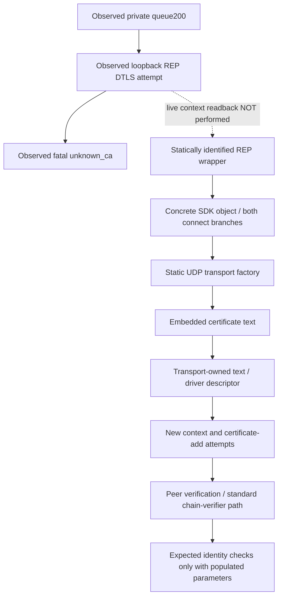

# Current REP trust policy — current-build evidence

> October 3 live follow-up: the mapped certificate-data candidate was refused at launch by intact EAC, then restored exactly. A matched unchanged-stock/original-launcher control reached queue200 and returned two further unknown_ca alerts. No private game DTLS acceptance; on-disk substitution is retired, not an EAC bypass. [Live comparison](PRIVATE_REP_ANCHOR_TRIAL.md), [receipt](../research/evidence/private-rep-anchor-eac-control.json). The static findings below are not a live readback of a candidate verifier.

## Result and identity

**The current REP wrapper→SDK→UDP secure-driver trust initializer and linked verifier are now statically identified. Private-root acceptance remains unproven.** The complete source/object chain is not a live readback of the selected enum, context or store contents.

The traced `gridmate-udp` / `gridmate-udp-bsd` transport passes embedded certificate text to a secure driver. That driver creates an OpenSSL context, parses the text, attempts to insert each certificate into its store, and enables peer verification. Within the inspected driver/connection lifecycle, the newly created context uses standard chain verification with no configured expected DNS/IP identity or separate certificate/key pin. This is **bounded static evidence**, not an application-wide absence claim or a demonstrated private-root override.

Analysis base: clean `d3841c476948595be9b430d66baa668516135f6d`, 2026-10-02. Stock Steam build **22469132**, client **1.400.6031.6004151**, installed EXE SHA256 `8654f01d324636d9f74f1c793b0cc4a417c3c5fa9847d9913c358ca29e0fdc8e`. All addresses are preferred-image virtual addresses for **this hash only**, not live ASLR addresses or hook instructions. Function/API labels below are semantic analysis labels, not a claim of recovered symbols or a specific shipped OpenSSL/source revision.

Receipt: [current-rep-trust-policy.json](../research/evidence/current-rep-trust-policy.json). Private disassembly, certificate bytes and proprietary files remain ignored and are not included in this repository. No process attachment/memory access, game launch, certificate/environment/hosts/firewall mutation, executable/EAC modification or mouse/keyboard control occurred during this analysis.

## Evidence ledger

| ID | Finding | Classification / limit |
|---|---|---|
| T47 | Transport factory `0x146b6a270` selects `gridmate-udp` or `gridmate-udp-bsd`; both pass global certificate pointer `0x149f80d90` to `0x146b34780` | Strongly source-supported; actual runtime selector and global-pointer immutability not established |
| T48 | Constructor copies the text into transport `+0x80`; client setup `0x146b36920` supplies its pointer in descriptor `+0x20`, copied to driver `+0x288` | Strongly source-supported; driver borrows the text pointer |
| T49 | Initializer `0x145dce750` parses the supplied text and calls a certificate-add routine for every parsed certificate | Strongly source-supported **insertion attempts**; add return is unchecked, so not proof of successful/live store contents |
| T50 | Client descriptor clears authenticate-client; initializer selects verification mode `1` with NULL per-certificate callback. Absent-CA branch instead installs a constant-1 callback | Strongly source-supported; absent-CA branch is not the non-null embedded-CA branch and is not a supported configuration recommendation |
| T51 | Full SSL-create and connect-success helpers contain no expected-host/IP/CN/fingerprint setup/check | Bounded negative static evidence; strengthened by T56–T58, never inferred from missing SNI |
| T52 | Initial construction and retries use the driver-created context retained by the connection | Strongly source-supported; borrowed pointer, not exclusive access or a new OS-root lookup |
| T53 | Queue handlers parse/copy typed `RepAddress`; exact queue-field-to-SDK argument provenance is not fully traced | Strongly source-supported up to response copy; distinct from the completed REP wrapper/interface join T61 |
| T54 | Own last Game.log has REP_CONNECTION marker at line461, no allowlisted transport/CA-key literal | Observed filtered metadata; marker presence/absence does not establish transport selection |
| T55 | Six preceding own-client attempts returned fatal unknown_ca after the configured server flight, with no completed DTLS/application data | Previously executed live evidence; not a live identification of the static context |
| T56 | Linked verifier dispatches a configured application verifier at context `+0x98`, otherwise standard chain verification | Strongly source-supported; distinct from ordinary verify callback `+0x188` |
| T57 | Context/default parameters begin zeroed; SSL inherits them; linked DNS/email/IP checks run only for populated expected-identity fields | Strongly source-supported; those fields are not populated by the inspected driver/connection functions |
| T58 | Context lifecycle and complete established-state handler show no extra identity/pin policy in the inspected scope | Bounded negative static evidence; aliases, callbacks and outside-cluster mutations remain unexcluded |
| T59 | Factory-created UDP transport creates the same client connection that calls the mapped secure setup, passing the copied endpoint-shaped value | Positive static object/vtable/data-flow proof; conditional on selection and construction, not runtime invocation |
| T60 | Context constructor creates a fresh store with initially empty object/lookup stacks; no explicit default-root loader found in that store constructor | Strongly source-supported scoped initialization; generic registered ex-data callback effects remain unexcluded |
| T61 | REP-labelled wrapper installs the concrete SDK primary object; both its direct and preparatory connect branches reach the mapped factory | Positive static reset/ownership/vtable/call proof; normal completion and UDP selection are conditions, not observed runtime branch values |

Two initial roles examined separate entry and verifier questions independently. Primary adjudication retained the missing bridge; targeted adversarial reviews verified the pinned artifacts and corrected insertion/ownership/verification scope. Agreement alone was not treated as proof.

## Trust-store initialization and ownership

1. **Selection:** caller `0x146b6d600` invokes factory `0x146b6a270` at `0x146b6d72f`, passing the value stored at object `+0x50`. That field is not established user-editable options storage. The factory independently reads `client-connection.transport-options.transport-type` at `0x146b6a44b`. Recognized UDP comparisons are at `0x146b6a4ba` / `0x146b6a561`. Both branches load the same embedded-text pointer and call constructor `0x146b34780` at `0x146b6a536` / `0x146b6a5e0`. This factory does not demonstrate the selected/default value for our run.
2. **Text ownership:** constructor copies the text at `0x146b34817` / `0x146b3481a` into transport `+0x80`. Client-style setup `0x146b36920` places its C-string pointer in descriptor `+0x20` at `0x146b369d8`. Own private-key/certificate slots are zero; authenticate-client is cleared at `0x146b369b1`. Driver constructor `0x145dbdd30` is called at `0x146b36ab5`; descriptor copying yields driver CA pointer `+0x288` and authenticate byte `+0x270`.
3. **Store construction:** `0x145dce750` creates the context through `0x1478ef900` at `0x145dce7e4`, saves it in driver `+0xd0`, and configures the existing cipher `ECDHE-RSA-AES256-GCM-SHA384`. Context construction calls store constructor `0x14777dac0` at `0x1478efabe`, storing it at context `+0x20` at `0x1478efac3`. That constructor zero-allocates the store, creates initially empty object/lookup stacks and fresh parameters, and initializes ex-data/locking/reference state. No explicit default-root loader is found there; globally registered ex-data callback effects remain unexcluded. For non-null CA text, driver initialization obtains the store through `0x1406ccf20` at `0x145dce8bb`, parses text through `0x145dc8de0` at `0x145dce8f2`, and attempts additions through `0x14777d770` at `0x145dce986`. The add return is not checked. No default-file/directory or Windows-root loader appears in this complete initializer.
4. **Verification mode:** `0x1478eff50` at `0x145dce9a5` writes mode and callback to context `+0x158` / `+0x188`. The traced client descriptor chooses `SSL_VERIFY_PEER` (`1`) with NULL callback. Only the alternate absent-CA branch installs `0x1402a1a70`, whose body returns `1`. Do not conflate NULL callback with disabled validation.
5. **Connection lifetime:** two driver-context reads at `0x145dcc30a` / `0x145dd9ee5` feed `0x145dce4c0`, which stores the borrowed context at connection `+0x2060`. Initial SSL creation and retry/reconstruction read that retained pointer. Driver destructor frees/clears its context. This establishes creation/destruction ownership, not exclusive access.

Embedded certificate region: VA `0x148590460`, pointer slot `0x149f80d90`, DER SHA256 `62880372376f5d9b4e63e453c7eaaf906a9b3d11bf8e3e9e2c8cbdd98c28ffe3`. Previous parsing established X.509v1, subject==issuer and absent BasicConstraints. That is self-issued metadata, not a verified self-signature. Missing BasicConstraints does not disprove an explicitly installed trust role. Subject strings/PEM are deliberately not exported; there is no demonstrated CN-string comparison in this path.

The public engine initializer is useful semantic corroboration for explicit descriptor certificates versus its alternate callback, **not evidence of the shipped source revision or actual REP execution**. [Public GridMate initializer](https://github.com/aws/lumberyard/blob/master/dev/Code/Framework/GridMate/GridMate/Carrier/SecureSocketDriver.cpp#L1398).

## Actual linked verifier and expected-peer inputs

- **Verifier dispatch:** current chain-verification analogue spans split unwind ranges `0x1478fd900–0x1478fdb98`. It selects certificate-specific store `cert+0x1d0` or context store `ctx+0x20`, applies client/server verification defaults, overlays SSL verification parameters, and uses the ordinary callback when present. At `0x1478fdadb` it separately tests the **application verifier** at `ctx+0x98`; non-null invokes it at `0x1478fdaee` with `ctx+0xa0`. Null calls the standard `X509_verify_cert` analogue `0x1477ae910` at `0x1478fdaf2`. Thus NULL ordinary callback alone was insufficient to settle policy.
- **Default state:** context constructor allocates zeroed state via `0x147781000`; app-verifier fields therefore initially null. A fresh verification parameter at context `+0x198` has null DNS/email/IP inputs. The complete secure initializer does not replace those fields.
- **Inheritance:** SSL creation copies mode/callback and inherits context verification parameters into SSL `+0xd0` (`0x1478f14cf–0x1478f14ee`). They are not automatically derived from the socket address or absent SNI by the inspected helper.
- **Expected identity:** linked identity checker `0x1477aff20` gates DNS checks on parameter `+0x30`, email on `+0x48`, and IP on `+0x58`. Those checks exist in the binary, but require populated inputs; the traced initialization does not supply them. This does not prove all callers lack expected-peer policy.
- **Success:** client handler `0x145dd2440` calls SSL-connect analogue at `0x145dd24a9`; result `1` immediately chooses state9. Its full registered `CS_ESTABLISHED` handler `0x145dd2630–0x145dd297b` performs transport/error work with no separate certificate/name/fingerprint decision found.

Interpretation: **ordinary embedded-certificate chain verification, with no expected hostname/IP or separate leaf/SPKI pin installed by the inspected lifecycle**. This is an embedded trust-source restriction, not proof of a custom leaf pin, global lack of hostname verification, or a bypass opportunity. Windows-root HTTPS success does not settle this separate context. OpenSSL's callback/parameter distinctions are corroborated by its [verify API](https://docs.openssl.org/1.1.1/man3/SSL_CTX_set_verify/) and [chain-verifier source](https://github.com/openssl/openssl/blob/OpenSSL_1_1_1w/ssl/ssl_cert.c#L326).

## REP source join and remaining live limits

**REP wrapper/interface join (T61):** initializer `0x146425cb0` resets the same wrapper through `0x14642d2d0`, then calls SDK allocator `0x146b6c490`. That allocator constructs `0x146b69ad0`; the returned **primary object base** is move-installed into wrapper `+0x1000` at `0x146425cf5–0x146425d02`. Its primary vtable is `0x148590ab8`, with slot `+0x18` targeting `0x146b6d600`. The separate small SDK wrapper at `+0x1048` is not confused with this field. Reset clears `+0x1000` at `0x14642d363` and releases the old object; it is not another install source in that inspected pair.

The current `REP connection` / `GameConnectionWrapper` format-string span begins at `0x1484fe8f0`. Reference `0x14644a651` is in `0x14644a070`, which calls `0x146425f20` at `0x14644a66a` with the same wrapper receiver. That routine loads its concrete SDK field and conditionally dispatches `+0x10` at `0x14642638e` or `+0x18` at `0x1464263d7`. Direct `+0x18` reaches the factory caller. Preparatory `+0x10` targets `0x146b6d580`, which copies a record into SDK `+0x3f0` then invokes the **same object's `+0x18`** at `0x146b6d5e4`; its copy helper does not mutate the primary vtable. **Both known implementations converge on `0x146b6d600` on normal completion.** UDP selection remains a separate condition.

Method correction: an exact NUL-terminated string search initially missed that longer format string. A bounded substring search found its start/code reference; the earlier absence claim is superseded. Matching slots alone were not accepted until constructor/store/receiver identity and the preparatory branch were checked independently.

Current HTTP paths `0x1463e6650` / `0x1463e6d30` use adapter `0x1474e1370` → parser `0x1474e89d0` → deserializer `0x1474e4f20` → reader `0x1474e5990`. `RepAddress` lands in result `+0x168`, with flag `+0x188`; response copying uses `0x146403790` → `0x146404a00`. Those handlers do not directly create transport. Exact decoded queue-field-to-SDK-argument provenance remains untraced; this no longer means the REP wrapper's concrete interface or factory-to-driver relationship is missing. Prior live evidence separately proves the synthetic response leads to the selected private endpoint.

**Positive factory-to-setup bridge (T59):** transport constructor installs vtable `0x14858d150`, whose `+0x8` slot is `0x146b393d0`. Factory `0x146b6a270` calls it at `0x146b6a769`; that method passes the **same transport pointer** into connection constructor `0x146b27180`, which stores it at connection `+0x2f8` (`0x146b27237`). Connection vtable `0x14858c358` has `+0x30` slot `0x146b27e10`. Factory retains the connection at `+0x60`, loads that slot at `0x146b6a7ec`, and invokes it at `0x146b6a8bb` with the address-shaped value copied from factory `+0x8`. The slot reloads the same transport and calls secure setup `0x146b36920`. Caller `0x146b6d600` also reads `client-connection.transport-options.rep-default-port`. Thus the transport/store relationship is no longer merely two neighboring code regions; the remaining provenance boundary is **upstream of `0x146b6d600`**, not factory-to-driver identity.

The positive static source/object join is complete for these known implementations. **Live enum/context/store/expected-parameter values remain unread**, and global pointer mutation, aliases or registered callbacks are not exhaustively excluded. Other factory branch `0x146b3de50` has not been classified here. Incoming `unknown_ca` identifies chain rejection for the tested flight, not the precise failing X.509 error/depth or live root set. Historical hooks, matching cipher choice or bidirectional DTLS alone would not have established this source join.

## Coverage, reproduction and preserved validation

1. Verify the installed EXE hash/build and inspect Git state before reading. Use `.scratch/rep-verify-policy/run.ps1` through the repository-required PowerShell wrapper; inspect exact current function addresses, not old First Light addresses. The original private analyzer refuses a different executable hash.
2. Reproduce the positive argument/copy/store/verify relationships using `.scratch/rep-verify-policy/ledger.md`, `ledger-second-pass.md`, `ledger-object-bridge.md`, `ledger-store-constructor.md`, `ledger-sdk-interface.md` and `ledger-sdk-branch.md`. The immutable `.scratch/rep-context-entry/entry-final-functions.txt` retains the wrapper initializer, REP helper/marker and reset functions; `ledger-entry-final.md` records the corrected search and receivers. Receipt hashes pin the final inputs. Proprietary output stays ignored. Never turn this into a hook/patch procedure.
3. For negative policy checks, enumerate **each** `.pdata` range independently and join split continuations only when control flow establishes the join. The secure-driver cluster `[0x145dbd000,0x145de1000)` scan covers435 records /37042 decoded instructions. It retains42 undecoded tail bytes at `0x145dd6210–0x145dd6238` and `0x145dd8596–0x145dd8598`. Direct-member matches are not alias-aware; gaps, outside-cluster code and generic ex-data registration callbacks remain unexcluded. A raw linear scan that stops early cannot prove absence.
4. Own-log helper `.scratch/rep-trust-review/inspect-owned-log.ps1` uses fixed allowlisted markers, drops secret-signal/userinfo lines and exports no raw lines. Stable source SHA256 `32b1f8a6eeaf1c4d776947a2c9e48771f9b61b6dbb4bb9f668ceabcfccbdef0b` matches the previous CA-file trial. Log extraction is not a live call stack.
5. `.scratch/rep-trust-review/verify-validation-identity.ps1` rechecked all39 source/fixture hashes and prior JUnit/runner identity from the273-pass receipt, plus installed EXE/launcher hashes. **No new tests were added or rerun** for this static/documentation-only change. Prior273 workspace pass and455 upstream pass/1 deliberate skip remain executed historical results, not new tests of these binary inferences.
6. Read-only runtime readback: no NewWorld process, TCP443/UDP64003 listener or project routing rule; hosts original byte hash; retained local root count1. No CA regeneration/removal/import. PowerShell helpers passed parser/automatic-variable checks before execution.

## Exact next blocker and gate

### Bounded read-only observation preparation

**Executed follow-up:** [access receipt](../research/evidence/current-rep-readonly-access.json) records the elevated stock-client query: exact creation time and executable path verified; module lookup returned Win32error5. Observer stopped before requesting VM_READ or reading memory. Exact API substage/cause is unknown, not an EAC verdict. No runtime trust-pointer/context/provider value was observed. [Procedure/results](CURRENT_CLIENT_CONNECTIVITY.md#october-3-elevated-read-only-access-observation). The preparation-only statements below remain scoped to their earlier checkpoint.

`scripts/windows_rep_readonly_probe.py` is an original, explicit opt-in observer for this pinned stock image only. Offline tests never construct its real Windows adapter. It does not establish a private-root override or change game behavior.

Admission requires an active ignored connectivity run, its three matching ownership/launch manifests, the pinned unchanged-stock containment-owner source identity, the installed stock hash, an exact process creation FILETIME (including its seventh fractional digit), successful `QueryFullProcessImageNameW` matching the installed client, and a unique exact-path `NewWorld.exe` module. Unavailable image-path queries fail closed. A matching *loaded module* alone is not main-image identity proof. The creation time is checked again on the read handle to detect PID reuse.

The observer requests only `PROCESS_QUERY_LIMITED_INFORMATION` (`0x1000`) and then that right plus `PROCESS_VM_READ` (`0x1010`). A denied query/read is timestamped evidence; it never enables debug privileges or works around the denial. No debugger attachment, writes, injection, protection change, driver, arbitrary-address input or heap traversal is present. Handles are closed in `finally`, including a failed log write after an open. The process exits after the bounded observation.

The only memory ranges are the hash-mapped global REP text pointer (8bytes), settings holder pointer (8bytes), initializer key/index (4bytes), and the statically mapped embedded certificate-text span (1350bytes), **1370bytes total maximum**. Output contains pointer/integer metadata and a SHA256 of that fixed text span, never raw game bytes. A changed pointer is reported but not followed. These metadata cannot prove the selected transport, successful root insertion, runtime store contents, verifier parameters, provider callbacks or DTLS acceptance.

Source provenance for the two new global locations is `.scratch/descriptor-provider-20261003T1635Z-a50f/selected-disassembly.txt`, SHA256 `39d002e50f9e4f8d4ba11e6e388f238e70d118cbccd303ab0a0e6a73edf15075`, from the pinned executable and function-scoped decode. At `0x1406d17b8` the shared holder slot is `0x14a2e5e98` (RVA `0xa2e5e98`); `0x1406d17c6` reads the index/key from `0x149e7c890` (RVA `0x9e7c890`). The latter's file value is `0x52c31db5`, not a proven live value or OS-thread identifier. **Correction to that private bundle's report:** `0x1406d1818` calls the direct field `[holder+0x40]`; it does not load the vptr at `[holder+0x30]` and dispatch its slot. The claimed `0x1405c6ab0` join/registry-getter semantics are withdrawn. The separately preserved `.scratch/descriptor-provider-correction-20261003T1642Z-b732/correction.md` (SHA256 `bf6377da2d14f0be2223c8c41e9c1c0e5e420b3d3b9b6304a2fcff97abfdcb1d`) maps constructor `0x1412f42d0` copying callback source `[global pointer at 0x14a314628 +0x30]` to the direct field. That source slot is virtual `.data` with no raw-file backing; its runtime owner/callback are unknown. Holder/global addresses remain supported independently of the withdrawn interpretation. Actual provider population is still under investigation.

Exact invocation, only after the existing stock containment owner has published a fresh `owned-client.json` and while it remains active: `.venv/Scripts/python.exe scripts/windows_rep_readonly_probe.py --run-directory <fresh private run>`. Use a validated, normal elevated helper if necessary; do not relax any identity or protection check. Output is a new, non-overwritten `rep-readonly-observation.jsonl` inside that run. Stop the owned client before restoring routing, close only owned listeners, and execute strict cleanup readback as in [the current-client procedure](CURRENT_CLIENT_CONNECTIVITY.md).

API contracts: Microsoft [OpenProcess](https://learn.microsoft.com/en-us/windows/win32/api/processthreadsapi/nf-processthreadsapi-openprocess), [ReadProcessMemory](https://learn.microsoft.com/en-us/windows/win32/api/memoryapi/nf-memoryapi-readprocessmemory), [GetProcessTimes](https://learn.microsoft.com/en-us/windows/win32/api/processthreadsapi/nf-processthreadsapi-getprocesstimes) and [CreateToolhelp32Snapshot](https://learn.microsoft.com/en-us/windows/win32/api/tlhelp32/nf-tlhelp32-createtoolhelp32snapshot). These describe Windows behavior, not actual EAC permissions. A separate October3 helper context check observed administrator role enabled under the same user with the retained root count1; the ordinary tool shell was not elevated. That context check launched no game, adjusted no privileges and read no process memory. Live observer results are not yet established by this preparation.

### Unchanged-client settings boundary — October 3 static follow-up

**Later callback initialization trace:** [24-binding receipt](../research/evidence/current-rep-provider-callback.json) resolves the direct holder callback's source within a conditional initializer, not configuration input. Constructor `0x1412f42d0` takes the address of slot `0x14a314628` and calls `0x1411f3390`; that helper saves the supplied address and writes the owner pointer through it at `0x1411f34b6`. It computes callback address **`0x141412f20`** at `0x1411f3447`, stores it to owner+0x30 at **`0x1411f3452`**, and the constructor copies that field to holder+0x40 at `0x1412f4311`. The accessor calls the direct field. Live execution/branch values remain unknown.

Selected callback bytes at `0x141412f20` form a29-byte leaf ending in return, with no containing `.pdata` range. Its static expression is: `index = DWORD[0x14a829d10]`; `array = QWORD at GS:[0x58]`; `block = QWORD[array + index*8]`; `result = QWORD[block + 0x2700]`. Retain the **nested dereference**. No runtime value, OS-thread lifetime, provider registration, JSON reader or private-CA input follows from this expression.

The original initialization report's manual LEA result `0x141414f20` and store-site `0x1411f344e` are incorrect; selected disassembly and the later leaf bundle support the corrected addresses above. The earlier report remains immutable and explicitly superseded. The target-specific scan found an aliased writer, so absence of a direct RIP store was not treated as global immutability. The next missing edge is still config-descriptor consumption/provider population/value merge, and whether any evidenced normal input can affect REP trust.

[Settings receipt](../research/evidence/current-rep-settings-boundary.json) pins the installed binary, three inspected top-level config files, prior source mapping and new original private notes. Investigation began at `bd1be58` with primary-owned documentation/receipt changes present; synthesis follows clean `9a4a811`. No client/config/process-memory/network/EAC/trust-store changes or new game trial/tests occurred in this slice.

| Boundary | Source-supported finding | Unknown / not implied |
|---|---|---|
| REP option reads | Factory/entry use typed getters for `client-connection.transport-options.` type, backoff, tick frequency, disconnect delay and default port; shared accessor `0x1406d17b0` | Normal input, supported override and precedence are not established |
| Registry/providers | Accessor initializes global holder via `0x140359be0`, then performs indexed registry lookup/allocation; observed initial optional provider list is null. Getter paths invoke callbacks at `0x140fc5e28` and `0x140fc5fec` | Registry index/lifetime and callback population remain untraced; per-thread ownership not established. Initial null is not permanent absence; shared accessor does not prove identical provider populations |
| Remote feature | `client-connection.enable-remoteCfg` getter `0x1464456f0` supplies defaulttrue; conditional processing references `0x1410376e0`, `0x14643f0a0`, `0x146468370` | Default is not a readback of our session; no proof it sets REP keys/CA text |
| Remote service | Function `0x140852f90` references S3-key query/retrieval; indirect service call `0x140853148` through slot `+0x3b0` | Concrete endpoint, payload model, ownership and merge into REP providers unknown; no service contacted |
| File layer | Initializer `0x140089350` calls builder `0x140fec750` in mode0; it constructs a `fileCfg` descriptor and stores `@assets@/client.json` at output+0x28 through copy helper `0x1402c43b0`. Mode4 stores the server JSON path; `0x140fecbc0` references `remoteCfg` | Reader/parser/provider insertion and physical asset alias remain unproven. Unclassified `0x1412f4730` receives the formatted label at output+8 **before** path copying, not the path. Initializer tail `0x147aa687c` also unclassified; helper effects/indirect I/O not excluded |
| Inspected top-level files | `bootstrap.cfg`, `engine.json`, `system_windows_pc.cfg` contain no observed transport keys; retail CFG comment is present | This does not exclude JSON/asset/remote/other layers. No file was edited |
| Trust | The mapped UDP descriptor still supplies embedded certificate text; no private-CA input established in this bounded settings trace | OpenSSL environment getters elsewhere and a LibUV constructor label do not establish a usable alternate trust/transport route |

The exact next static boundary is descriptor consumption/provider population and file-layer read/parse/merge, **not** an invented `ca-file` setting or assumed `client.json` location. The original file-layer addendum is separately hash-bound under `.scratch/settings-provider-filelayer-f276326dc9e2`; prior notes remain unchanged. A live configuration trial requires an evidenced input and value-to-transport relationship first. The on-disk certificate substitution has already been refused by intact EAC. Carrier/V3 remains gated on actual game DTLS/application data; actors remain gated after that.

**Establish a narrowly scoped private-anchor loading boundary while preserving verification, then prove it with the actual owned client.** No supported private-root override is established. The current REP source path and UDP initialization/verifier are identified; the factory supplies the embedded certificate argument for both recognized UDP branches. That is not proof every configuration path is immutable. Do not repeat blind Windows-root or CA-file controls as though they choose this descriptor.

If stronger runtime attribution is needed during that test, observe only the owned session's selected transport/context/verify mode/store fingerprints/expected-identity metadata. If a read-only process query is denied, report that denial rather than bypassing EAC. No raw memory/token capture or write is needed by this plan. Any client interoperability change is a separate evidence-constrained implementation, not part of this analysis.

**Next engineering checkpoint:** trace the shared settings-manager/provider input boundary for a supported unchanged-client REP trust control, if one exists. The [private anchor trial](PRIVATE_REP_ANCHOR_TRIAL.md) is now complete as an EAC refusal with verified recovery; do not repeat that substitution or modify EAC/launcher protections. No supported normal override or actual private game acceptance is established.

**Current outcome unchanged:** synthetic character selection → private queue → DTLS certificate rejection. No world-loading state, completed game DTLS, decrypted Carrier/V3 record, actor or Milestone1. Carrier/V3 can proceed only after an actual current-client handshake and genuine application data are observed; actor/spawn work remains gated.
