# Player spawn sequence — evidence map, not a packet recipe

**Latest gate:** [DTLS_REGISTRATION](DTLS_REGISTRATION.md) records the stock game's **fatal unknown_ca** after our configured full-chain DTLS flights, six attempts across three runs. [REP_TRUST_POLICY](REP_TRUST_POLICY.md) now maps current embedded-certificate initialization/verifier/identity inputs statically; actual REP context/private-anchor configuration remain unproven. No established DTLS or current Carrier/V3. The frontend preview is not a world actor; Play spinner is not world loading. Private transport acceptance, secure ticket binding, registration and actor contract remain gates. Earlier receive-only stopping points are historical.

## Gate and current stopping point

Current build `1.400.6031.6004151` / Steam22469132 accepts original synthetic credentials/login-info/queue200 and attempts DTLS at selected127.0.0.1:64003. Our responder now answers, but the game rejects its configured full chain with **unknown_ca**. No completed handshake, world loading, in-world actor, initial transform or visibility. Offline spawn research remains separate; live actor implementation is gated.

Source map below: clean external First Light `63756a3f7ff0ae41752dcc7c80267802c3fa7548`. Its flow note is dated2025-12-27 and reports client `1.365.6030.5950962` (`docs/connection-flow.md:1,68`), **not our current build**. References are paths within that ignored source checkout. No source/code/captured actor bytes are vendored here.

## State machine

The prefix through owned UDP attempt below is current observed ordering. Subsequent edges are historical source-supported ordering or explicitly future/unresolved hypotheses, not replay validated with our game. Numeric state labels refer to old static analysis, **not measured current-client state values**.

```mermaid
stateDiagram-v2
    [*] --> Bootstrap
    Bootstrap --> ChannelAccepted: current local descriptor200 parsed
    ChannelAccepted --> TokenModelAccepted: current synthetic envelope SDK0
    TokenModelAccepted --> CredentialsRequested: current local credentials GET
    CredentialsRequested --> LocalCredentialsAccepted: current synthetic200 / login-success marker
    LocalCredentialsAccepted --> GatewayLoginInfo: current GET / character-selection frontend
    GatewayLoginInfo --> PrivatePreview: current synthetic login-info200
    PrivatePreview --> QueueV2: user selection and Play
    QueueV2 --> OwnedUDPAttempt: current synthetic829byte200 /selected REP
    OwnedUDPAttempt --> DiagnosticStop: server flight then fatal unknown_ca (current)
    DiagnosticStop --> [*]
    OwnedUDPAttempt --> DTLSConnected: NEXT separate UDP DTLS handshake/trust
    DTLSConnected --> PrivatePeerBound: future secure ticket-to-peer ownership
    PrivatePeerBound --> CarrierConnected: historical SM_CONNECT request / ACK
    CarrierConnected --> RegisteredV3: historical request0x13 / response0x03
    RegisteredV3 --> SelfIdentWait: historical state10
    SelfIdentWait --> SelfIdentified: proposed0x5d1; body unresolved
    SelfIdentified --> LevelInfoWait: historical11 to12 local readiness
    LevelInfoWait --> ReplicaWait: proposed LevelInfoChanged; ID unknown
    ReplicaWait --> ActorExists: creation / ownership packet unknown
    ActorExists --> InitialTransform: current payload unknown
    InitialTransform --> WorldVisible: dependencies / acknowledgment unknown
    WorldVisible --> PeerVisible: second actor and movement fan-out unimplemented
```

The lower half is a **research target**, not an implemented or proven sequence. In particular, SelfIdent + LevelInfo + NewProxy is not a demonstrated three-message minimum.

## Message/state evidence

| Stage | Existing definition / relationship | Classification and missing proof |
|---|---|---|
| Authentication | `auth_mock.py:766–805` credentials handler; historical Steam/Omni chain `connection-flow.md:5–37` | Old log plus synthetic mock. Current accepted request/response schema and private-account ownership missing. Do not reuse seeded identities/JWT assumptions as real authentication. |
| Character / world choice | `auth_mock.py:895`, route map `:1345–1360`; `/prod/game/getlogininfo`, `/prod/game/login/queue` | Handler scaffolding exists. Old note documents queue for one character, not a general selection UI/state machine. Current private behavior unknown. |
| Session ticket | `auth_mock.py:258–314`; `CharacterId`, `WorldId`, `RepAddress`; shared `Ctx :404–464` | Source-supported old mock fields. No current ticket fixture or per-account isolation; never export secret ticket values. |
| REP session | Detailed `docs/post-v3-flow.md:16–35`: UDP/DTLS1.2, then Carrier connect/ACK | Source-supported old transport. Older `connection-flow.md:63–69` calls it TCP: retain conflict, prefer detailed implementation historically. Current DTLS flight receives fatal unknown_ca; no established Carrier session. |
| V3 registration | `RegistrationRequestV3Msg 0x13` → `RegistrationResponseMsg 0x03`; responder `:586–675`, token echo `:650–676` | Sender/decoder implemented historically. Not observed/validated on current build. A decoded request is not authenticated account ownership. |
| Self-identification | `PlayerManagerSelfIdentificationMsg 0x5d1`; dispatch encoder/decoder `:120–124,212` | Codec exists but message absent from replay and sender unwired (`post-v3-sequence.md:115,132–140`). `self_ident.py:39–61,92–104` conflicts between four-byte trigger hypothesis and ≥21-byte structured body. No current valid body. |
| Level readiness | `LevelInfoChangedMsg`; `level_info_changed.py:1–36,147–190` | Speculative codec, **no established wire ID**, absent from central dispatch; nonempty extended container unimplemented (`:129–135,221–226`). No proof of client transition. |
| Actor/replica creation | Historical state13→14 predicate over local replica-shaped collection (`state_machine_summary.md:90–105,283–293`) | Static RE, not current execution. NewProxy is leading hypothesis; exact New World message/wire type unresolved (`state_13_14_writer_investigation.md:187–235`). |
| Replica stream | `StateBundle / chunked stream 0x08`; `chunked_stream_08.py:1–30,67–165` | Captured old server-direction data; anchor/subtype or UUID plus **opaque tail** round-trip. No actor/transform/owner/visibility semantic codec. `SpawnActorsMsg 0x23e` is not a captured top-level packet (`typeregistry_vs_replay.md:46–76`). |
| GridMate commands | Generic stream `Cmd_NewProxy=2`, `Cmd_NewOwner=4`; constructor/dataset/RPC notes `gridmate-reference.md:413–483,510–518` | Reference concepts, not identified current New World packets. Do not confuse nested command IDs with Carrier/Javelin wire IDs. |
| Spawn-labelled old records | R-direction `0x1096`, `0x1097`; phase outline `post-v3-sequence.md:124–126` | `frame_config_1096.py` documents one 80-byte shape with speculative fields; `result_token_1097.py` a paired numeric result. Neither establishes an initial player transform. `0x663` is a level descriptor, not world-visibility proof. |
| Visibility / movement | No authoritative actor owner/fan-out in the responder | Unknown current registration/creation linkage, initial transform, AOI/visibility completion and local-vs-remote identity. No movement server implemented. |

Do not confuse decimal type13 in newer position notes with hexadecimal registration `0x13`. Transport framing, Javelin messages, nested replica commands and RPC type identifiers are different layers; build-specific meaning must be captured.

## What First Light actually emits

`rep_responder.py:598–675,776–830,873–931` sends V3 responses, replays captured R-direction records with redacted request-derived spans substituted, and can regenerate heartbeat scaffolding. It does **not** call the SelfIdent or LevelInfoChanged encoder, generate current actors/replica identities/initial transforms, or implement world movement ownership. Replaying old opaque actor-state bytes does not create a valid independently owned player. No alternative SessionStatus/re-handshake path was found in this bounded sender/codec/flow review.

Reusable now: transport framing/codec round-trip tests, per-peer DTLS scaffolding and replay analysis as research tools. Broken/abandoned for this target: unwired SelfIdent/LevelInfo setup, unknown creation packet, opaque replication tail, shared auth persona, and old replay-as-world-state. Do not fix these by inventing fields or substituting arbitrary packet IDs.

## Independently testable next tasks

1. **Compatible HTTP/address handoff (proven):** current original token/credentials/selection/queue response fixtures advance to owned UDP; [PRIVATE_GAME_HANDOFF](PRIVATE_GAME_HANDOFF.md). Not secure account/ticket validation and no real-token replay.
2. **Separate transport gate (next):** resolve current REP's active trust configuration after explicit unknown_ca, then establish own current-client DTLS and Carrier/V3 with secret-minimizing traces. Two isolated Python DTLS peers already exchange data; they are not game acceptance.
3. **Private auth/session ownership:** exact current request schemas/state relationships and isolated local account/character/ticket-to-peer tests. Synthetic compatibility is not authorization.
4. **Current spawn fixture:** relate registration, self-identification, actor/replica creation, ownership, initial transform and visibility. Record state/frame direction/channel, build, byte boundaries, stable **sanitized** ID correlations and positive/negative outcomes. Validate codec parsing/serialization before changing them.
5. **One-player visible actor:** emit the minimum validated sequence with structured logs and demonstrate local world/actor state. Stop expansion at that success as requested.
6. **Second distinct player:** independent private account/session/actor, bilateral position/rotation changes, removal/reconnect without duplicate actor. No combat/NPC/inventory/persistence work beforehand.

**Exact immediate blocker is current REP's active trust source/private-root configuration after explicit full-chain rejection.** Live actor work still waits for DTLS/Carrier/V3, private ownership and current spawn fixtures. No official-system bypass, credential acquisition, EAC modifications or proprietary server material is assumed.
