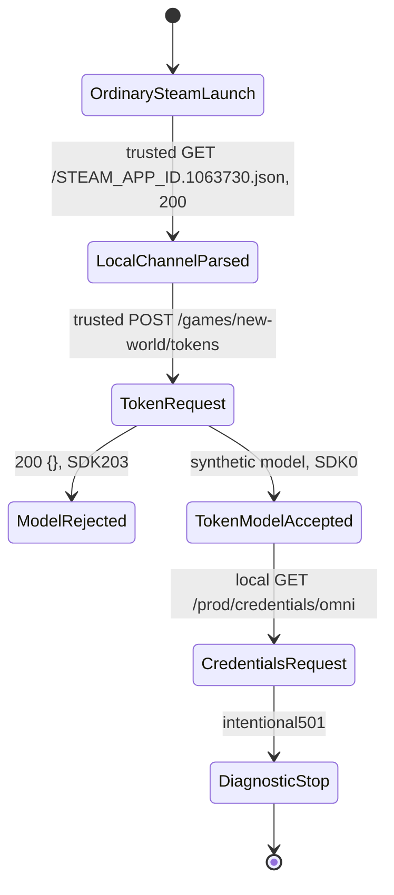

# Current token/session response contract

## Verified boundary — 2026-10-02 UTC

**The unchanged current client accepts our synthetic token response, reports Omni CreateSession result `0`, and advances to `GET /prod/credentials/omni` on our local service—with or without top-level `account`.** This is response/model acceptance, not an implemented private account system or a successful game login. That next route deliberately returns `501`. No world selection, REP connection, world load or actor is proven.

Client: Steam app1063730, build22469132, version1.400.6031.6004151; installed EXE SHA256 `8654f01d324636d9f74f1c793b0cc4a417c3c5fa9847d9913c358ca29e0fdc8e`. Normal exclusive Steam launches and exact client-side TCP tuple owners identify these experiments; no live executable-path/image-hash claim. No attachment, memory write/read, executable/EAC patch or input takeover was needed.

Evidence: [metadata receipt](../research/evidence/current-token-contract.json), [observed transition fixture](../tests/fixtures/connectivity/current-token-contract-result.json), [original synthetic response](../tests/fixtures/connectivity/current-token-parser-candidate.json). Derived assembly stays ignored locally; no proprietary binary/source or credential payload is redistributed.

## Executed comparisons

| Controlled response to token POST | Current-client observation | Limit |
|---|---|---|
| Earlier intentional501 | SDK201, no credentials request | Historical token connectivity receipt; numeric error meaning unresolved |
| `200 application/json`, body `{}` | SDK203; no credentials request | Fresh PID860; missing-model control, not a certificate rejection |
| `200 application/json`, synthetic model including `account` | SDK0 and attributed credentials GET7ms after token response | Fresh PID32416; next endpoint501; no game login |
| `200 application/json`, identical synthetic model minus `account` | SDK0 and attributed credentials GET5ms after token response | Fresh PID42280; next endpoint501; no game login |

The first two current trials used the same trusted local CA/leaf, holding trust/routing fixed. The successful no-account repeat used a fresh, positively verified CA after the old one was removed. All used correct-name leaves, the same three-host mapping and descriptor SHA `68bf491abacc05e06c4a536015aaffb3a653618d23c04f61810df6af854a5f13`. **Processes were fresh; per-user cached state was not cleared.** The no-account request was719bytes rather than2941. Its body was not inspected, so the reason and equivalence of request/session state are unknown. This proves compatibility within the recorded handoff, not pristine-first-login requiredness. An earlier no-account launch was canceled at Windows elevation: no game or routing, unused listeners stopped; it is not a protocol failure. The user requested the successful repeat. Both trust identities and the failed attempt are retained in the receipt.

## Transport and request boundary

- Observed SNI/Host `tokenservice.amazongames.com`, HTTP/1.1 `POST /games/new-world/tokens`, TLS1.3 / TLS_AES_256_GCM_SHA384, selected ALPNnull. Declared request bodies:2941bytes for control/account-present,719bytes for account-absent; sizes are session-specific, not a constant. Authorization/Cookie absent. **The body is discarded, not decoded, logged, retained or forwarded.** Its current field schema and the size-change cause are unknown.
- Response: HTTP200, application/json, UTF-8 compact JSON, explicit Content-Length, connection close. No compression/encryption beyond TLS was added. Other framing/keep-alive combinations remain untested.
- With the synthetic model: local follow-on `GET /prod/credentials/omni`, HTTP/1.1, TLS1.2 / ECDHE-RSA-AES256-GCM-SHA384, Authorization present, Cookie absent, body0. Header values are never exported or compared. The local channel profile deliberately uses the bootstrap hostname for this regional API; this is not proof it is the official regional hostname.
- No `prod.newworld.com` HTTP request was observed in these bounded trials. That is not proof that the endpoint is never used.

## Current model reads and validation

Read-only inspection of the installed SHA-pinned PE was necessary because First Light's old mock is not current-runtime proof and our previous501 supplied no accepted response. Exception-table bounds constrain inspected functions. These are original functional descriptions, not copied disassembly. Static requiredness and actual accepted values are separate.

| Field | Static evidence / behavior | Current live evidence |
|---|---|---|
| `platformAccount` | Root parser calls object parser without a presence guard; false result ->203. Nested parser requires object and member presence | Object accepted in successful model |
| `.identityType` | Presence required; string read, lowercase enum lookup; mapped enum must be nonzero | `"Steam"` accepted; other platforms untested |
| `.identityId`, `.personaId` | Presence required, string accessors; no UUID-format check established | Synthetic local UUID-shaped strings accepted, not real Steam/account identifiers |
| `.ageGroup` | Presence required, string enum lookup; nested success predicate does not reject zero age enum | `"Adult"` accepted; other values/null/type variants untested |
| `.platform` | Optional string read | Omitted successfully |
| `account` | Root absence stores nested status307 and continues; presence invokes account model | Both present synthetic object and complete omission reach SDK0/credentials GET; not required for this handoff |
| `.identityId`, `.personaId`, `.type`, `.ageGroup` | If account is present, object/member existence required. Identity/type use string accessors; lowercase `shadow` has a special path; ageGroup presence checked but not otherwise read here | Synthetic UUID-shaped identities, `"Amazon"`, `"Adult"` accepted; semantics/enumeration unproven |
| `accessToken`, `fallbackToken` | String getter reads/copies them; missing/null view or underlying getter-null uses an empty-string default. No nonempty check established in this root parser; wrong-type behavior not fully mapped | **Opaque unsigned synthetic markers accepted for this step.** Missing/empty fields untested; later validation unknown |
| `expiresIn` | Numeric getter, caller default0; conversion to integer and multiplication by1000 in expiry calculation | Integer3600 accepted; seconds strongly static-supported; refresh/expiry not exercised |
| `limitedUseToken` | Optional string presence/read | Omitted successfully |
| `penalties`, `suspension`, `region`, `conflictingAccount` | Conditional nested parsing; some false returns ->203; full submodels/error-state conditions not mapped | All omitted successfully; present/null models not tested |
| `errorCode`, `account.isNewAccount` | Optional conditional reads; full server-error mapping not established | Omitted successfully |

Presence helper checks object/member existence, not the member's JSON type: a present null can pass presence checking yet fail a later conversion. Do not turn this permissive implementation into our eventual server's validation policy.

### Exact static anchors

Image base `0x140000000`; installed-file identity above. Private metadata receipt records inspected helper/annotation hashes.

- Root model `0x1479b6d00..0x1479b82e5`: platformAccount call `0x1479b7a08`, false->203 `0x1479b7a11`; account presence `0x1479b7a7d`, absent nested307 `0x1479b7aea`; accessToken read `0x1479b800c`, expiresIn `0x1479b80d9`, times1000 `0x1479b8125`, fallbackToken `0x1479b81fb`.
- Platform model `0x1479c0fd0..0x1479c1a33`, member vector `0x1495d94c8..0x1495d94e8`; identity enum helper `0x1479c2240`; age enum helper `0x1479d0de0`.
- Account model `0x1479c0620..0x1479c0fc4`, member vector `0x1495d93b0..0x1495d93d0`.
- Member-existence helper `0x1479d6860..0x1479d68af`; string getter `0x1479d6770..0x1479d67fa`; integer getter `0x1479d66e0..0x1479d6724`.
- Token HTTP wrapper `0x1479c9f00..0x1479ca3d3`, model call `0x1479ca332`: invalid JSON changes an otherwise-zero SDK status to203; already-nonzero statuses are preserved. Thus203 is **not exclusively a syntax error**. HTTP501 vs SDK201 must not be conflated.

## State progression



Client log records carry extraction timestamps, not original client-event timestamps. Network events have probe UTC timestamps, per-connection IDs/sequence numbers and accept-time OS owner evidence. Operator DNS resolution is not a client DNS trace. Firewall ActiveStore readback is not a packet-level enforcement experiment.

## First Light comparison / reuse

Pinned clean external First Light `63756a3f7ff0ae41752dcc7c80267802c3fa7548`, `server/auth_mock.py:1153–1240`, and historical Omni research were references, not accepted-current fixtures. Its model names are partly reusable as research leads; current static checks and live response now independently support the tested subset. The historical mock's comment that both account models are mandatory does not establish root-account requiredness now.

Do not reuse its fallback JWT decoding, shared persona context, raw request logging, signed-token assumptions or backend-success responses as a private account system. Our successful response contains newly authored synthetic values, no old/replayed service token and no JWT/JWKS service. This proves JWT signing is unnecessary to reach **this one observed callback/next request**, not that every later endpoint accepts unsigned tokens.

## Reproduce the checkpoint

1. Confirm this exact installed build/hash, clean source/reference identity, no existing game, and no unrelated port443 listeners. Run the focused offline tests; they never launch the game or change system trust/routing.
2. Create a fresh ignored **run/journal**, not a new certificate for every run. Copy `tests/fixtures/connectivity/local-channel-token-hostnames.json`; prepare a `TokenServices` hosts journal. **Routine runs reuse the retained certificate directory below.** Only when no owned valid/correct-name retained certificate exists, generate a short-lived local CA/leaf for the bootstrap, token and prod.newworld hostnames via `connectivity_probe.py certificates`. Never store/reuse an official credential.
3. For retained trust, verify expiry/manifest/ownership and exact CurrentUserRoot thumbprint+SHA readback1 without another import. For a newly generated CA only, import through validated `Use-ConnectivityTrust.ps1`; **wait for completion and exact readback1 before launch**. Windows prompts are user-operated. A CLI import wrapper in the first run failed a conservative other-root comparison; independent read-only exact-CA verification succeeded. Do not erase that failure or claim the whole-root comparison passed.
4. In hidden owned processes start both loopback bindings with distinct fresh logs:

```powershell
$certificateDirectory = 'C:\Code\NewWorldPreservation\private\connectivity\token-contract-2458af8d05284aaf953801042aa5e810\certificates'
$probeArguments = @('scripts/token_contract_probe.py','--certificates',$certificateDirectory,'--descriptor','C:\Code\NewWorldPreservation\private\connectivity\<run>\local-channel.json','--log','C:\Code\NewWorldPreservation\private\connectivity\<run>\bootstrap-v4.jsonl','--bind','127.0.0.1','--port','443','--duration','600','--observe-local-socket-owner','--case','model-with-account')
& .\.venv\Scripts\python.exe @probeArguments
```

   Repeat for `::1` and a separate log; verify real socket-owner PIDs and venv launcher/child relationships. For the rejection control choose `empty-object`. `malformed-json` is an available offline-tested response case, not a live result unless separately recorded.
5. Execute validated/elevated `Invoke-BootstrapTrialWindow.ps1` with fresh RunDirectory, both actual listener PIDs, `-EndpointProfile TokenServices -Seconds 300`. Require BOOTSTRAP_TRIAL_READY: three operator-resolved names all loopback and program-only containment configured. Helpers/Steam/EAC remain unfiltered; no game binary/config/memory change.
6. Launch normally through Steam. Record exclusive fresh PID, exact UTC start/launch boundary in `<run>/owned-client.json` before watchdog cleanup. Correlate every material HTTP connection with accept-time exact tuple owner. No user input automation is needed to reach the observed request on these launches.
7. Require token response case/hash, own-log SDK0, then attributed credentials GET501. Stop at this boundary. Use fixed-marker `bootstrap_log_metadata.py` for our own Game.log; no raw lines, identity strings, headers, tickets or tokens exported.
8. Signal the trial's stop.request. Require recorded owned game exit **before** byte-exact hosts restoration and owned firewall removal. Stop only owned listeners. Normally remove only the receipt-owned CA and require Root0; **the current user explicitly requested retaining this CA**, so require exact Root1 and the retention receipt instead. Always require original hosts SHA and no owned game/listeners/rules. Preserve journals and failed attempts ignored; export metadata only. Never put live launch/routing/trust operations into offline test scripts.

### Retained certificate / avoid repeat approvals

User instruction: leave the certificate installed for repeated testing. Current retained directory is `private/connectivity/token-contract-2458af8d05284aaf953801042aa5e810/certificates`; lookup receipt `private/connectivity/retained-test-ca.json`. CurrentUserRoot thumbprint `1AEE2B69AD82A5C6F2CF52A80127D22A4487CECA`, CA SHA256 `2c9f403d47318a0c1f801d5bc5ea11a33cef83612221248a0df8c5ca3e34bbeb`, expiry **2026-10-09 18:58:22 UTC**. It is intentionally present, not failed cleanup. Earlier CA `A7AFB2CE…` was removed before this instruction.

Future routine runs must reuse this certificate directory and leaf, verify expiry/manifest/ownership/exact Root1, and **not generate/import/remove a new CA for every launch**. Hosts/firewall/process cleanup still runs every time. Keys stay ignored locally; the generator never persists the CA signing key. A replacement is needed at expiry or if test names change; don't assume this leaf covers new hosts. If removal is later requested, validated `Use-ConnectivityTrust.ps1 -Action Remove -CertificateDirectory <exact-retained-directory>` uses its existing ownership receipt. No ongoing monitor or scheduled trust mutation was created.

## Exact next blocker / unknowns

Validation: **30 new tests**,88 focused checks and145 full workspace regressions pass with no failures/skips. [Test command/module/source-hash receipt](../research/evidence/current-token-contract-validation.json). Existing codecs/upstream were unchanged; the upstream455/one-skip baseline was not rerun. These offline checks preserve response/metadata consistency and privacy, not independent live-client proof.

**The response contract for current `GET /prod/credentials/omni` and its private game-session handoff.** Its Authorization value, successful response fields, credentials meaning, subsequent gateway calls and REP/DTLS validation remain unknown; do not fill these using old mock success claims. No actor implementation yet. Static actor research remains separate from live spawn acceptance.

This envelope is a locally verified compatible example, not an exhaustive API specification. Remaining unknowns include absent/empty token handling, identity-format requirements, optional-null/submodels, errorCode/status mapping, expiry/refresh/retry/reconnect, and later token/signature/claim enforcement.

## Capture Before Shutdown

From our own normal legitimate sessions only: account-independent response field names/types/presence (not values), normal token->credentials->gateway order/status/errors, identity presence/shadow-account branch, expiry/refresh timing and reauthentication, region/penalty/suspension conditional shapes, character/world selection and ticket handoff metadata, then separate REP trust/registration observations. Strip identities and all credential-bearing fields before durable output; do not retain request tickets or service tokens. These official successful-path observations are outstanding, not fabricated by the local fixture.
